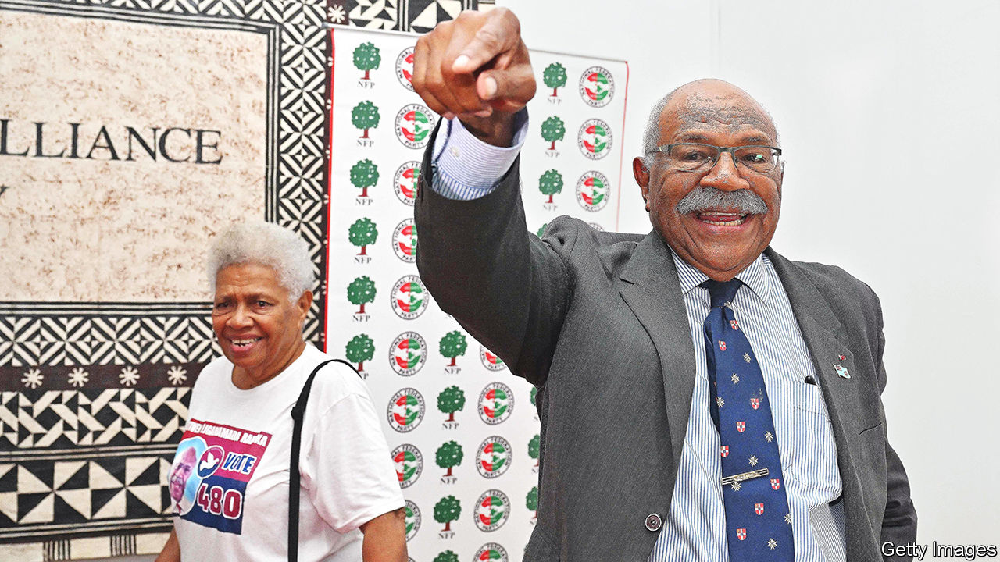

###### Cloud coup-coup land

# A historic transfer of power in the South Pacific 

##### But will Fiji’s armed forces continue to mind their own business? 

 

> Jan 5th 2023 

On christmas eve the small Pacific-island state of Fiji witnessed an opposition leader being sworn in as prime minister for only the third time in its history. The previous two such prime ministers were both ousted in coups, in 1987 and 2000. As Sitiveni Rabuka—a 74-year-old political veteran and himself a former coupster—took the oath of office, the country’s meddlesome armed forces nonetheless promised to abide by the election result and uphold the country’s constitution. But will they keep that vow?

Mr Rabuka emerged as the victor of the election held on December 14th by the narrowest of margins. The FijiFirst party of the outgoing prime minister, Frank Bainimarama (another former coupster), won the most seats, with 26 of the 55 contested. Mr Rabuka’s People’s Alliance party secured only 21. But Mr Bainimarama, who ruled Fiji for 16 years, failed to secure a majority. Mr Rabuka was able to form a governing coalition with two smaller parties, the National Federation Party and sodelpa, which together won eight seats. Mr Bainimarama conceded defeat, then flew off to Australia, where his son is facing domestic-assault charges. Yet by New Year’s Day the former prime minister was back and appeared to have had second thoughts.

Mr Bainimarama called on several senior officials, including the powerful police commissioner, to refuse the new government’s demand that they resign. Having nominated his chief henchman and former finance minister, Aiyaz Sayed-Khaiyum, to represent the opposition on the important Constitutional Offices Commission, Mr Bainimarama then rescinded that nomination on January 4th. Mr Sayed-Khaiyum, who was considered the de facto prime minister under FijiFirst rule and had left the country on Christmas Day, has since been put on a police border alert. 

Even if Mr Bainimarama restrains himself, there may be political trouble ahead. The constitution that the army has sworn to uphold was imposed on Fiji’s 900,000 people by Mr Bainimarama after he seized power and abrogated the previous version. Much of the incoming government’s platform, including reforms to the country’s anti-corruption commission and the restoration of the Great Council of Chiefs, might require amendments to it. Yet constitutional change would require the support of 75% of voters in a referendum, an almost impossible threshold. And the armed forces are deeply attached to the current constitution because it confers upon them responsibility for the “well-being” of the Fijian people.

Politics aside, Mr Rabuka inherits an economy stricken by covid-19. It shrank by more than a fifth over the course of 2020 and 2021, before somewhat rebounding last year when tourists began returning. During the pandemic the FijiFirst government had to bail out the national carrier, Fiji Airways. And the war in Ukraine has since made the public finances even worse, by raising the price of energy and of many basic foodstuffs, which Fiji imports. The national debt now stands at 85% of gdp; around a third of annual revenue is dedicated to servicing it. 

Geopolitics represents another challenge for Mr Rabuka. In recent years Fiji has seen considerable investment from China. A Chinese company owns the country’s gold mine; another mines bauxite on its second-largest island. Chinese concessional loans have paid for new roads and bridges. Fearful of being squeezed out, Australia and New Zealand have rushed to provide hefty budget support, covid relief, rural electrification and a new peacekeeping centre for the armed forces.

Yet the most pressing risk is of another coup. In the uncertain aftermath of the election, the police commissioner called in the armed forces, citing a risk of ethnic unrest. Their commander, Major-General Jone Kalouniwai, obliged, but with only a token deployment. Yet many think Mr Bainimarama is intent on goading him to intervene more forcefully—on the pretext that Mr Rabuka is already violating the constitution. The former prime minister will need to be managed carefully if Fiji is to witness its first-ever enduring democratic transfer of power.■

