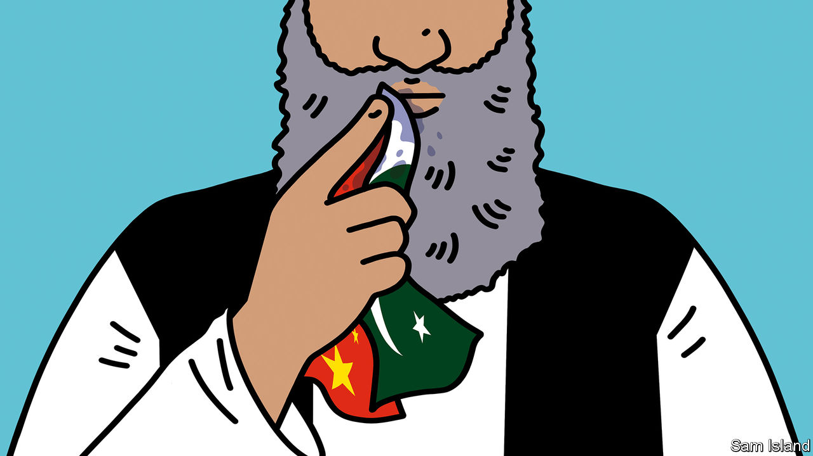

###### Banyan

# Pakistan and China find they have little leverage with the Taliban 

##### Hopes of greater influence after the departure of the Americans have remained unfulfilled 

 

> Jan 5th 2023 

When america beat a sudden, ignominious retreat from Afghanistan and the Taliban surged to power, there was much cheering in next-door Pakistan. In China, America’s withdrawal was considered a great propaganda coup.

Naturally, many like to see one in the eye for the overweening Americans. But the Pakistanis, in particular, had much more than that at stake in the Taliban’s triumph. The Islamist movement was part-created by Pakistan’s powerful military spies in the 1990s and had ever since been harboured by them.

Grooming the Taliban had a logic to Pakistani generals but not to outsiders—including the successive American administrations covering the generals’ bills. The Pakistanis wanted to control Afghanistan through the Taliban, to gain vital “strategic depth” in the event of a conflict with India. That might involve providing the generals with territory to retreat to or, more important, merely denying India a foothold in Afghanistan by which to encircle them. 

Yet how fleeting that dream has proved. Pakistan has no more control of Afghanistan than any of the other foreign powers it has sent packing. The Taliban’s victory has also electrified hardliners in Pakistan, who have redoubled calls for sharia. Worse, it has emboldened Pakistan’s own militants, the Tehreek-e Taliban Pakistan (tTp). In the year following the Taliban’s return to power, terrorist attacks in Pakistan jumped by half.

ttp fighters are, like the Afghan Taliban, mostly ethnic Pashtuns, whose traditional lands are on both sides of the shared border. After attacks on Pakistani soil, Pakistan’s defence minister complained on January 2nd, they melt across the frontier to Afghanistan to regroup. The irony hardly needs stressing: rather than furnishing Pakistan with strategic depth against India, Afghanistan gives the tTp depth against Pakistan. After Pakistan’s interior minister threatened strikes against tTp bases in Afghanistan, a Taliban official tweeted a grainy image from 1971 of Pakistan surrendering to India after losing East Pakistan. Ouch.

The disputed border, the “Durand line” drawn by the British in 1893, is another point of contention. Taliban and Pakistani forces have clashed there—six Pakistani civilians were killed by Afghan shelling in December. Pakistan is putting up barbed-wire fences along the border, and the Taliban are pulling them down.

The indignities mount. Pakistan imagined it would be managing its client’s interactions with the outside world, as it did during the group’s previous spell in power. But the Taliban have direct dealings with others, even America, and receive Indian aid. The American departure has if anything turned out to be even more galling, by massively reducing Pakistan’s relevance and sway in Washington.

As for China, it was under fewer illusions that America’s withdrawal would be a serious boon. But as Andrew Small of the us German Marshall Fund, a think-tank in Washington, argues, Chinese policymakers at least hoped the Taliban would go through the motions of seeking diplomatic recognition and normalising relations with others.

Taliban triumphalism has put paid to that. Being an international villain, if not quite a pariah, does not seem to vex the group’s leaders. After banning girls from high school and women from universities, the clerics recently banned women from working for ngos. The International Rescue Committee, a big international ngo, promptly suspended operations.

China, unlike most other countries, has stayed put. Though it does not recognise the Taliban, its embassy is one of a handful still operating in Kabul. Mr Small suggests that, in a country once again providing inspiration to regional militants, China hopes to persuade the Taliban to restrict the activities of Uyghur militants—whose suppressed homeland in China’s western region of Xinjiang is just across the border.

But the major Chinese investment once promised to Afghanistan is off the cards. Though the Taliban have learned to speak development cant, security in Afghanistan remains abysmal. In December gunmen launched a deadly attack on a Kabul hotel where Chinese business types congregate. China will not risk being dragged into the Afghan mire as was America (which even now provides far more aid than China does). Mr Small predicts that China will minimise the scope of its activities, leaving as much as possible to its friends in Pakistan’s security establishment. They, after all, are responsible for so much of the tragic state of Afghanistan.■


