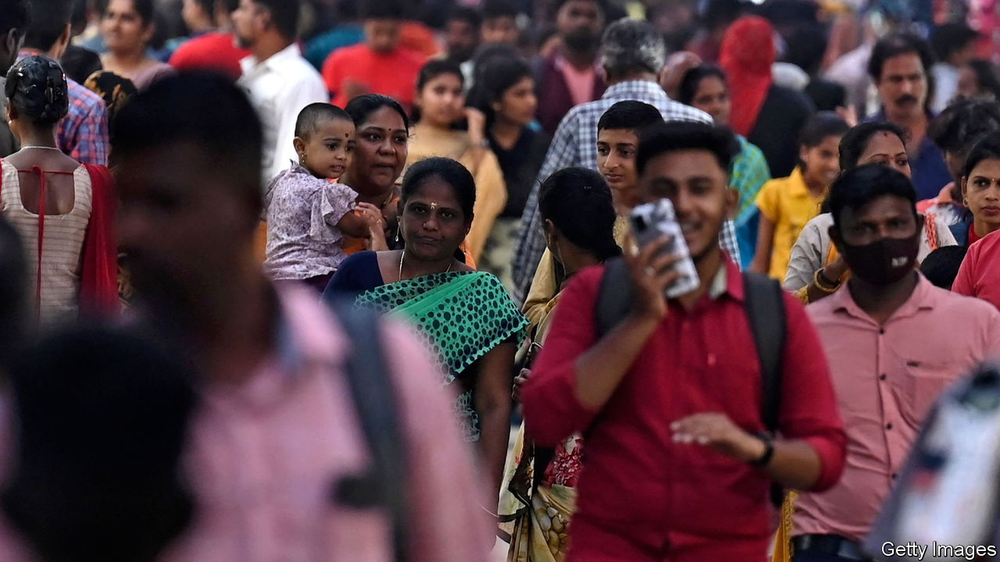

###### Groping in the dark

# Postponing India’s census is terrible for the country 

##### But it may suit Narendra Modi just fine 

 

> Jan 5th 2023 

Three years ago India’s government was scheduled to pose its citizens a long list of basic but important questions. How many people live in your house? What is it made of? Do you have a toilet? A car? An internet connection? The answers would refresh data from the country’s previous census in 2011, which, given India’s rapid development, were wildly out of date. Because of India’s covid-19 lockdown, however, the questions were never asked.

Almost three years later, and though India has officially left the pandemic behind, there has been no attempt to reschedule the decennial census. It may not happen until after parliamentary elections in 2024, or at all. Opposition politicians and development experts smell a rat. 

Narendra Modi often overstates his achievements. For example, the Hindu-nationalist prime minister’s claim that all Indian villages have been electrified on his watch glosses over the definition: only public buildings and 10% of households need a connection for the village to count as such. And three years after Mr Modi declared India “open-defecation free”, millions of villagers are still purging al fresco. An absence of up-to-date census information makes it harder to check such inflated claims. It is also a disaster for the vast array of policymaking reliant on solid population and development data.

India’s first proper census was conducted in 1881 by British colonial administrators, who calculated that finding out more about their subjects would help them consolidate power. Independent India continued to hold one every decade. Census data are used to determine who gets food aid, how much is paid to schools and hospitals across the country, and how constituency boundaries are drawn. They also form the basis for more detailed, representative-sample surveys on household consumption, a key measure of poverty, and on social attitudes and access to health care, education and technology. 

For a while policymakers can tide themselves over with estimates, but eventually these need to be corrected with accurate numbers. “Right now we’re relying on data from the 2011 census, but we know our results will be off by a lot because things have changed so much since then,” says Pronab Sen, a former chairman of the National Statistical Commission who works on the household-consumption survey. And bad data lead to bad policy. A study in 2020 estimated that some 100m people may have missed out on food aid to which they were entitled because the distribution system uses decade-old numbers. 

Similarly, it is important to know how many children live in an area before building schools and hiring teachers. The educational misfiring caused by the absence of such knowledge is particularly acute in fast-growing cities such as Delhi or Bangalore, says Narayanan Unni, who is advising the government on the census. “We basically don’t know how many people live in these places now, so proper planning for public services is really hard.”

The home ministry, which is in charge of the census, continues to blame its postponement on the pandemic, most recently in response to a parliamentary question on December 13th. It said the delay would continue “until further orders”, giving no time-frame for a resumption of data-gathering. Many statisticians and social scientists are mystified by this explanation: it is over a year since India resumed holding elections and other big political events. 

True, the census process requires training some 3m “enumerators” to go door to door with the questionnaires, and the government’s ambition to register the answers digitally for the first time may make the task more complex. Teachers, who usually do much of this work, have only just returned to schools. The window for conducting the census is short, as the monsoon makes much of the country difficult to get around for much of the year. Yet such logistical hurdles never stopped previous administrators undertaking the census. Mr Modi should explain why his government appears unable to follow their lead.■


