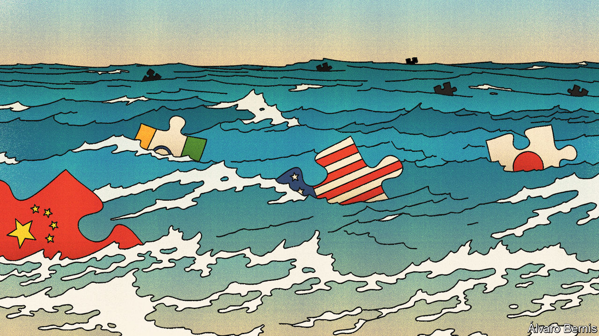
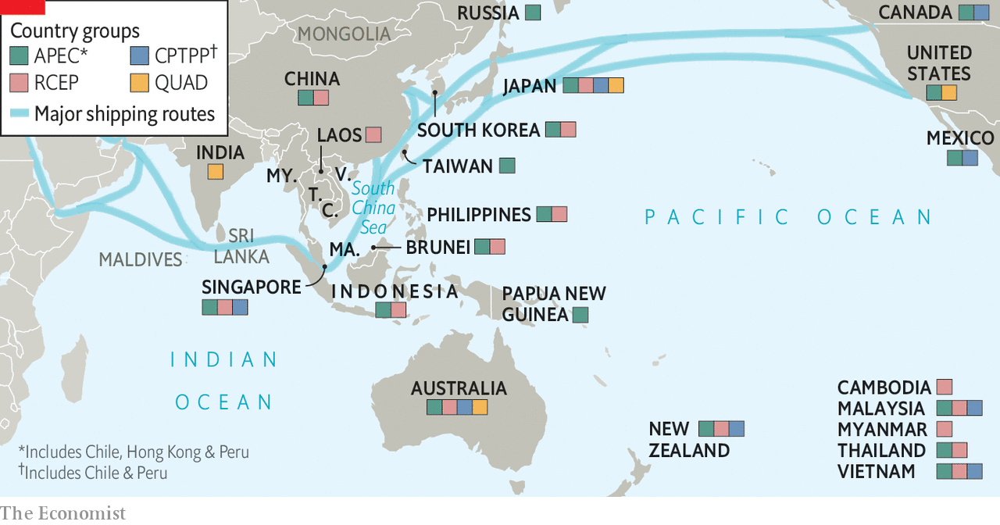

###### Asian geopolitics

# Reinventing the Indo-Pacific 

##### A new super-region is taking shape—mainly to counter Chinese aggression 

 

> Jan 4th 2023 

Until a few years ago, the term “” was hardly uttered in international affairs. Now many countries have adopted so-called Indo-Pacific strategies, including America, Australia, Britain, France, India, Indonesia, Japan, the Philippines and even Mongolia. South Korea joined the pack in December. The main Asian holdout is China, which scorns the phrase. That is key to understanding what the Indo-Pacific is all about.

Outside geopolitics, the term, implying a conjoined perspective on the Indian Ocean and the even vaster Pacific, is not new. Its first recorded use was by a British colonial lawyer and ethnographer in the mid-19th century. Patterns of human trade and exchange had already spanned the two oceans for millennia, with Islam spreading eastward from the Middle East and Hinduism and Buddhism fanning outwards from India. In more recent decades scientists have grasped how the circulation and biogeography of the two oceans are closely connected. The great story of  can be usefully framed by the two-ocean notion of an Indo-Pacific.

Yet for strategists, alternative frameworks such as the “East Asian hemisphere”, “Pacific Basin” or “Asia-Pacific” were until recently more compelling. The Asia-Pacific Economic Co-operation, or APEC, a late-20th-century initiative of 21 states, was intended to unite the economic dynamism of the Pacific Rim, including especially East Asia. What need for a new geographical descriptor? For this newspaper, it has been enough simply to define everywhere from Afghanistan to the top of Japan, and from the Maldives to New Zealand, simply as “Asia”.

The answer is that in statecraft, as Rory Medcalf of the Australian National University argues in his elegant book on the rise of the Indo-Pacific concept, mental maps matter. These not only define a country’s “natural” region, Mr Medcalf writes. They signify national priorities, which in turn shape “the decisions of leaders, the destiny of nations, strategy itself.” 

Crucial to understanding the new Indo-Pacific map is that it connects the economic powerhouse of East Asia to the newer dynamism of South Asia, including along the sea lanes by which most of the world’s trade and ship-bound energy pass. Equally important, the Indo-Pacific concept is underpinned by the main challenge to this engine of Asian prosperity: China’s destabilising behaviour as its military, economic and diplomatic power increase, not only in its backyard of East and South Asia, but across the Indian Ocean to east Africa and down into the South Pacific.

China’s rise has long been a given. But the countries embracing the new Indo-Pacific nomenclature, most of them more or less democratic, have grown increasingly concerned about China’s coercive tendencies. Australia is a victim of Chinese economic boycotts and insidious political-influence campaigns. Sri Lanka has seen its sovereignty eroded by indebtedness to China under the infrastructure-led Belt and Road Initiative. Huge Chinese fishing fleets encroach on the territorial waters of states in Asia and beyond. China’s growing fortification of the South China Sea unnerves South-East Asians. Both Japan and India have faced Chinese aggression at their frontiers. Chinese military threats towards Taiwan unsettle not only that self-governing island but the whole region.

China’s “wolf warrior” diplomacy reflects the nationalist grievances its president, Xi Jinping, is stoking at home. Thus, the Indo-Pacific defines not only a space. It represents perhaps the greatest geopolitical challenge: how to respond to Chinese aggression without, as Mr Medcalf puts it, resorting to “capitulation or conflict”. 

That challenge has been sharpened by periodic concerns about the capacity and staying power of the United States, the pre-eminent power in the region since the second world war. It was Japan, America’s principal ally in Asia, that first divined the importance of engaging traditionally aloof India, a move that helped crystallise the Indo-Pacific concept. During Abe Shinzo’s first term, from 2006 to 2007, the then Japanese prime minister “clearly saw that the old notion of the Asia-Pacific failed to embrace India,” says Taniguchi Tomohiko, the late leader’s speechwriter. Abe thrilled India’s MPs with an address to the Indian parliament entitled “Confluence of the Two Seas”, a phrase borrowed from a book by an early Mughal prince. Kanehara Nobukatsu, a former diplomat and architect of Japan’s Indo-Pacific policy, says they were “like kids: applauding, banging the table, stamping the floor.”

When Abe returned to power in 2012, the risks attending China’s rise were clearer. So was the growing importance of India. “To make a counterbalance [to China], the only option is India,” says Mr Kanehara. Abe therefore reprised an earlier idea of a security dialogue between America, Australia, India and Japan, leading to the revival of that dormant “Quad”. And at an African summit in 2016 he proposed the notion of a “a free and open Indo-Pacific” (foip). 

 


Since then Chinese border incursions in the Himalayas have tilted India, once insistent that it would not be part of an anti-China bloc, towards the Western camp. It is now a more engaged member of the Quad, not only militarily but also, for instance, offering to work with the other members to get covid-19 vaccines to the region. India has warmly embraced the foip principle. Still, drawing proud, cautious India deep into a Western network of security alliances is going to require a long courtship—assuming it is possible.

None of the advocates of foip countenances cutting economic ties with China. Even so, China, not altogether illogically, sees foip as a ploy to contain it. The Indo-Pacific idea has plenty of critics in the West, too. Some consider it a mere front for geopolitical agendas, starting with America’s Manichean battle with China; President Joe Biden’s administration is a major fan of foip. Others argue that the concept is so capacious and vague as to be incoherent. Nick Bisley of La Trobe University in Melbourne calls the Quad, whose vaccine initiative quickly ran into problems, “strategic policy by press release”.

Above all, there are glaring gaps on the Indo-Pacific’s eastern and western flanks. For all the hard power America and India bring to the region, they are largely absent from regional economic initiatives. 

Missed opportunity, missing links

Under President Donald Trump, America backed out of the Trans-Pacific Partnership, a free-trade pact which Japan and Australia then helped to salvage as the Comprehensive and Progressive Agreement for Trans-Pacific Partnership. Mr Biden’s Indo-Pacific Economic Framework may nod to the region’s new nomenclature, but offers none of the market access its members want. “For Asians, the American market is the biggest pie to eat,” Mr Kanehara says. Despite years of negotiations and lobbying from Abe, India opted not to join the Regional Comprehensive Economic Partnership, another jumbo trade agreement now dominated by China. For Japan, that decision brought “a great sense of disappointment”, says Mr Taniguchi.

Even Michael Green, a former American official now at the University of Sydney and a fan of the Indo-Pacific, compares the framework to “a big piece of IKEA furniture, held together by little dowels”. Mr Kanehara describes foip as primarily a “networking concept”. Most non-defence regional initiatives, with the exception of Japanese infrastructure investment, are small beer. Indian technical assistance and South Korean projects promoting women’s empowerment are notably modest. Nonetheless, as Mr Green argues, through all the Indo-Pacific activity a common theme is emerging: smaller states “cannot be bribed or forced into a Chinese sphere of hegemony and influence”.

The most salient, and best-developed, Indo-Pacific dimension concerns security. It is based on America’s network of bilateral alliances, overlaid with ad hoc arrangements such as the Quad and the aukus defence technology pact of 2021, a deal between America, Britain and Australia to supply Australia with nuclear-powered submarines and develop other military technology. There are also triangular efforts such as those among America, Japan and South Korea. But there is no Indo-Pacific nato in the making, with mutual defence or joint planning, and little clarity about who would do what in a crisis. As for Taiwan, an Indo-Pacific focal point, it is nearly absent from regional strategising.

Just as “minilaterals” still count for something, so too does co-operation among smaller Asian states. For instance, though the former president of the Philippines, Rodrigo Duterte, succumbed to bullying and threats and tilted towards China, his successor, Ferdinand “Bongbong” Marcos, has adopted a less yielding stance. It includes increased military co-operation with America. The Philippines is also procuring cruise missiles from India, patrol boats from South Korea and air defences from Israel. Taiwan’s policy of countering Chinese coercion includes not just military upgrades from America but also thickening ties with its Asian neighbours.

Major challenges, Mr Kanehara contends, lie ahead in convincing more countries that committing to an Indo-Pacific idea is better than falling under China’s sway. Many dislike taking instruction from former colonial powers. One big Asian country, Indonesia, with a low-powered approach to foreign affairs, has yet to signal clearly how it intends to wield its influence in an Indo-Pacific context. It does not want to rock any boats with China. 

Such reluctance may be one reason why China’s outgoing foreign minister, Wang Yi, once scornfully predicted that talk of a free and open Indo-Pacific “will dissipate like ocean foam.” Maybe. Yet the likeliest thing to prove him wrong is China’s own relentlessly provocative behaviour.■

