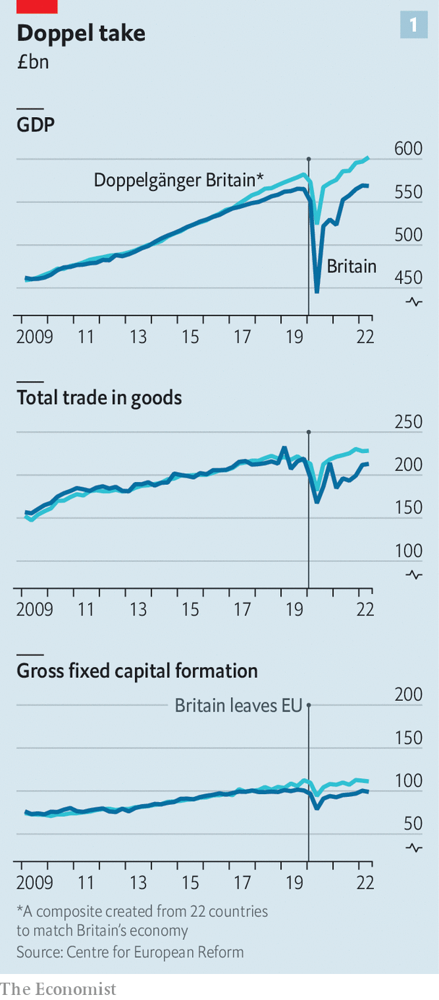
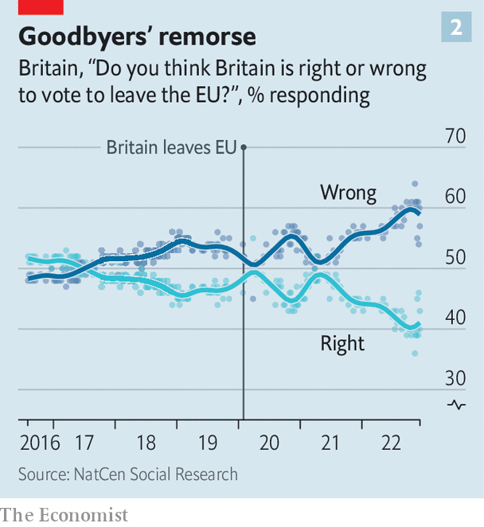
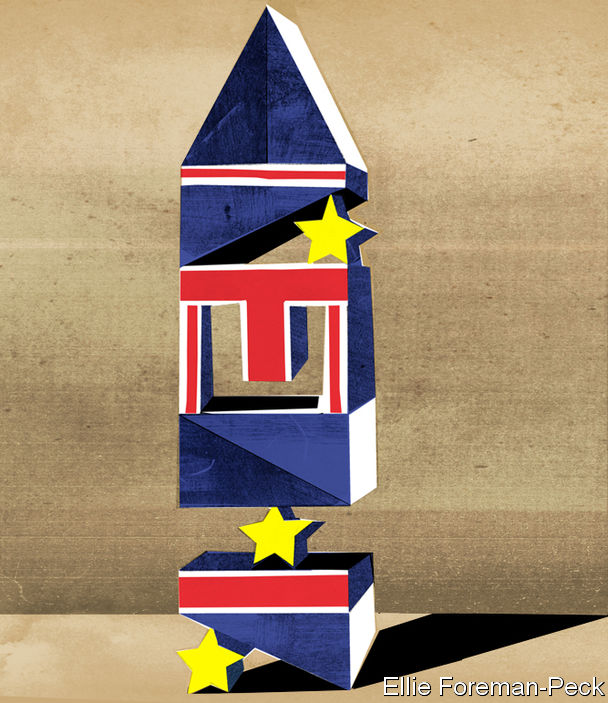

###### Je regrette quelque chose

# Assembling a better British relationship with Europe 

##### The components are there. Putting them together will not be easy 

 

> Jan 5th 2023 

Greg Vaitsas wanted to introduce his neighbours to fine Greek foods. For the first decade, the delicatessen he opened in east London with Paulina, his girlfriend, motored along. But in November he gave the keys back to the landlord. Brexit had brought hefty customs charges and bundles of paperwork; overnight the stream of small consignments of wines, oils, meats and cheeses they sourced from tiny island producers was throttled. Better to shut up shop, Mr Vaitsas thought, than to rely on wholesalers that supplied the same big brands to all the other stores. “We did not allow it to degenerate into something that wasn’t our dream.” 

The reality of Brexit is hitting home for others, too. It is now two years since the Trade and Co-operation Agreement (TCA), the trade deal negotiated by Boris Johnson, took effect. The picture is muddied by the effects of covid-19 and high energy prices; it is too soon to assess Brexit’s long-run effects. But the evidence suggests that leaving the bloc has inflicted a lot of .

 


John Springford of the Centre for European Reform (CER), a think-tank, has constructed a phantom country that tracked Britain’s performance before the referendum in 2016. This shadow nation shows the path Britain might have taken had it not voted to leave the EU. He estimates that by the second quarter of 2022, Brexit had left GDP 5.5% smaller and dragged down investment by 11% (see chart 1). Given that Britain was already one of the worst performers on investment among G7 countries before the referendum, Brexit seems to have made a bad situation worse.

Mr Springford’s model has its critics, but the picture he paints is plausible. The uncertainty induced by years of bickering over the terms of Britain’s departure has put managers off making big investments. Trade barriers have done their job: British exports to Europe have fallen from 70,000 to 42,000 product types, according to a paper by researchers at Aston Business School. The dream of a “sovereign global Britain” has fizzled. A promised trade agreement with America has gone nowhere. Trumpeted ones with Australia and New Zealand are expected to lift GDP by 0.08% and 0.03% per year respectively. 

 


Mr Johnson’s form of hard Brexit suddenly looks more fragile. If you exclude people who answered “don’t know”, 60% of Britons now think leaving the EU was an error, according to polling by YouGov (see chart 2). Only a quarter pick rejoining as their preferred solution, but some 70% of Britons favour a closer relationship with the EU, according to the Tony Blair Institute, a think-tank. 

The path to a smoother relationship between Britain and the bloc does exist. It involves first normalising relations, then exploiting the TCA to the full, and then bulking it out with new provisions. A new and deeper form of integration would be a final step. But the route is strewn with obstacles—and not just because of the recalcitrance of Brexiteers in Britain. 

The solipsism that the relationship is largely a matter of British choices persists in Westminster. But no one in Brussels is itching to reopen a divorce that has already swallowed too much of their time. “There will not be political traction in the EU to change the relationship, until there is something quite clear coming from London,” says Nathalie Loiseau, an EU lawmaker and an ally of President Emmanuel Macron of France. Since Britain is the smaller market, EU business lobbies have far fewer gripes with the TCA than British ones. “For us, success means no longer talking about Brexit,” says an EU diplomat. 

The good news is that a normalisation is under way. Mr Johnson is out of office. Rishi Sunak promises a “respectful, mature” relationship. A flurry of modest initiatives points to a thaw. During her brief tenure, Liz Truss signed up to the European Political Community, a pet project of Mr Macron’s. Britain has joined a scheme to rapidly move military kit across borders and volunteered to help police the EU’s southern border against migrants. In December Britain joined an EU programme to build wind farms and electricity interconnectors in the . For British officials, this is a taste of the near-term future: not yet touching the TCA, but overlaying agreements in areas of common interest. 

Whether this is a false dawn depends largely on Northern Ireland. No sooner had the TCA been signed than Mr Johnson began unpicking the withdrawal treaty that preceded it, and specifically the  which in effect keeps the province in the EU’s single market for goods. The protocol means that there are no border controls on the island of Ireland, in an effort to prevent sectarian conflict, but it created a customs and regulatory border in the Irish Sea instead. That infuriates both (pro-British) unionists in Northern Ireland—the largest unionist party withdrew from devolved government in 2022 in protest—and Brexiteers on the mainland. 

Mr Johnson and Ms Truss left behind a ticking bomb, in the form of a bill currently before Parliament that would allow ministers to unilaterally discard bits of the protocol. In response the EU has frozen chunks of the deal provisionally agreed with Mr Johnson. They include participation in Horizon, a vast scientific-research programme, and Copernicus, a space-satellites programme, as well as co-operation deals between regulators in competition policy and financial services. 

Mr Sunak has promised a resolution to the row over the protocol in time for the 25th anniversary of the Good Friday peace agreement, which falls in April. “It’s like having something in your eye,” says a British official. “You can’t focus on anything else.” The European Commission is ready to “de-dramatise” the existing checks on goods crossing the Irish Sea, through shared customs data and whittling away at the paperwork. But it refuses to make the big structural changes to the protocol that many Conservative MPs want, including gutting the role of the European Court of Justice. As so often, a Tory backbench rebellion could shatter a fragile deal. 

Mr Sunak’s wider choices on regulatory policy pose a further risk of conflict. The prime minister says that he wants to take advantage of Brexit by fine-tuning the rule book in a few high-value sectors, such as financial services, artificial intelligence and life-sciences. That would be a manageable concern for the EU. But a second bomb left by Mr Johnson worries diplomats gravely: a monster bill to amend or repeal all EU law by the end of 2023. Intended to facilitate a hard and fast divergence with the bloc, it could slice through Britain’s obligations under the TCA to uphold environmental and labour standards.

Things can quickly fall apart. If Britain did unilaterally override the Northern Ireland protocol, for instance, the EU would respond swiftly, possibly by suspending the trade deal and levying tariffs. Britain’s relationship with the bloc is fragile by design, reflecting the mistrust on which it was built. EU permissions for data-transfers and the clearing of derivatives will lapse in June 2025, and need to be renewed. Agreements on fisheries and electricity expire the year after. The relationship is a bicycle: stop cycling and it falls over. 

But strike a deal on Northern Ireland, and avoid a new front over aggressive regulatory divergence, and relations could greatly improve. “It would be a very big symbol of mutual trust, the thing we have been missing for some years,” says Ms Loiseau. That could allow Britain to fully exploit the TCA, from participation in Horizon to shaving frictions at the border. The TCA is an elaborate structure. A powerful partnership council led by politicians can amend much of the deal. Beneath it sit 18 technical committees in fields such as aviation, customs and intellectual property, tasked with identifying snags and fixes. Currently, these committees “are operational, but they are not operating,” says Charles Kinnoull, chair of the European affairs committee in the House of Lords.

If normalising ties and making the most of the existing TCA are the first steps to a better relationship, the next would be to widen its purview. The deal comes up for its first five-yearly review in 2026. If Mr Sunak wins the election, the veto power of the Eurosceptic Tory right would make an expanded TCA nigh-on impossible. But if the Labour Party is in office by then (an election must be held by January 2025, and the polls point to a big Labour victory), that could spell a new beginning. “They’re desperate for a British government that wants to engage,” says Rachel Reeves, the shadow chancellor. “I do feel we’d be knocking at an open door if we went in with a different attitude to our future relationship.” 

Up to a point. To understand the challenge ahead for a Labour government, revisit the painful birth of the TCA. It is a conventional free-trade agreement, similar to the bloc’s deal with Canada. It eliminates tariffs on goods, but does little to remove regulatory barriers or to facilitate the movement of services and people. That was in part the choice of David Frost, Mr Johnson’s confrontational chief negotiator, who was fixated on a concept of British “sovereignty” that insisted all obligations under EU law were scrubbed. 

But it was not Lord Frost’s choice alone. His opposite number, Michel Barnier—backed by EU governments—was also determined to prevent Britain “cherry-picking” elements of the single market. Out meant out. Principle fused with self-interest: why, Mr Barnier asked, should Europe let Britain be its hub for things like legal services? A hard Brexit suited everyone. 

Sir Keir Starmer, Labour’s leader, does not plan to up-end this basic settlement. He is after a fast, off-the-peg agreement that would allow him to claim he has “made Brexit work” while avoiding the quagmire of EU negotiations that has broken previous prime ministers. To that end Labour proposes a veterinary agreement, which would allow agricultural products to be freely exported (a big bone of contention in Northern Ireland). A mobility agreement would ease the bureaucracy around short-term visits for businesses, artists and musicians; even Lord Frost now admits he was “too purist” on this point. 

The party wants a security treaty with the EU, too—something British officials were wary of for fear of entangling foreign policy in the toxic politics of Brexit. In theory, all three agreements are possible. “They are not breaching anyone’s red lines; they are just things that Boris Johnson and David Frost didn’t want,” says Charles Grant of the CER. 

 


But they will demand extensive negotiations, and diplomats worry that Labour’s stance is fuzzy. In the case of a veterinary agreement, for example, the commission would insist that Britain stays in line with EU law (“dynamic alignment”, in the jargon). That goes far beyond the party’s promise not to cut standards. 

The party’s hopes for a bolt-on agreement on certifying industrial goods, so that a product approved as fit for sale in one market is automatically certified in the other, overlook the fact that the EU refused similar requests from Lord Frost. “Even if you normalise the relationship, that won’t obliterate the economic interests the EU has to defend,” says Georg Riekeles, a member of Mr Barnier’s team. “They are going to look at the EU with puppy eyes, and the EU will take out a gun and shoot the puppy,” fears a former British official. 

This worry—that a big chance to reset the relationship will be squandered—applies to the EU, too. The bloc has done too little thinking about how to embrace a Labour government that wants to move closer to Europe, says Rem Korteweg of Clingendael, a Dutch think-tank. “There is one moment to get it right, and we need to avoid a knee-jerk reaction, saying ‘Here we go again, this is cherry-picking.’ The political damage that would do is immense.”

Ever closer

A beefed-up TCA could make a big difference to a few sectors, such as farming, notes Sam Lowe of Flint Global, a consultancy. The fading threat of a trade war over Northern Ireland should help business investment pick up. Yet the trade barriers thrown up by leaving the single market and customs union would largely remain. To tackle the damage that Brexit has done to Britain’s growth prospects requires deeper integration. “The choice is to warm up the deal we have now versus seeking to change the parameters of the relationship,” says Denzil Davidson, a former adviser to Theresa May, Mr Johnson’s predecessor.

A deal with the EU like Norway’s, fully inside the single market but without a vote on its rules, is often seen as a possible model. Yet Mr Barnier’s team never thought this a stable settlement for a large services economy, discloses Stefaan De Rynck, an aide, in a new book. The rule-taking it demands “would have put Euroscepticism on steroids”. 

Finding a middle way would mean scoping out terrain somewhere between “Norway” and “Canada.” Precedents exist. Switzerland is a de facto member of the single market in pharmaceuticals, aviation, haulage and other areas; in exchange the Swiss adopt broad swathes of EU law. This was the turf scouted by Mrs May, who sought to remain in the single market for goods and stay outside it for services. She was felled by her own party before her proposals could be fully tested out. 

Lateral thinking is again in the ether. Peter Mandelson, a former EU commissioner, calls for a “reconceptualisation” of the relationship. Take financial services. The City of London is relying on the EU’s bog-standard equivalence regime, which grants market access based on an alignment of rules. But Britain has been given access in far fewer areas than America, Hong Kong or Singapore. A “high ambition” deal would see financial regulators co-ordinate policy more tightly and adopt a “more rational, less mercantilist” approach, says Lord Mandelson. 

Philip Hammond, a former chancellor of the exchequer, suggests a new grand bargain on migration policy to alleviate Britain’s skills shortages. More EU citizens departed than arrived last year. A right of access to Britain’s  could be exchanged for far deeper access to the European services market, says Mr Hammond. A return to the EU’s customs union is also theoretically possible, if a future government were ready to forgo the (thus far) economically nugatory but politically potent idea of an independent trade policy.

The moment to rethink Britain’s relationship will come in the second half of this decade, as the EU grapples with the membership ambitions of Ukraine and some Balkan states, says Nicolai von Ondarza of the German Institute for International and Security Affairs. The architecture of the wider continent will be in flux. “A smart British government could actually push the EU quite far,” he says. “If you add enough building blocks, you could move from the very hard Brexit we have today to a quite significantly softer version.”

Yet it would also require a revolution in thought. For British leaders it would mean a less dogmatic approach to EU law and free movement. One minister’s recent suggestion that Britain’s relationship with the bloc could eventually become more Swiss triggered paroxysms in the Tory party. For the EU it would require an even bigger leap: bringing a large, unpredictable rival uncomfortably close. In his memoirs Mr Barnier warns European leaders to be vigilant against Britain attempting to re-enter the single market “through the windows”. 

Convergence, then, can seem both inevitable and impossible. In an era of rivalry with China and war in Ukraine, the thin TCA “simply cannot bear the weight” of the relationship both sides need, says Sir Jonathan Faull, a former commission official. But overhauling the relationship will take time. Mr Vaitsas would have kept his deli open for longer, if he thought a solution was close. But he is 46, and wants to move on. “I think it might take a generation again for something significant to help.” ■


