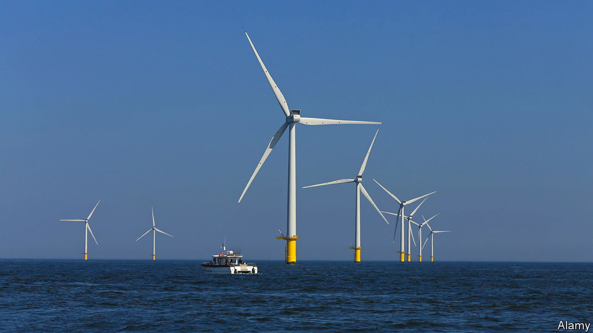

###### Windrush

# Britain’s offshore wind farms attract tourists 

##### Once thought of as ugly, turbines become destinations 

 

> Jan 5th 2023 

For years Paul Dyer relied on the dual attractions of diving and fishing to pull tourists away from the bars and ice-cream parlours that dot Brighton’s seafront. Then came Rampion, a 400MW  now operated by RWE, a utility firm. Its construction limited opportunities for diving trips. So Mr Dyer bought the domain name “www.rampionwindfarm.co.uk” and began offering boat trips for tourists to see the wind farm up close. Four years later business is booming. “It just gets busier and busier,” he says. 

Rampion faced opposition because locals said it would spoil the view of the English Channel from the South Downs National Park, part of which overlooks Brighton. Yet where some see ugliness, others see beauty. At least five companies are now offering boat trips. “There’s enough to go around,” says Steve Johnson, another tour operator. 

Visitors range from environmentalists to corporate folk. Employees of oil firms have been booking trips. “They’ve all got departments that work in renewables,” says one sailor. “But they’ve never seen a wind farm.” Others come from farther afield. “We get a lot of engineering types,” boasts another. “So a lot of Chinese.” With the air of a taxi driver proud of having a TV star in the back of their cab, one mariner brags that he recently had a certain East Asian ambassador on his boat, who wants to build offshore wind farms back home. Sailors are adept at talking about wind-farm technology. “I just sit there and give them 45 minutes of spiel,” says one. 

Mr Dyer claims that his trips have helped to assuage the concerns of locals who campaigned against the wind farm being built. But trouble is brewing again. RWE is planning a big expansion of Rampion, adding 90, much taller turbines to the existing 116. Campaigners argue that this would harm wildlife and habitats. “Tourists like a boat trip,” says Zoe Visram of the Middleton-On-Sea Coastal Alliance. “However, that does not warrant building a gigantic wind farm close to shore.” Many a skipper might disagree.■


