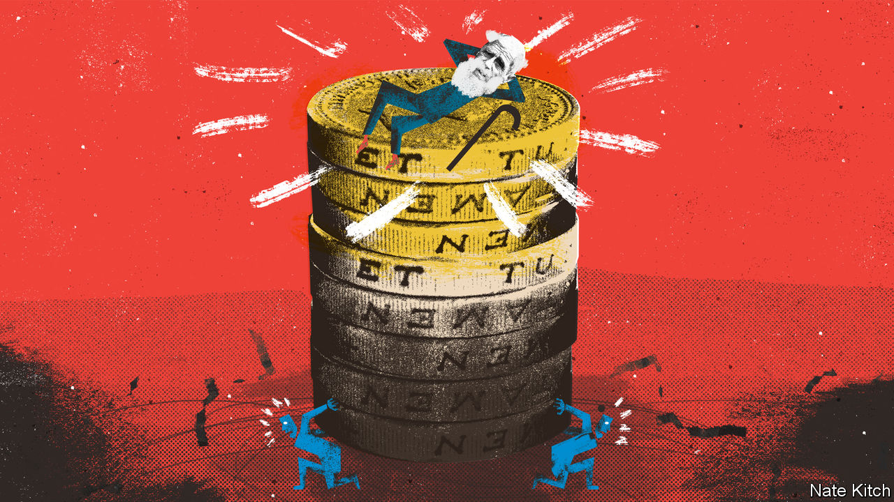

###### Bagehot

# Britons in their thirties are stuck in a dark age 

##### Youth is wasted on the young. But wealth is wasted on the old 

 

> Jan 5th 2023 

Pity the millennial. Greying at the temples, thinning on top and thickening round the middle. Once a shorthand for rebellious youth, now even the prime minister (born in 1980, uses more than two fingers to type) falls into this increasingly aged category. The typical millennial is haunted by Instagram adverts for fertility treatment, wills and Viagra. 

If the ravages of time were not bad enough, then the iniquities of British society make things worse. Life is pretty tough for the generation sinking into their middle years. It is a time when people are supposed to be kicking on with their careers, rearing children and, often, caring for ageing parents. But it is also a time when housing and  combine with uneven taxes and an unbalanced welfare state to create a miserable period. Call it the Dark Ages. (Bagehot should declare an interest: he is slap-bang in the middle of them.) 

As with most problems in British politics, it all starts with housing. The average age of a first-time buyer is 32. Those who bought a house recently may be on the wrong side of a leveraged bet on the most expensive asset they will ever buy. If house prices crater, younger people will find it easier to buy; older homeowners will be insulated, having built up more equity. Those in the Dark Ages will be stuffed. Even before  shot up, affordability was stretched. The average house costs about £300,000 ($362,000). When the median salary is about £33,000, it takes two earners to afford one. That makes child care inevitable, unless Granny and Grandpa are around. 

Unfortunately, Britain has among the most expensive child care in the world. British parents spend between a quarter and a third of their income, depending on how it is measured, on paying other people to look after the sprogs. The government has parked plans to give parents more free child care, along with a scheme to reduce required staffing ratios in a bid to make it cheaper. 

Still, 30-somethings on average earnings can surely console themselves that their basic rate of income tax is a mere 20%. Unfortunately, things sometimes go haywire in the tax system—and those in the Dark Ages are often the victims. Policies such as whipping away child benefit from the moderately well-off mixes poorly with a byzantine and often cruel working-age welfare system. An unlucky household with children could in some circumstances face a marginal deduction rate of between 80% and 96%, according to the Resolution Foundation, a think-tank. 

Every generation thinks they have it rough. Someone with a mortgage during the early 1990s may have struggled with rocketing interest rates (even if lower house prices made those loans more affordable). Houses may have been cheap in the 1960s, but petrol had lead in it, men dropped dead in their 60s and women could not open a bank account in their own name. 

Some have it better than others, however, even if they do not always like to admit it. Those who are now at retirement age will have benefited most of all. On average someone born in 1956 will pay about £940,000 in tax throughout their life. But they are forecast to receive state benefits amounting to about £1.2m, or £291,000 net. Someone born in 1996 will enjoy less than half of that figure: a fresh-faced 27-year-old today will receive barely more than someone born in 1931, about a decade before the term “welfare state” was first popularised.

And so a fundamental part of the social contract has broken down. Before Britons exchanged a miserable middle age for a gilded retirement. “Giving goods to an older person is figuratively giving goods to yourself when old” is a neat adage from Paul Samuelson, an economist. Those in the Dark Ages will pay more and receive less. Boomers used their demographic weight to slant the state to their benefit, argued David Willetts, a Conservative grandee, in “The Pinch”, a prescient book published in 2010 on inequality between the generations. Millennials are bearing the cost. 

It would be better—politically, economically and socially—to offer younger voters something today. It is in the Conservatives’ political interest. British millennials are the first generation to buck the trend of drifting right with age, according to one study by the . For some mps this is proof that the generation is irredeemably woke. More thoughtful Conservatives take a materialist view: it is hard to vote for the party that offers them so little. At the moment, neither head, heart nor wallet provides much reason for younger people to vote Conservative. 

Helping those stuck in the Dark Ages might boost the economy, too. Better access to child care could boost output per worker by 30% according to one controversial study, if inept male workers are replaced by competent women. Even if the gains from better child care are smaller, they would be welcome for an economy in sore need of productivity growth. 

More self-interested millennial moaning below 

Intergenerational inequality leads to intergenerational conflict. Some pensioners are poor, but more are rich. Although one in five pensioners is in poverty, one in four lives in a household with assets of more than £1m, thanks to a booming property market and generous pensions. Friction between haves and have-nots is inevitable, even if they are separated by age. Merely waiting for inheritances to cascade down through the generations is a recipe for an unhappy society. 

Each of these problems is fixable. The government could and should do more for young parents. That child care is unaffordable is not a fact of life, as any German can attest. That  are small and dear is not a law of nature, but a choice of successive governments. That Britain’s taxation system is tilted too far towards income, while property wealth is left undertaxed, is a policy decision. The government could choose differently. Spread some light on the Dark Ages and everyone would be better off. ■


