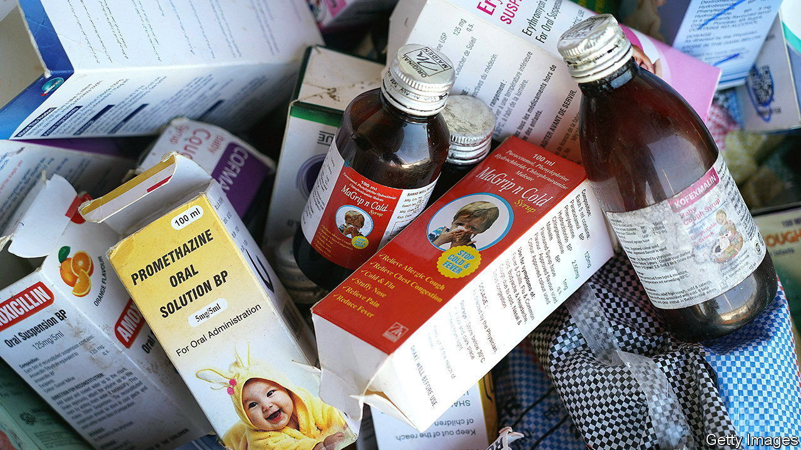

###### Bitter syrup

# A scandal rocks India’s pharmaceutical industry 

##### Can the world’s pharmacy escape a reputation for poor quality control? 

 

> Jan 5th 2023 

It is the stuff of parental nightmares. Between July and October 70 children in Gambia died of kidney failure. In December 18 perished in Uzbekistan from renal problems and acute respiratory disease. In both cases Indian-made cough syrups may have been at fault, according to allegations by a Gambian parliamentary committee and the Uzbek authorities. 

The manufacturer in the Uzbek case, Marion Biotech, has been suspended from Pharmexcil, an Indian government-linked trade group that plays a role in pharmaceutical exports; the firm’s website appears to be down. An executive for Maiden Pharma, which produced the medicine used in Gambia, told an Indian newspaper that the company was shocked and saddened by the deaths. The firm posted a report on its Facebook page claiming that a government drug-testing lab in India had found its syrup to be problem-free; unpersuaded Gambian parliamentarians recommended that Maiden should be prosecuted. Neither firm responded to ’s requests for comment.

Both companies are small and privately held. A causal link between their products and the deaths has not been proved. Sample tests in India have so far cleared Maiden of blame; an investigation of Marion has just begun. Yet the incidents have touched a raw nerve in India’s vast pharmaceutical industry, where around 10,000 factories operated by 3,000 firms churn out nearly $50bn-worth of drugs a year, accounting for 20% of the world’s and 40% of America’s generics supply by value.

The world’s pharmacy, as India’s drugmakers like to call themselves, is no stranger to scandal. In 2022 America’s Food and Drug Administration issued “import alerts” to four large Indian companies. Such notifications, which usually follow inspections of foreign factories, could lead to exports to America being blocked without physical evidence that a particular shipment is bad. 

Concerns about corner-cutting and poor quality control are the long-standing flip-side of the rock-bottom prices that have fuelled the industry’s rise in India in the past few decades. In a new book, “The Truth Pill: The Myth of Drug Regulation in India”, Dinesh Singh Thakur, a former industry executive, and Prashant Reddy, a lawyer, document at least five cases of dangerous medications entering the market, each causing multiple fatalities, since the 1970s. In many more instances shabby manufacturing methods could lead to medicines that are ineffective. These shortcomings are obscured by a complex and opaque inspection regime, says Mr Reddy. Concerns aired by critics like him and Mr Thakur are often ignored—or met with threatening legal notices from the government for supposedly tarnishing the domestic industry’s reputation. 

The government’s initial response to the latest tragedies has been lethargic and has lacked a detailed public examination of the relevant supply chains, says Mr Reddy. History offers little hope of a swift conclusion. One case in Mumbai, which involved the deaths of 14 people in a big hospital in 1988, is still being litigated. Such foot-dragging risks the lives of more patients. It also ultimately harms India’s drugmakers, whose health is inextricably bound up with that of their customers. ■


