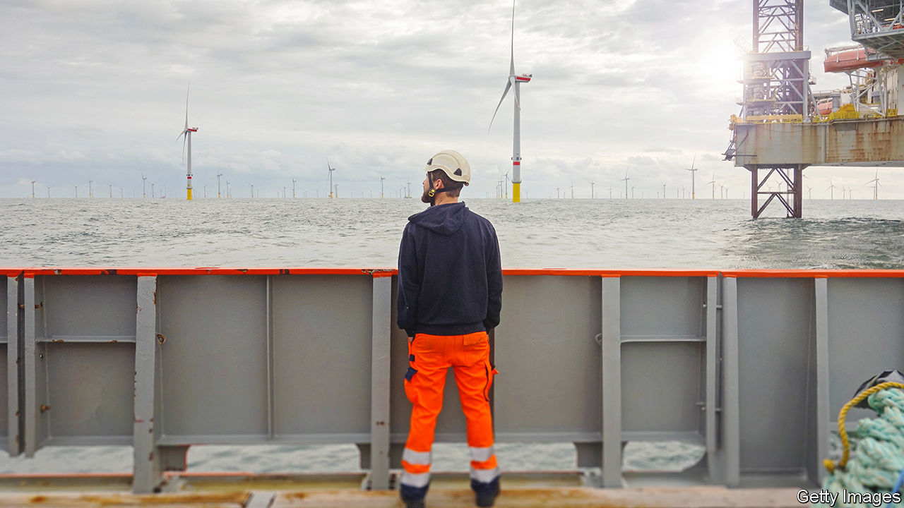
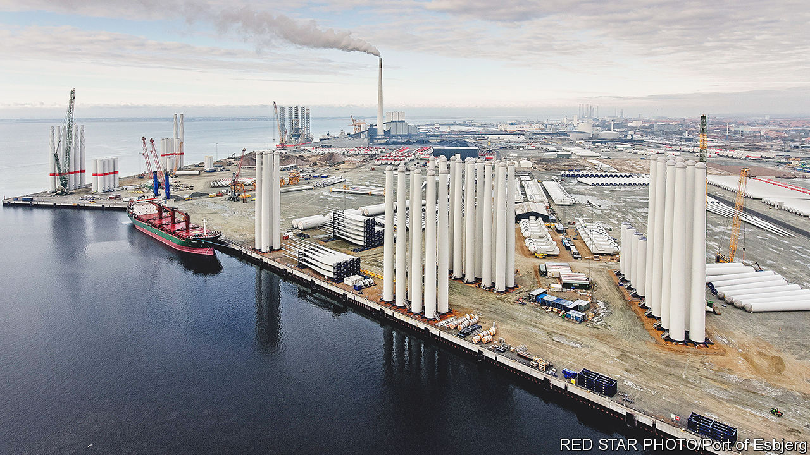

###### Mare industriae

# Can the North Sea become Europe’s new economic powerhouse? 

##### The continent’s most turbulent body of water is finding fresh uses 

 

> Jan 1st 2023 

PICTURE A MECCANO set, but one made for gods. Blades as long as Big Ben is tall, rotors and tower sections the size of school buildings, shafts and generators so heavy they must be rotated every 20 minutes so as not to be crushed by their own weight: all these parts are strewn across an area the size of 150 football pitches. Clicked together, they form edifices rivalling the Eiffel Tower, except more useful—wind turbines to be planted somewhere in the North Sea.

Welcome to Esbjerg, the hub of Europe’s offshore-wind industry. Two-thirds of the turbines currently spinning off Europe’s coast, enough to power 40m homes, were put together in the Danish port town of 72,000 people. And Esbjerg’s gods have only started tinkering. The city’s port operator plans to nearly triple capacity to handle wind projects by 2026. Local engineering firms that once served the fossil-fuel industry now supply the wind-power sector instead. Meta has bought 212 hectares of farmland outside Esbjerg to build a renewables-powered data centre for its social networks. Out on the sea, cables that will ferry 30% of the international data traffic into Norway are being laid. Esbjerg’s mayor has travelled as far as Vietnam and Washington to share its success story. 

With a dose of strategic thinking, and a bit of luck, a string of Esbjergs could scale up into a new North Sea economy. This would help Europe meet its ambitious  and rebalance its energy sources away from countries ruled by tyrants such as . Its newly minted corporate champions could offer Europe’s best, and perhaps last, chance to stay globally relevant. And it could alter the continent’s political and economic balance by creating an alternative to the sputtering Franco-German engine.

The North Sea has always been economically significant. Bordered by six countries—Belgium, Britain, Denmark, Germany, the Netherlands and Norway—it is where many important shipping routes intersect. Its strong tides, which sweep nutrients to its shallow seabed, are a boon for fishermen. In the 20th century oil and gas were discovered beneath its floor. At their peak in the 1990s Britain and Norway, the two largest North Sea producers, together cranked out 6m barrels of crude a day, half as much again as the United Arab Emirates does today. One Scottish field, Brent, lent its name to the global price benchmark. As that bounty runs out—and demand for what remains dwindles amid concerns about climate change—the turbulent body of water is finding lucrative new uses. 

The biggest bet is on a resource of which the sea has an infinite amount—awful weather. With average wind speeds of ten metres per second, the basin is one of the gustiest in the world. The day your correspondent visited Esbjerg speeds were twice that, enough to push the wholesale price of electricity down to nearly zero. The North Sea floor is mostly soft, which makes it easier to fix turbines to the seabed (the floating kind have yet to be deployed at scale anywhere in the world). It is also typically no more than 90 metres deep, which allows wind farms to be placed farther away from the coast, where winds are more consistent. Ed Northam of Macquarie Group, an investment firm with stakes in 40% of all British offshore wind farms in operation, says his offshore turbines work at up to 60% of capacity, compared with the 30-40% that is typical onshore. 

In 2022 North Sea countries auctioned off 25 gigawatts (GW) in wind-power capacity, making it the busiest year by far. Nearly 30GW-worth of tenders have already been scheduled for the next three years. Annual new connections are expected to grow from under 4GW today to more than 10GW by the late 2020s. At a meeting in Esbjerg in May the European Commission and four North Sea countries agreed to install 150GW by 2050, five times Europe’s and three times the world’s current total. In September this group and another five countries raised the number to 260GW, equivalent to 24,000 of today’s largest turbines. 

This ambition is made possible by wind’s version of Moore’s law, which described the exponential rise in computing power. Three decades ago the world’s first offshore wind farm—Vindeby in Denmark, comprising 11 turbines—had a total capacity of five megawatts (MW). Today a single turbine can generate 14MW, and one farm may contain more than 100 of them. More robust cables and transformers at sea to convert wind power from alternating into direct current, which can travel over long distances without big losses, enable more electricity to be generated farther away.

The result is that several wind farms being installed surpass 1GW in capacity, the typical output of a nuclear plant. The one at Dogger Bank, between 130km and 200km off the British coast and due to come online this summer, will clock in at a record 3.6GW at full capacity in 2026. Economies of scale are driving down costs, making offshore wind competitive with other sources of power. In July Britain awarded contracts to five projects, including Dogger Bank, at a price of £37 ($44) per megawatt-hour—less than a sixth of the British wholesale electricity price in December.


The bad weather is not always a boon: its vagaries can also stress the grid. Helpfully, technology and falling costs are allowing wind-power operators to combat the elements. One way to do this is with more interconnections, first between the farms and land—today most wind farms have one link to the shore, which is inefficient—and then among the farms themselves. Half of the 3GW to be tendered by Norway will have the option to create links to more countries. Phil Sandy of National Grid, which runs Britain’s power infrastructure, predicts a future of complex undersea grids similar to that on land. 

Another way to manage the variability of wind power is to use it to split water molecules to produce “green” fuels, such as hydrogen and ammonia. In May the European Commission and heavy-industry bosses pledged a ten-fold increase of EU manufacturing capacity for electrolysers, which do the splitting, by 2025. This would allow it to produce 10m tonnes of green fuels by 2030. The commission has also proposed a “hydrogen bank”, capitalised with €3bn ($3.2bn), to help finance the projects. 

Investors are giddy. In August Copenhagen Infrastructure Partners (CIP), a private-equity firm, said it had raised €3bn for a fund that will invest solely in hydrogen assets. A dozen projects have been announced in Europe; the three largest add up to 20GW of green power. Topsoe, a Danish firm that provides technology for such ventures, says its orders amount to 86GW.

Eventually the North Sea’s power system could take the form of an archipelago of “energy islands” that host wind-farm repair staff, aggregate electricity and produce hydrogen to be transported onshore by ship or pipeline. Up to ten such schemes are being considered, according to SINTEF, a research firm. North Sea Energy Island, an artificial atoll 100km off the Danish coast, is due to be tendered in 2023. It will act as a hub for ten nearby wind farms, with links to neighbouring countries. 

One bidder, a joint venture between Orsted, a Danish offshore-wind developer that is the world’s largest, and ATP, a big local pension fund, envisages a modular design, with components made onshore and assembled at sea. “We expect it to still be functional in 100 years’ time,” says Brendan Bradley of Arup, an engineering firm that is advising the bid. Thomas Dalsgaard of CIP, which is part of a rival consortium, reckons that producing green fuels offshore will not only help reduce pressure on grids but also save money: hydrogen pipelines are one-fifth the cost of high-capacity power-transmission lines.

And there is more to the new North Sea economy than the energy sector. Electricity and hydrogen will not be the only things to course across the sea floor. So will carbon dioxide. Some industries, such as cement-making or chemicals, are hard to decarbonise. But their CO can be collected and pumped into depleted gasfields in the North Sea. Such carbon capture and storage (CCS) used to seem an unappealing way to fight climate change, because of its high cost and unpopularity among environmentalists, who worry it could prolong the life of fossil fuels. Now, as with wind, the costs are falling, political resistance easing and projects multiplying. 

One seeking approval in Rotterdam, called Porthos, would connect Europe’s biggest port via a pipeline to a compressor station, and then out to an empty offshore gasfield. Although a court recently delayed its start, the project has received the green light from Dutch regulators. Once operational, it would take in some 2.5m tonnes of CO annually for 15 years, nearly 2% of Dutch emissions. The port of Amsterdam is planning something similar. Farther north, near the Norwegian city of Bergen, Equinor, an energy firm, and its partners have finished drilling operations for a CO injection well as part of a project called Northern Lights. According to Guloren Turan of the Global CCS Institute, a think-tank, Europe now has more than 70 such facilities in various stages of development.

 


Another valuable product criss-crossing the North Sea is information. If you follow one of the newer transatlantic submarine data cables that land in Esbjerg, called Havfrue, and then turn right at a fork in the middle of the North Sea, you end up in Kristiansand, a city in southern Norway. It is the home of N01 Campus, the “world’s largest data-centre campus powered by 100% green energy”, according to its owner, Bulk Infrastructure. “We want to build a platform for sustainable digital services,” says Peder Naerbo, the firm’s founder.

North Sea countries are an excellent place to store and process data. Low electricity prices make for cheaper number-crunching, which is energy-intensive. A cold climate means data centres can be cooled just by circulating outside air instead of using costly cooling systems. The region boasts a highly skilled workforce, stable institutions and some of the world’s most enlightened data laws. Latency, the time it takes to move data in and out of the computing clouds, is becoming less of a problem as the technology improves, so digital workloads can be processed in ever more far-flung facilities. And data centres are hitting limits elsewhere in Europe. In 2021 Irish data centres and other digital uses consumed 17% of the country’s power. To prevent blackouts, EirGrid, a state-owned Irish utility, will no longer supply electricity to new server farms.

According to TeleGeography, a data firm, 13 new cables have been installed in the North Sea since 2020, compared with five in all of the 2010s. Data centres, too, are springing up, as big cloud providers vow to decarbonise their supply chains. Amazon Web Services (AWS) and Microsoft Azure, the two largest cloud companies, have built server farms in the Nordics. Meta has its plot outside Esbjerg. Older industries are also moving more of their computing north. Mercedes-Benz and Volkswagen have computers sitting in former mines in Norway, simulating wind-tunnel and crash tests for their cars. On average, estimates Altman Solon, a consultancy, demand for data centres in the region will grow by 17% a year until 2030.

Go north, old industrialist

More European economic activity could be drawn north. “Abundance of energy tends to attract industry,” says Nikolaus Wolf, an economic historian at Humboldt University in Berlin. That is what happened in the early 19th century, when abundant hydropower helped attract the cotton industry to Lancashire. Mr Wolf and Nicholas Crafts of the University of Warwick calculate that if Lancashire had 10% less hydropower it would also have had 10% less textile employment by 1838 in key places.

Energy is easier to distribute via grids and pipelines today than it was in the Industrial Revolution, and existing industrial centres across Europe exert their own pull. Transplanting cement-making kilns to North Sea shores would mean transporting limestone there and cement back to customers, making the process uneconomic (and, until the advent of zero-emissions lorries, climate-unfriendly). Giant steam crackers, which split hydrocarbons into smaller molecules at chemical factories, won’t be moving north soon, either: they are too big an investment, too integrated in existing supply chains, and already in the process of being electrified.

But Mr Wolf’s principle still holds for some industries—and may benefit other northerly locations not directly on the North Sea. In Narvik, farther north on the Norwegian Sea, Aker Horizons, a firm that invests in renewable energy, wants to establish a green industrial hub powered by offshore wind. In Boden, a Swedish town near the eastern coast of the Scandinavian Peninsula, H2 Green Steel is erecting a new steel mill, Europe’s first in half a century. The factory will run not on coal or natural gas but on green hydrogen, created in one of the world’s largest electrolysis plants using onshore wind and hydroelectric power. 

Besides exporting steel, H2 Green Steel hopes to export sponge iron, an intermediate product which accounts for much of the total energy used in steelmaking. This would amount to splitting the steel industry in two, explains Henrik Henriksson, the firm’s boss. The energy-intensive bits of the process would migrate to where they can be done most efficiently: right next to the sources of renewable energy. The more labour- and knowledge-intensive parts could remain in Europe’s steelmaking heartlands, like the Ruhr valley. 

In Wilhelmshaven, a German coastal city, Uniper, a state-owned energy company, has just completed Germany’s first import terminal for liquefied natural gas (LNG), to replace some of the Russian gas no longer flowing through pipelines from Siberia. The firm plans to erect crackers to produce hydrogen from ammonia next to the LNG terminal. In another corner of the port, close to a decommissioned coal plant, Uniper will build a hydrogen plant and provide space for energy-hungry businesses. “Wilhelmshaven will play an important role as the place where green energy comes onshore,” says Holger Kreetz, who is in charge of managing Uniper’s assets.

Others flocking north include makers of electric-vehicle batteries, which also require lots of energy to produce, and manufacturers of wind turbines, hit by supply-chain snarls. Vestas, the world’s biggest turbine-maker, is closing a factory in China and opening one in Poland, in part to be close to a new wind farm on the Baltic Sea. 

As with all such shifts, some see problems. Renewable energy will be even cheaper elsewhere, warns Christer Tryggestad of McKinsey, another consultancy. Rather than investing in and around the North Sea, firms could move to sun-kissed places such as the Middle East or Spain. Not everyone is convinced that the EU can meet its ambitious goals to ramp up the production of offshore wind power. Vestas and its fellow turbine-makers are already complaining bitterly that permits for new wind parks can take a decade or more to secure. The offshore-wind-services firms warn that they may soon run out of people and machinery to keep customers happy.

The last obstacle comes from across the Atlantic. President Joe Biden’s Inflation Reduction Act includes $370bn in subsidies and tax credits for climate-friendly products and services, so long as they are made in America. The EU worries that the handouts will lure investors away from its shores. The bloc is looking into whether the law breaches international trade rules.

If these problems can be overcome, the new North Sea economy’s impact on the continent will be momentous. As Europe’s economic epicentre moves north, so will its political one, predicts Frank Peter of Agora Energiewende, a German think-tank. This could shift the balance of power within littoral countries. Coastal Bremen, one of Germany’s poorest states, could gain clout at the expense of rich but landlocked Bavaria. At the European level, France and Germany, whose industrial might underpinned the European Coal and Steel Community, the EU’s forebear, may lose some influence to a new bloc led by Denmark, the Netherlands and, outside the EU, Britain and Norway. The French and Bavarians may bristle at the idea of a de facto Wind-power and Hydrogen Community centred on the North Sea. But it would give Europe as a whole a much-needed economic and geopolitical boost. ■


