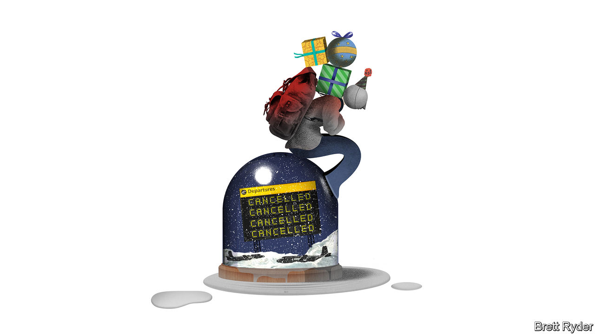

###### Schumpeter

# How to avoid flight chaos 

##### Lessons from Southwest and Volaris, two highly successful airlines that ruined the holidays 

 

> Jan 5th 2023 

Many will have seen TV footage of woebegone travellers unable to visit their families during the holidays because of a cyclone-induced meltdown at Southwest Airlines, America’s largest domestic carrier. Very few, however, know about the travel hell just south of the border at Tijuana airport, due to fog-induced mayhem at Volaris, a low-cost carrier that is Mexico’s largest airline. Your columnist does. He and Mrs Schumpeter spent much of Christmas Eve, Christmas Day and Boxing Day stranded there along with thousands of other travellers, trying to rebook cancelled flights to destinations across Mexico. For most of the time, resignation not rage prevailed. But yuletide cheer did fade when, after standing in line for 11 hours to rebook tickets, people were told by a Volaris representative they were in the wrong queue. At exactly the same moment, the company sent out a seasonal tweet: “The magic of Christmas extends to the whole Volaris family.” 

The two incidents share many similarities. Both were weather-related. They became critical on the same day, December 23rd, and dragged on through much of the holidays. Their effects were traumatic. According to FlightAware, which tracks airline activity, at its peak Southwest cancelled almost three-quarters of its flights. The thick fog in Tijuana forced Volaris to cancel 45% of flights across its network, hitting its core market—Mexican migrants returning home from America. Both airlines were caught out worse than full-service rivals. United Airlines, for example, cancelled far fewer flights than Southwest, even though both have big presences in Denver and Chicago, where the situation was particularly acute. Unlike Volaris, Aeromexico, a legacy Mexican carrier, immediately resumed flights from Tijuana when the fog lifted.

So what can be learned from the mishaps—and how can they be avoided in the future? In Southwest’s case, much of the attention has focused on its outdated technology, some of which its new CEO, Bob Jordan, had promised in early December to upgrade. But the airline industry is also human. When it stops working, it becomes all too clear how important it is that pilots, flight attendants, mechanics and ground staff are in the right place at the right time. An interview with Enrique Beltranena, boss of Volaris, provides a reminder that human problems can be at least as difficult to solve as technological ones. 

He starts with both a  and an excuse. In America and Mexico the weather problems occurred at Christmas when airlines are particularly reluctant to cancel flights because of the emotional toll on passengers. “We probably took too much time before biting the bullet and really cancelling what we had to cancel,” he admits. For Southwest and Volaris, this was a particular problem because both airlines mostly fly point to point—in other words, their planes hopscotch from one airport to the next—rather than returning to a hub, as do legacy carriers. The point-to-point model made famous by Southwest has many advantages. Planes make their money in the air, not sitting on the tarmac. A Volaris aircraft, for example, flies on average to more than five different airports in a single day. But when problems arise, it is easier to send planes from a hub to rescue stranded passengers, rather than rerouting flights from myriad airports. It is also easier to find spare—and rested—crew members. 

As Mr Beltranena explains, to stop a problem snowballing into a crisis, you need to pre-emptively scrap flights in order to quickly reroute aircraft as backup. Pre-emptive cancellation is a tough choice, though. Henry Harteveldt, president of Atmosphere Research Group, a consultancy, likens it to deciding “which one of my children am I going to throw out of the aircraft”. Both Southwest and Volaris failed to do it swiftly enough to safeguard their wider networks. You can see the cascading problems at Southwest in FlightAware’s data. They show it barely scrapping any flights in the days before the storm, and then cancellations soaring from 33% of its flights on December 23rd to 74% three days later. “Southwest came as close to doing a full airline reboot as I’ve ever seen,” says Kathleen Bangs of FlightAware. A few days later Volaris took similarly drastic measures. “We basically restarted the entire process,” Mr Beltranena says.

The next problem was on the ground. Passengers pleaded for their suitcases. But ground staff are also human. In Denver some failed to show up for work. In Tijuana, Mr Beltranena says baggage handlers put in so much overtime that they were exhausted by the time they started a new shift. Moreover, as passengers tried to rebook flights, there was a chronic lack of communication. A handful of Volaris staff were unable to handle the thousands of stranded passengers in Tijuana, and the airline’s call centre made things worse by promising to rebook passengers on flights that no longer existed. The answer, Mr Beltranena believes, will be to increase staffing, even if that leads to spare capacity in normal times. 

The biggest reboot will be to IT systems. Southwest’s crew-management technology has failed to keep pace with the airline’s increasingly complex network. Volaris’s, too, clearly let it down. Jahan Alamzad of CA Advisors, a consultancy, says the problem is that airlines have focused on creating attractive customer-facing applications, such as booking systems, while back-end ones such as those keeping track of planes, crews, maintenance and weather operate in silos. In order to reroute planes and crews in times of stress, it is important to have the complete picture in real time. 

Brace position 

New IT infrastructure is hard to install. Airlines cannot rip out the old and put in the new. Systems must be integrated. There is also widespread fear of hacking. Yet the biggest hurdle is probably, again, a human one. Airlines like Southwest and Volaris think they are exceptional. They have grown so fast that they risk becoming complacent. Freak weather may, as Mr Beltranena puts it, be an act of God. But there is no excuse not to prepare for the worst. ■


