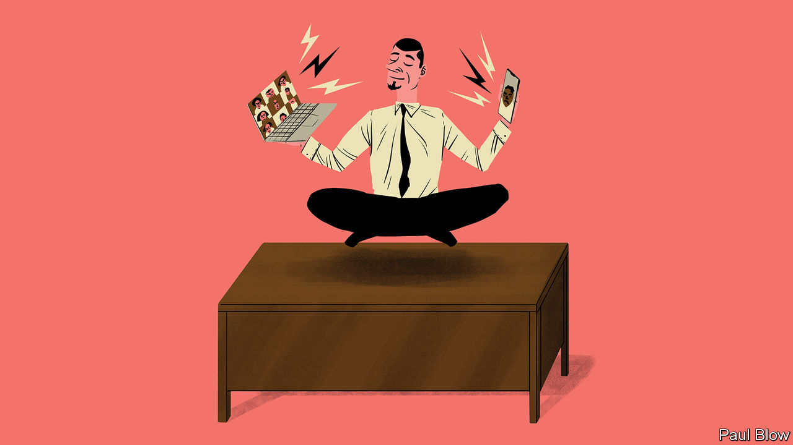

###### Bartleby

# How to have the most productive working day of your life 

##### New year, new you 

 

> Jan 4th 2023 

It’s the first full working week of 2023. You have two new year’s resolutions. First, to turn yourself into a humming machine of productivity. No more procrastinating, no more afternoon naps. Second, to maximise your own sense of well-being. A few days in, and your daily journal bears witness to a changed person, a model of self-caring efficiency. 

 Go to the gym. Leave phone at home. .

 Tell au pair to wake children, and to keep them out of your way.

 Listen briefly to the call of a whale on Spotify. Shower. Dress.

 Eat something with chia seeds. 

 Remove chia seeds from teeth.

 Enter home office. Great sense of wellness. Never felt weller.

 Turn phone off aeroplane mode and fire up laptop. Phone goes mad: missed calls, Slack messages, texts. Precisely where the day went wrong in the bad old days of 2022. Use new batching technique: respond to the oldest five emails and ignore everything else. Turn notifications off again.

 Make a list of tasks that need to be completed today. Colour-code those tasks according to priority. Chunk each of the high-priority tasks into discrete segments. Use combination of time-boxing and Pomodoro techniques to put them into the calendar for the day ahead.

 Calendar for the day is now complete. Very full few hours ahead. Get up and go for a walk around the block to avoid musculoskeletal problems. Every so often stop and look 20 yards into the distance to maintain eye health. See friend on street.

 Back at desk. Decide to find a “Study with Me” video, a recording of someone else working at their desk, as extra motivation for the day to come. Very effective technique, just need to choose the right recording. Might have one with rain pattering on the windows. Or a cat sleeping. Or logs on a fire.

 “Study with Me” recording is now playing. Went with the cats. Day is slightly off-track now. Begin first 25-minute Pomodoro session. 

 Excellent session. Get up. Stretch.

 Second Pomodoro session begins. Lasers are less focused than me. 

 Extremely bored. Try to get onto Wordle but have installed blocker on laptop that means I cannot use the site until 18:00. Only way around this is to change the time on the computer. Not sure how to do this but it cannot be that hard. 

 It is quite hard. But Wordle is done (in four tries!). Clock on computer is now totally wrong; saying it is 2024. Just need to change it back. 

 No time for second email-batching session. Lunch and well-being hour begins an hour late. Make open sandwich with rye bread, salmon, dill. Use stacked-habits advice to do two mindfulness exercises at once: self-administer head massage while listening to soundtrack of grasshopper noises. 

Activating hermit mode. Ditch Pomodoro technique: need to get at least two hours done before final email-batching session. Use timer tab to set countdown clock going on my browser. 

 Not made great progress. Feeling a bit worthless. Open the compliments folder in my email inbox to remind myself of praise I have received from colleagues in the past. 

 Starting to feel a bit panicky. As last resort use “Write or Die”, an old program that starts deleting your work if you have not met targets for word count. Helps just to get something on the page. 

 FFS. Child came in with something hairy (a rat? someone else’s hair?) glued to her hand. By the time I had shooed her out, “Write or Die” had erased most of what I had got done. 

 Have used child’s stencil set to make a very professional poster that says “Do not enter: I am working”. I will paste it on my door here. Good to get this done. Need a pick-me-up, so am going to attend laughter-therapy session that the company has been advertising. 

 Couldn’t get sound to work for some reason. Everyone looked completely mad on the laughter-therapy thing. Have logged the problem with IT.

 Third (well, second) email-batching session begins. Notifications back on, and email opened. Torrent of messages. Four calls from my boss. Hard to tell what is going on, but everyone seems upset that I have been consciously prioritising work. Typical. 

 Ring boss. I have until 9am tomorrow morning to get something done for a new client. Feel much better. If only people could just set me an urgent deadline every day. ■


