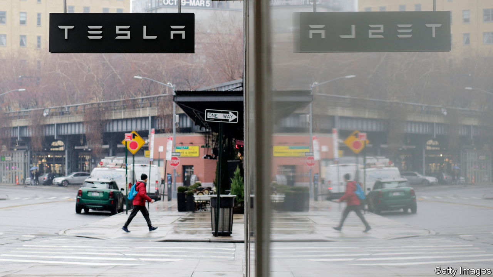
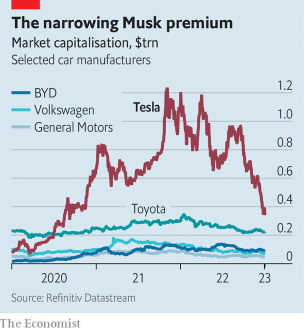

###### The Tesla conundrum

# Investors conclude that Tesla is a carmaker, not a tech firm 

##### A share-price rout suggests they no longer think it will take over the world 

 

> Jan 4th 2023 

After Tesla’s market capitalisation swept past that of Toyota, then the world’s most valuable car company, in the summer of 2020, devoted fans and incredulous sceptics deployed a new unit of measurement. As the electric-vehicle (EV) champion’s share price rose, its worth was couched in terms of the combined value of the next two, then five, then ten biggest carmakers. A year ago Tesla’s market value surpassed $1.2trn, more than most other car companies put together. Since then it has lost 71% of that—a sum exceeding the value of most of the industry. The fortune of its mercurial boss, , has shrivelled by more than $200bn as a result.

The latest blow came on January 3rd, after Tesla missed analysts’ expectations for deliveries for the third quarter in a row and reported that the gap between production and deliveries had grown, suggesting softening demand for its EVs. It lost 12% of its value—roughly $50bn, or one Ford Motor Company—in a day. Even bullish investors now doubt that Mr Musk will fulfil his promise of making 20m cars a year by 2030, or that Tesla’s ”Autopilot” is close to becoming a world-changing fully autonomous driving system. Yet the main reason for the market’s recalibration of Tesla’s prospects is a dawning realisation that the company is chiefly a carmaker—and that its boss is not superhuman.

 


Mr Musk has always regarded his company as a tech firm, a peer of digital giants like Alphabet, Apple or Meta, not of old-economy metal-bashers such as Toyota or Volkswagen. For a time, so did the market—first as tech shares soared amid the pandemic-era boom in all things digital, then as they slumped last year, after their growth began to slow and higher interest rates made their promised future profits look less valuable today. 

In the past few months, however, Tesla’s share price has suffered a sharper correction than big tech. This has coincided with its more mundane tribulations as a car business. Having managed to avoid the worst of the pandemic supply-chain disruptions, Tesla has been caught up in China’s chaotic retreat from the zero-covid policy; its big factory in Shanghai has been hit by virus-related shutdowns. And having set the course for the industry’s EV transition, it now faces plenty of competition from established rivals and a host of newcomers it inspired. Days after Tesla reported the disappointing figures, Volkswagen unveiled its id.7, a challenger to Tesla’s entry-level Model 3 saloon. 

EV-buyers, for their part, are becoming less willing than early adopters to overlook Tesla’s questionable build quality and the interior of a much cheaper car. And the natural Tesla-owners among the wealthy progressive set are less prepared to overlook Mr Musk’s libertarian antics at Twitter, which he bought in October and has mismanaged with gusto—especially now that they have plenty of conscience-salving EV alternatives to choose from.

Tesla is, in other words, no longer the only game in town—and certainly no tech behemoth. As EV-makers go, though, it still looks impressive. In 2022 it delivered 1.3m cars, 40% more than the year before, and opened two new assembly plants. It is working on a smaller, cheaper car and this year will start to deliver its long-awaited Cybertruck pick-up. And it is still worth some $360bn—about as much as the next three biggest carmakers combined. ■


