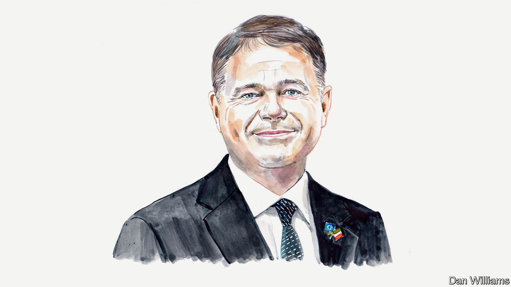

###### Europe’s economy

# Paschal Donohoe on how the euro will thrive in spite of the war in Ukraine 

##### Ireland’s finance minister says that the crisis can make the currency stronger 

 

> Jan 4th 2023 

Europe is facing a time of great challenge and uncertainty, with soaring  driving inflation to record highs. The  is great. In the midst of this, the euro is our most tangible demonstration of European strength and unity.

During the 20 years of the euro’s existence we have faced a financial crisis, a sovereign-debt crisis, Brexit and the covid-19 pandemic. At each point the foundations and architecture of the currency have been strengthened. President Vladimir Putin’s war against Ukraine, and his energy war against the West, will be another crisis from which the euro area will emerge stronger and more united.

Stewardship of our common currency is the responsibility of the Eurogroup, the informal body of finance ministers of euro area countries. It is my great privilege to have been re-elected as president of this group, and we will continue to play our role in rising to the significant challenges we now face.

Of all the largest advanced economies, the EU is bearing the fullest cost of Mr Putin’s war. Unlike in the United States, inflation in Europe is not primarily a result of excessive demand, but is heavily influenced by the price of energy. It is the first time that the euro area has faced prolonged high inflation. As finance ministers, we must act to reduce inflation, and we will. The alternative would make our citizens poorer, for longer—an unacceptable outcome. 

At the same time, our measures should accelerate decarbonisation and reduce energy dependence on Russia. The EU has already taken steps to reduce its carbon emissions by at least 55% by 2030, through modernising its emissions-trading system, investing massively in renewable energy, enabling industry and transport to use substitutes for fossil fuels and encouraging behavioural changes to reduce energy usage. These changes are necessary but certainly not sufficient.

The first priority now is to strengthen the euro area’s co-ordination of national fiscal policies between member states, to fit the goal of fighting inflation. At the Eurogroup meeting in December finance ministers agreed that measures to support businesses and households should be more focused on vulnerable citizens and firms, preserving incentives to reduce energy demand. The ministers agreed that these measures should be withdrawn as price pressures diminish; it is imperative that they do not undermine the single market or actions to tame inflation. There are different ways to achieve this: for example, a pricing model whereby firms and households receive a basic package of energy services at a subsidised price, with market prices applying for higher levels of energy consumption.

The second priority is to act on the supply side. Anything that expands our energy supplies and improves the way in which we use them will help to reduce inflation. Since the onset of the war, the EU and its member states have taken swift and decisive action, for example through the REPowerEU plan that aims to save energy, diversify its sources and build up reserves. 

Together with the European Central Bank’s (ECB’s) decisive tightening of monetary policy, these budgetary and energy policies should reduce inflation back to its 2% target, while at the same time protecting citizens, businesses and the climate. It is imperative that monetary, fiscal and energy policies act in unison. Lack of progress in one policy strand increases the difficulty for policymakers in other domains. As we learned during the sovereign-debt crisis, these spillovers are more significant in a single-currency zone, where economic and financial interdependence can often transmit a local shock to the whole region.

Third, we must make use of the opportunities that the new geopolitical realities have created. As the war is drastically accelerating our energy transition, the EU is now well placed to become the global leader in renewable energy, and for the euro to become the global currency most associated with and benefitting from the transition to a lower-carbon future.

NextGenerationEU is an €807bn ($853bn) fund, equivalent to 6% of the euro area’s GDP, to build a greener, more digital and more resilient future. This, coupled with €20bn of new grants from REPowerEU and private funding, gives us the means to build clean-energy infrastructures, transition to renewable-energy sources and improve the energy performance of our buildings and vehicles as we seek to become climate-neutral by 2050.

Europe has given itself the means to fulfil its green ambition and create the conditions for sustainable growth. We need to be mindful, however, that the support that governments provide to the economy do not undermine the benefits of free and fair global trade. As the United States takes its own steps towards the green transition, the last thing the world needs right now is a subsidy race between two close, like-minded partners.

There are reasons for optimism. The euro area economy has continued to perform well, achieving record-low rates of unemployment across member states, with growth still forecast at 3.2% for 2022. This is remarkable given that the EU went from importing 54% of its gas from Russia in January 2021 to 17% in August 2022, according to the European Commission.

Businesses have rapidly adapted. Inflation has come down for the first time in 17 months. Our currency union is expanding: on January 1st Croatia became the 20th country to adopt the euro. And work on an ECB-backed digital euro is under way to ensure that our currency is responsive to future needs.

In addition to all this, the war on European soil reminds us of the importance of standing up for our shared values: freedom, democracy and the rule of law. These values are critical to our economic prosperity and must be re-emphasised in the face of Russian aggression. 

My fellow Irishman, Bono, lead singer of the band U2, is not known for his views on economic integration, fiscal rules or price caps. But his words provide a poetic description of how Europe can work together to overcome our great challenges: “whenever you see darkness, there is extraordinary opportunity for the light to burn brighter”. ■


