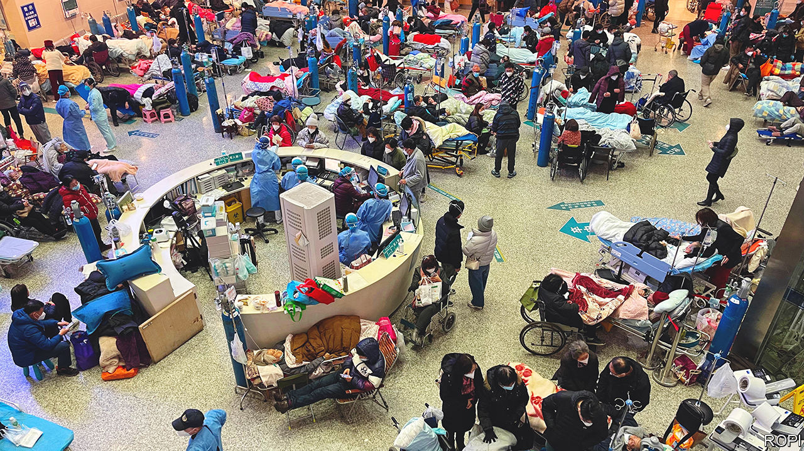
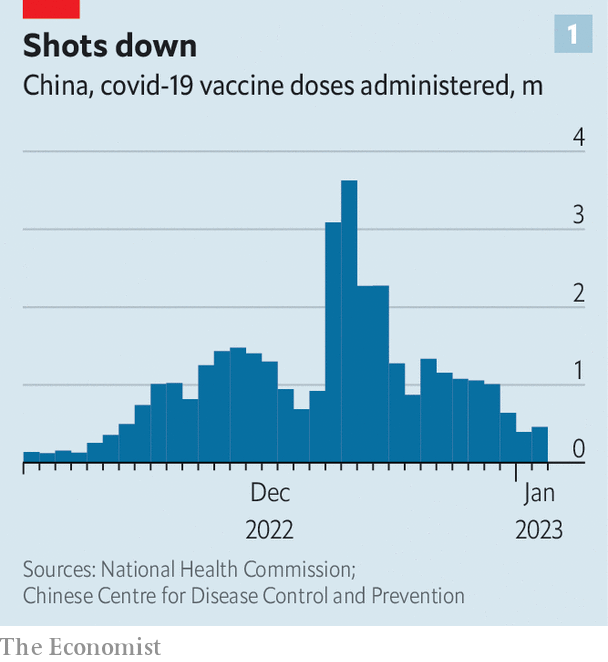
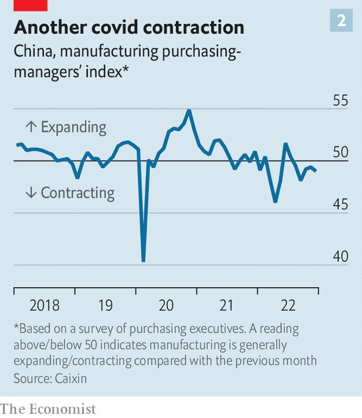

###### The tsunami

# China is overwhelmed, yet an even bigger covid wave may be coming 

##### The transition back to normal life is proving difficult 

 

> Jan 5th 2023 

Outside the People’s Hospital of Dezhou, a small city in the coastal province of Shandong, an old woman on a stretcher, breathing quickly with her eyes closed, is unloaded from an ambulance. A few minutes later she is put back into it. Her family members start calling other hospitals. There is no room at this one.

In the lobby, another family refuses to give up. “There are no beds at the moment, but let’s wait a bit,” says Mr Teng, who prefers that only his surname be used. He is trying to secure space for his father-in-law, who fell sick in late December and now has dangerously low levels of blood oxygen. The patient is sitting in a wheelchair, breathing through a mask attached to his own portable oxygen-concentrator, which is plugged into a wall socket.

A while later nurses find a spot for the Teng family, squeezed in between other wheelchairs and beds. All are filled with elderly patients, who are hooked up to drips and breathing from oxygen tanks. Most of them are infected with covid-19, says a nurse. New critically ill patients arrive every day. “Beds are in short supply everywhere at the moment,” she says. “None of us has had any rest. We’re working all the time.” Relatives are enlisted to push trolley beds and remove used bedpans. 

Similar scenes are common across China. Since December, when the country ended the lockdowns, mass testing and domestic-travel curbs of its “zero-covid” policy, the virus has spread at a blistering pace. Many young and middle-aged people have already shaken off a bout of the disease. But  are now full of people whom the virus is hitting harder. Most of them are elderly, or have pre-existing conditions such as heart disease and diabetes. They are often in a perilous state: many are under-vaccinated, if they have been jabbed at all. 

Coyly, the government calls its U-turn on covid an “optimisation of prevention and control measures”. On social media, some commenters are more forthright. They describe the upsurge of the disease as a , or tsunami. By one estimate, 37m Chinese people are catching the virus daily. The country has experienced no outbreak on anything like this scale since the pandemic began three years ago. 

When the zero-covid strategy was , the virus was proving hard to contain without imposing endless, crippling lockdowns; its now-dominant form, Omicron, is more infectious than earlier variants. As controls were lifted, cases surged in big cities. Beijing, Shanghai, Chongqing and Guangzhou have already passed their first peak of infections, according to experts in Shanghai at Ruijin Hospital and Shanghai Public Health Clinical Centre. About 70% of Shanghai’s population may have been infected, the vice-president of Ruijin Hospital reckons. State media have quoted a senior epidemiologist as saying that in Beijing the proportion is probably higher than 80%.

Such cities are better prepared for the virus than small ones. They have more trained doctors, nurses, intensive-care units (ICUs) and better supplies of drugs. Beijing, for instance, said in late December that it was giving out Paxlovid, an American antiviral that helps prevent severe sickness, to community health centres, even though the medicine is in short supply nationwide. Such drugs sell for thousands of dollars on the black market. Even basic cough medicine has become a rare and desperately sought commodity. The capital has the advantage of being in the political limelight. In recent weeks medical teams from several provinces have been sent to Beijing, drawing them away from the areas that will need them more.

The outbreak is now spreading to smaller cities like Dezhou, which have fewer medical resources, and rural areas, which will struggle even more. Many doctors in the countryside have never treated covid patients before. Reports speak of queues forming outside village clinics, where many medical workers are also infected and drugs are lacking. On December 31st the government released a plan for tackling infections in the countryside. Many of its proposals, such as stockpiling drugs and increasing ICU capacity, will be hard to implement before the virus arrives. 

It is hard to estimate the death toll. Official statistics are useless. According to them, there have been fewer than 5,300 covid deaths during the pandemic, most of them at the beginning. In the seven days before this story was published, only 13 people had died of covid, according to the official tally. The World Health Organisation has asked China to release more  on hospitalisations and deaths. Some Chinese citizens are demanding more information, too. “What’s the death rate? What’s the rate of severe illness?” asked one person on Weibo, a Chinese social-media platform. “Don’t make ordinary people face this battering without protection!”

Peak China

The Chinese Centre for Disease Control and Prevention has said that it will eventually release an estimate of excess mortality, which should indicate how many more people are dying compared with the average rate. Airfinity, a London-based data firm, estimates that around 9,000 people are probably dying of covid in China every day. It predicts the number may peak late this month at about 25,000, and that another—higher—peak of infections will occur in early March. ’s model predicts that in a worst-case scenario 1.5m Chinese people will die from the virus in the coming months. 

Demand for cremations is surging. Police in Shanghai say they have caught over 20 “funeral scalpers”, who are being paid to help people jump the queue for services. One funeral operator in Dezhou estimates that deaths have increased by 20-30% since covid restrictions were dropped. “It’s been crazy,” he says. Things were safer when the government was controlling covid, he adds. “But you can’t have restrictions for ever. And if you open, this is the course of events you have to experience.” 

China’s government insists that it was right to drop covid controls when it did. On December 29th Chen Wenqing, the country’s domestic-security chief, said that in the past three years the country’s strategy for controlling the epidemic had been “scientifically effective and completely correct”. Since the new approach was adopted, President Xi Jinping has not directly talked about the stress on hospitals or covid deaths. In a year-end speech, he merely acknowledged that “tough challenges remain”, and called for “perseverance”.

State media have been more forthcoming about pressures on medical facilities, but have emphasised the heroism of medical workers rather than the system’s many weaknesses. During a New Year’s Eve programme by Hunan province’s television network, photos of exhausted nurses and doctors were projected behind a stage as a singer belted out inspiring lyrics: “From darkness to dawn, no matter how hard, setbacks can only make me stronger!” 

 


State media also shy away from discussing whether China could have been better prepared for the lifting of covid-related restrictions, which happened just as the winter flu season was getting under way. By late November only 40% of those aged over 80 had received the three shots of vaccine required to protect them from severe disease or death. By December 21st the average number of doses being administered daily had risen to more than 3.6m compared with fewer than 140,000 at the beginning of the month (see chart 1). 

Since then, however, the campaign appears to have slowed again, with administered doses dropping below half a million per day by the start of January. Local media suggest possible reasons: workers assigned to deliver shots are getting infected, while others are being diverted to help treat the sick. It remains the case that only Chinese vaccines are permitted. Foreign ones, some of which are more effective than China’s, are still banned. 

The next challenge facing China’s doctors and nurses will be the Chinese New Year, the first day of which falls on January 22nd. Celebrations surrounding it involve the biggest family get-togethers of the year: millions will leave China’s big cities and travel back to towns and villages where many people are elderly, immunisation rates are lower than in cities and natural immunity barely exists. 

A B-list virus 

At least one county (in Hunan province) has urged people not to return for the holiday “unless necessary”. The central government, however, is showing no sign of wavering. In contrast to its stance during the zero-covid phase, it has not tried to deter people from heading to their home towns. On January 8th it will begin managing covid as a “class B” disease, like HIV and hepatitis, rather than “class A”, which includes bubonic plague and cholera. This will involve abandoning the biggest remaining legacy of the zero-covid era: stringent quarantine requirements and pandemic-related visa restrictions that have made it extremely difficult for most foreigners to enter the country for nearly three years. The change will also apply to quarantine requirements for crossing the border between mainland China and Hong Kong. 

Several countries, including America, Britain, India and Japan, have announced coronavirus-testing requirements for visitors from China. Morocco has shut its doors to them entirely. China says these measures are unscientific and politically motivated. It is true that testing all arrivals from China is not very useful. That said, Chinese official indignation is complicated by rules requiring negative covid tests from all travellers into China. Covid-related spats threaten once again to bedevil China’s fraught relations with the West. 

But trips abroad are likely to increase rapidly. For much of the past three years people in China have been deterred from travelling overseas by the difficulty of returning, and by Chinese officials’ efforts to dissuade them from leaving the country except for essential purposes. On January 8th the police are due to resume issuing passports to outbound tourists. Members of a cosmopolitan class of young, wealthy Chinese, long starved of opportunity for international travel, may seize the chance. (Travel sites report a big increase in searches.) The  with the outside world is perhaps the final major step needed before the post-pandemic era can truly be said to have started. 

In China, the transition back to normal life is already proving difficult. There is a sense of euphoria that restrictions are being lifted. But fear remains. Central shopping districts in many big cities appear empty during the day. Over the three-day public holiday around January 1st, the number of domestic trips was barely higher than a year earlier, and less than 45% of the pre-pandemic figure. At cinemas, box-office sales were down by nearly 46% (even though the biggest draw, Hollywood’s “Avatar: The Way of Water”, has been highly rated by Chinese viewers). 

But nightlife has picked up as the threat of quarantine disappears. Images of packed bars and crowds of new-year revellers in cities across the country have circulated on Chinese social media. It is possible that many of China’s young people will try to party through the worst of the exit wave, even as hospitals fill up. 

 


While the disease spreads, it will be hard to keep production lines running and lorries on the road. Covid is already ripping through factory towns and causing serious disruption. Local governments and company managers are battling high infection rates on factory floors. In late December suppliers in major exporting provinces such as Guangdong, Zhejiang, Shandong and Jiangsu faced severe delays, according to , a Chinese magazine. Many home-appliance makers, for example, were operating at 20-50% capacity, the publication said. Its purchasing managers’ index, a gauge of the manufacturing sector, suggests a contraction in activity (see chart 2).

Factory bosses are weathering the storm as best they can. Mr He (who also prefers to give just his surname) runs four plants with a combined 600 workers in the provinces of Guangdong and Sichuan, where he makes paper packaging for high-end alcohol and cigarettes. By December 19th more than 50% of his workers in Sichuan had fallen ill, forcing him to shut his plants for four days. The factories in Guangdong fared better: just half the production lines were closed for a few days at the end of December. Mr He’s operations are now getting back to normal. He has even resumed business travel and is meeting clients for drinks.

Another worry is that workers could be forced to quit to take care of elderly family members living far from the factories. As China proceeds with its flash exit from zero-covid, manufacturing hubs could experience some short-term shocks to labour supply, as workers head home earlier than expected for their Chinese New Year break. They may also delay their return. 

Local-government intervention may also pose a risk to business. Some executives worry that, as cases surge, officials may begin to seal off their towns. Even within towns, traffic from one district to another might be restricted. That would interrupt the connectivity that makes Chinese cities so efficient for manufacturers.

Predicting how long such disruptions may last is difficult. The stunning collapse of the zero-covid policy means the route to economic recovery will be bumpier but quicker than many originally expected. Analysts have been bringing forward their projections of when the corner will be turned. Many economists think that the worst will be over by late March. At that point a recovery will begin that could gain strength later in the year.

New propaganda needed

An economic rebound would be seized on by the Communist Party to shore up battered faith at home in its propaganda line, which in zero-covid days emphasised Western “chaos” in the face of the pandemic compared with China’s “order”. Officials must worry as they assess the cacophony that is erupting on Chinese social media about the current outbreak. Explicit criticism of the government is muted (as always, censorship helps to crush it). But the torrent of praise that zero-covid once elicited, at least until 2022, when many people began to balk at the growing number of lockdowns, has not been replaced with similar applause for the about-face. 

 


Even among the government’s most ardent online cheerleaders, hints emerge of surprise at the way the country’s exit from zero-covid is playing out. “The tsunami of infections caused by Omicron in Beijing has surpassed expectations,” wrote Hu Xijin, a nationalist former newspaper editor, on his Weibo account on December 25th. Concerning the covid-related deaths of old people he told his nearly 25m followers: “This kind of price causes people sorrow.” Another Chinese journalist, with nearly 1.9m followers, called the relaxation of covid controls “chaotic” and “ill prepared”. On December 29th a neo-Maoist website, Utopia, published a commentary accusing the government of ditching its strategy too swiftly. “We’re not a racing car, but a big bus full of old, weak, ill and handicapped people,” it said. “A smooth and steady transition is extremely important.” The article has been deleted. 

On Weibo, many commenters have been turning on people they call , or lying-flat bandits. The term refers to sceptics of the zero-covid policy, who are accused by pro-party types of wanting to lie down and accept the spread of the disease. Those who joined demonstrations against zero-covid measures that took place in several cities in late November are said to belong to the bandit group. The central government clearly is nervous that it might be deemed a member, too. Searches for the term  were already being blocked by social media in November, before the government made fully clear that it was ditching its covid policy. To evade the censors, users now use homonyms.

A few stick their necks out. “You’re so good at talking rubbish with your eyes wide open,” said a Weibo user in Guangdong province with more than 320,000 followers. He was referring to an official spokesman’s claim that the state had prepared for the change in policy. “You’re always just thinking of putting gold on your face. Aren’t you just treating the common people like idiots?” The censors have scrubbed that one. They will have a lot more work to do in the months ahead. ■


