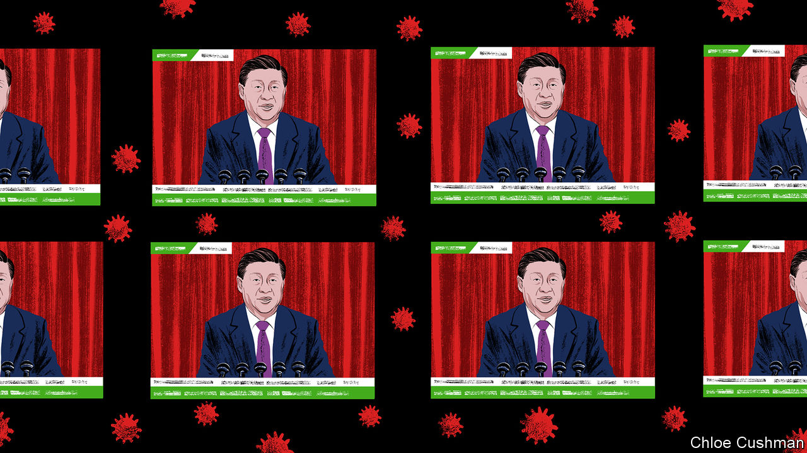

###### Chaguan

# The Chinese Communist Party plans to avoid a zero-covid reckoning 

##### Like Chairman Mao, Xi Jinping seems to believe that China’s rise trumps individual suffering 

 

> Jan 5th 2023 

Across China, families are enduring avoidable misery and heartbreak, as loved ones succumb to a deadly—and predictable—wave of covid-19 infections for which their rulers failed to prepare. Some overseas analysts talk of a turning-point. They wonder if today’s policy disarray, which follows on the heels of anti-lockdown protests in late 2022, signals a crisis of legitimacy for President Xi Jinping and the Communist Party. 

This is a grim moment for China’s people. For all the claims that infections have peaked in big cities like Beijing, there will, tragically, be more deaths when the virus finds older folk now sheltering at home, or living in rural villages. A shameful number of those deaths will be preventable. Yet it is possible that Mr Xi will pay no visible price for pandemic horrors on his watch.

Many outsiders were taken aback by the Chinese public’s broad tolerance of zero-covid controls, notably in the first two years of the pandemic. Even the months-long lockdown of nearly 25m people in Shanghai, in the spring of 2022, was shrugged off by many other Chinese. Zero-covid was, in essence, a giant utilitarian experiment. In a huge country with a weak health system, its harsh, often arbitrary controls did save lives. Most of the time, in most of China, life was relatively normal. The suffering of unfortunates living in closed cities or hauled off to quarantine camps was not much discussed or (owing to censors) widely known. 

The best explanation for zero-covid’s unplanned end involves a similar weighing of numbers. A dangerously broad cross-section of the public grew sick of controls that no longer worked, as the virulence of the Omicron variant disrupted life and wrecked the economy in too many places, and oases of normality shrank. Protests offered proof of this exhaustion. But in truth authorities were losing control of covid before demonstrators hit the streets.

The party’s information monopoly helps it conceal how it wasted 2022, failing to raise vaccination rates or prepare hospitals. No opposition or free press exists to challenge the National Health Commission’s sudden claim, in the  of January 3rd, that the country has 12.8 intensive-care beds per 100,000 people, though the same commission said in November that there were fewer than four such beds per 100,000. China calls two home-grown covid shots “full vaccination”; most Chinese do not know that a World Health Organisation boss last month called that dose “just not adequate”, especially for the over-60s.

Nationalism continues to generate bad policy. On January 3rd China’s foreign ministry rejected an offer by the European Union to donate advanced vaccines, tweaked to tackle Omicron. A spokesperson snapped that Chinese vaccine supplies are “ample”. A day earlier, China’s embassy in Paris challenged the notion that imported mRNA vaccines are more effective than China’s shots (though they are and would save lives if used). Rehashing an anti-vaxxer talking-point, the embassy scorned Pfizer’s boss for catching covid, twice, after receiving his own company’s vaccines. Actually, nobody claims that mRNA shots prevent mild infections. 

The party has worked to portray outsiders seeking transparency as hostile and ill intentioned. While verifying reports of covid deaths far in excess of official statistics, an colleague was scolded this week by a worker near a Beijing crematorium. With sincere anger, the man called death a private matter and, using a stock propaganda phrase, told the foreigner to “go report something involving positive energy”.

Public opinion is not monolithic. Online, cheerleading state-media reports about heroic doctors and nurses co-exist with widespread public cynicism about official pandemic statistics, for instance, and incredulity when many pharmacies and clinics recently ran out of even basic fever-reducing medicines. 

Still, most urban Chinese under 40 have known life only in a country growing more prosperous and stronger, and that is a unifying experience. The party is tireless in harnessing such pride. Some months ago, the China Media Project at the University of Hong Kong, an invaluable propaganda-studies centre, spotted a revealing official commentary defending zero-covid. Reposted online by leading party media, it revived a long-forgotten argument advanced by Chairman Mao Zedong in 1953. Impatient with party elders fretting about high taxes levied on peasants to pay for China’s intervention in the Korean war, Mao dismissed the or small benevolence, of worrying about immediate concerns like taxes, next to the , or great benevolence, of giving the masses a motherland that stood up to American imperialists. The commentary called the sacrifices of zero-covid an example of great benevolence in the people’s long-term interests.

An autocrat’s definition of benevolence

Mr Xi appears to subscribe to the same logic. In a year-end televised address, he nodded to “tough challenges” ahead in a new phase of covid-management, before pivoting to the glories of living in a rising China, hailing everything from the Beijing Winter Olympics of 2022 to the launching of new spacecraft and warships. He then praised early Communist Party revolutionaries for enduring hardships, and noted that one of his favourite phrases is: “Just as polishing makes jade finer, adversity makes one stronger.”

Mr Xi’s insouciance about suffering in a great cause is chilling, for the same logic might be used to justify any autocrat’s cruellest whim. It is also a bet that China’s national rise, his core claim to legitimacy, will continue. Expect the party to trumpet that the country is swiftly returning to economic growth as covid controls vanish, and to censor and demonise all those exposing its blunders. Already officials offer hollow boasts about new covid policies that “put the people first and put life first”, while busily hiding needless deaths. Mr Xi may yet face hard-to-see costs when it comes to public trust in his rule. But if the party retains absolute power after memories of covid fade, that is a bargain it will take. ■


