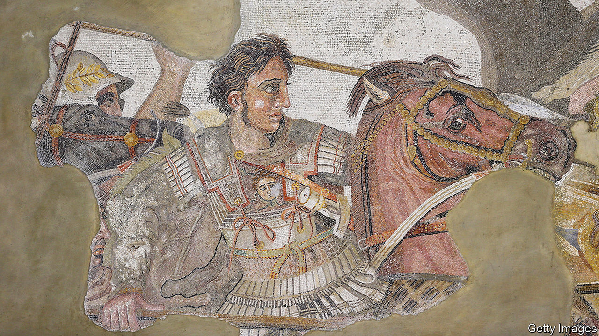

###### Kings of the world

# Alexander the Great and the birth of the modern world 

##### A new museum in Greece raises questions about the arc of ancient history—and the legacies of empire 

 

> Jan 5th 2023 

In a misty stretch of northern Greek countryside, wedged between forested hills and a coastal plain west of Thessaloniki, is the modern village of Vergina. But Angeliki Kottaridi, who has spent a lifetime digging here, prefers the spot’s ancient name, Aigai—pronounced —meaning goats, which still abound nearby. The place was utterly obscure until  from its damp earth about half a century ago. 

As a 20-year-old student, Ms Kottaridi witnessed an electrifying moment in : the discovery in 1977 of a royal tomb, complete with golden artefacts and beautiful frescoes, which, controversially at first, her mentor Manolis Andronikos identified as the resting place of Philip II of Macedon. Inheriting Andronikos’s mantle, Ms Kottaridi and her team have since dug out a royal palace three times the size of the Parthenon; dozens more royal tombs and over 1,000 regular ones; and a theatre that must be the site of Philip’s assassination during a wedding feast in 336bc.

He was succeeded by his 20-year-old son, Alexander (pictured in a mosaic from Pompeii). The rest is world history: by the time he died in 323bc, Alexander the Great commanded an empire stretching from Egypt to the Hindu Kush. A new museum that opened on December 19th explores his family’s accomplishments—which, Ms Kottaridi insists, went well beyond conquest. For her, the capital of ancient Macedonia was the prototype of a kind of urban civilisation that later stretched from the Maghreb to Central Asia. Her work, and the museum, challenge conventional views of ancient history—and raise pointed questions about the legacies of empire. 

Despite its brevity, Alexander the Great’s reign has always been revered. Turks, Arabs and Persians call him Iskander, a popular name for people and places. An exhibition now at the British Library in London recalls the many ways in which Alexander’s tale has been told, from medieval manuscripts to modern animation. For Ms Kottaridi, two aspects of the monarchs’ story are especially intriguing. 

First, the efficiency with which Philip forged a sophisticated, money-based society from a group of rough herdsmen. As Alexander once told his soldiers, his father “found a tribe of impoverished vagabonds, mostly dressed in skins, feeding a few sheep…He made you city-dwellers, he brought you law, he civilised you.” 

The second is the way rapid urbanisation of the kind Philip fostered was repeated across the so-called Hellenistic world—in other words, throughout the successor states, tinged with Greek influence, into which Alexander’s empire dissolved. The Macedonian conquerors, says Ms Kottaridi, bequeathed a distinctive form of urban society: not as  or sovereign as golden-age Athens, but endowed with well-functioning institutions, ample public amenities and a civic pride in which people of many languages and faiths could participate. As a panel in the new museum puts it, Alexander’s expeditions “would transform the age-old clash between Europe and Asia into the most creative synthesis and coexistence of cultures that the world had ever seen”. 

The arc of ancient history is typically sketched very differently. The focus is generally on the Hellenic city-states that flourished in the fifth and early fourth century BC: Athens above all, but also Corinth, Thebes and warlike Sparta. From this perspective, the rise of Philip and Alexander, who subordinated the southern Greek cities, was a retrograde turn. In Ms Kottaridi’s view, the Greek city-states had been exhausted by internecine fighting. The cosmopolitan cities that developed in Alexander’s wake represented an advance. 

Privately, she goes further. Hellenistic cities, she says, played a vital role in shaping today’s religious world, as hubs of early Christianity and, arguably, of Buddhist culture too. For example, the Indo-Greek kings who held sway in what today is the Pakistani Punjab not only practised Buddhism; they actively propagated that faith and its artistic expression.

To help visitors grasp this scope, the museum presents giant video footage of Hellenistic remains in the Levant and points east. This is the first step, Ms Kottaridi says, in the assembly of a huge digital exhibition of the Hellenistic era. Amid the weapons, jewellery and utensils, perhaps the finest physical artefact is a sculpture of Philip’s mother, Queen Eurydice, clad in flowing robes. As a model for the portrayal of royal or divine women, this artistic form recurs widely, not least in depictions of the Virgin Mary. The museum’s inner courtyard is an exact reproduction, using many original parts, of the upper floor of the palace, the nearby site of which should open to the public soon.

Does Ms Kottaridi exaggerate the Hellenistic cities’ role as the crucible of the modern world? Quibblers might point out that Christianity, Judaism and Islam all kicked against the polytheistic Greek spirit spread far and wide by the conquering Macedonians. Yet at a minimum, Hellenistic culture was a catalyst for the development of these faiths, which partly evolved in great cities such as Alexandria in Egypt.

The legacy of the Macedonian kings in the eastern reaches of the Greek-tinged world—where from 200BC people read Greek literature and practised Buddhism—is also contested. In an echo of disputes over later colonisers, Indian scholars are understandably averse to the idea of Alexander as leader of a “civilising mission”. 

As Meenakshi Lekhi, an Indian government minister, recently told a conference, exchanges between Greek and Indian cultures long predated his conquests. According to Yaamir Badhe, a classicist of Indian origin, those Homer-reading Buddhists should not be seen as the spearhead of Western imperialism. Rather, they were a creative presence in a local culture marked by openness to outside influences. 

That is exactly the sort of sweeping historical discussion that Ms Kottaridi’s new museum hopes to stimulate. Rural Greece may seem an odd starting-point for such debates—but then, it was an unlikely base for world conquest. ■


