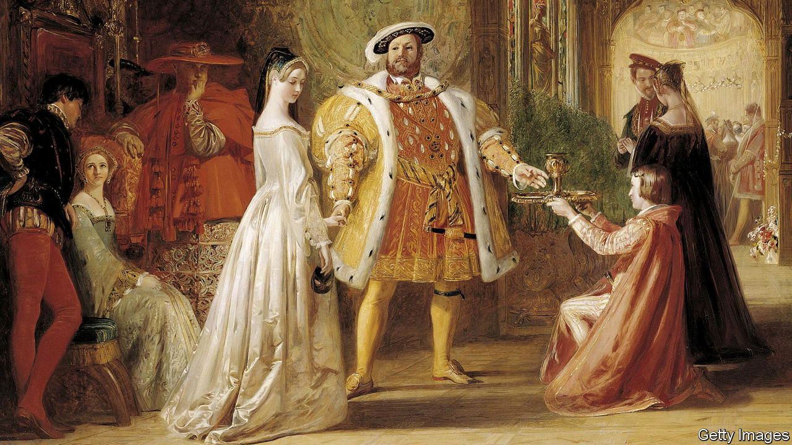

###### Courtly love

# For the Tudors, love was an elaborate game 

##### And sometimes a deadly one, as Sarah Gristwood’s history shows 

 

> Jan 4th 2023 

By Sarah Gristwood. 

As  “The Edifying Book of Erotic Chess” shows, chess once carried a more thrilling charge than it does today. The pages of this 15th-century manual, which mingle poetry with lechery and a touch of hard-core pawn, also make something else clear. If chess used to be more erotic, then the erotic used to be more chess-like, too.

In bygone centuries aristocratic love was not merely a thing of passion but a complex and courtly game, played with knights and bishops, in which the most dazzling figure might be the queen—but the most important was the king. Anne Boleyn forfeited her head not merely because she failed to produce a male heir but also, argues Sarah Gristwood in “The Tudors in Love”, because she had lost at the game of courtly love. For it, like chess, was played until one side or the other was routed.

Few people are much interested in courtly love today.  galloped into battle in Arabia with a copy of Thomas Malory’s “Le Morte d’Arthur” in his saddlebag; John Steinbeck rewrote Malory using a ballpoint stuck into a goose quill. But the mannered pantomime of courtly love, with its Guineveres, gauntlets, Lancelots and favours, has, on the whole, fallen out of fashion. This, Ms Gristwood argues, is a shame, for it is impossible to understand the Tudors—not to mention ,  and the rituals of modern romance—without considering Renaissance-era love, above all the courtly kind.

Yet much like the ideal courtly maiden, the precise definition of courtly love is hard to pin down. It seems to have begun as a literary trope among French troubadours, before an 11th-century ecclesiastical clampdown on sexuality apparently caused a literary ideal to become a pragmatic one. Carnal romping was out; largely chaste mooning around was in.

However, the  of the “gentil knight” was not always as pure, nor the knight so gentil, as the literary ideal implies. Take William IX of Aquitaine, grandfather of Eleanor, seen as “one of the most courtly men in the world”. A quotation from William musing on his beloved has survived: “God let me live long enough to get my hands under her cloak!”

Soon, courtly love was popular enough to have its own genre of slightly creepy self-help guides, including one that offered a series of points on how the infatuated courtly lover should behave. Rule two advised that “He who is not jealous cannot love.” Point 15 explained that “Every lover regularly turns pale in the presence of his beloved.” Few things shout unbridled passion like a numbered how-to list.

This book is itself passionately written (at times a little too much so—it would have been a better book with fewer exclamation marks). Desire and matrimony clearly skewed Tudor history, and there are moments when courtly love itself seems to have done so. The prolonged smouldering of Henry VIII’s feelings for Anne adhered to the courtly code, as did the flirtations with courtiers that contributed to her downfall. In  hands, Ms Gristwood writes, courtly love became not a game but “a tool”. 

In the end, though, its divorce from reality is the big problem with courtly love. Often it feels like a contrived conceit with which the showy elevated their lusts. It is a relief when, as the book progresses, later writers such as Shakespeare and Erasmus—still widely read and admired today—pop up to laugh heartily at the genre. 

But perhaps courtly love foresaw its own demise. As rule 17 in that list had it, “A new love puts to flight an old one.” That goes for literature as well as paramours. ■


