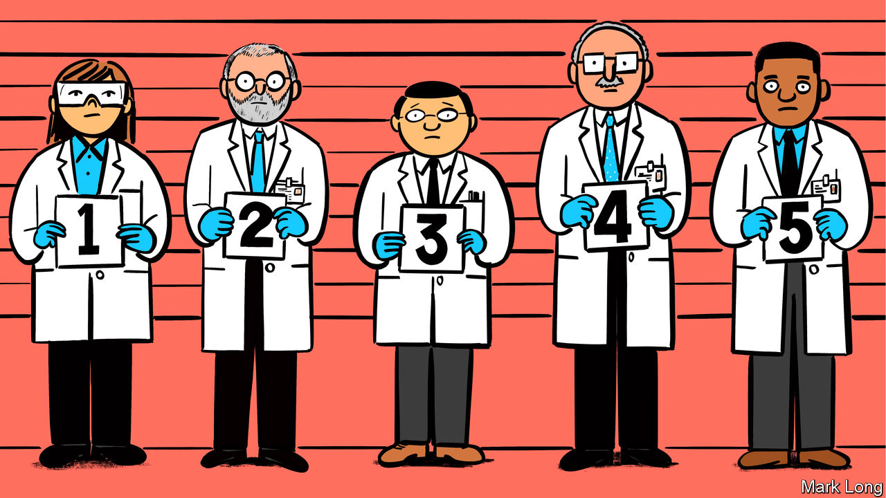

###### Genetic engineering

# “As Gods” is a valuable primer on a controversial science 

##### Matthew Cobb illuminates the moral issues raised by genetic engineering 

 

> Jan 5th 2023 

By Matthew Cobb. 

In 2018 He Jiankui, a Chinese biologist,  around the world when he announced the birth of the first genetically modified human beings. Using a new and powerful gene-editing technique called CRISPR-Cas9, Dr He had tried to recreate mutations in the babies that are known to confer resistance to HIV, the virus that causes AIDS.

Dr He may have been expecting plaudits. Instead, . Geneticists decried the experiment (one called it an “ethical fiasco”). The gene editing turned out to have gone wrong, introducing new, never-before-seen mutations in the babies instead of the intended ones. And, crucially, Dr He’s tweaks are heritable, meaning the children will pass on the botched edits to their own offspring. In 2019 he was sentenced to three years in prison and a fine of 3m yuan ($435,000).

Apart from nuclear physics, which has empowered a handful of leaders to destroy civilisation, few branches of science have inspired as much public dread and disputation as genetic engineering, which allows tinkering with the stuff of life itself. These moral concerns animate a new book by Matthew Cobb, a zoologist at the University of Manchester.

“As Gods” is a history of both genetic engineering and the worries—justified, dubious and sometimes outright conspiracist—it has provoked. The technology has . The insulin needed by diabetics is now produced by modified bacteria, for instance, instead of being laboriously harvested from pig corpses. Modified viruses carrying fixed versions of malfunctioning genes have been able to cure some rare diseases, such as spinal muscular atrophy, for which a genetic-engineering treatment was recently approved in Britain.

But there have been many setbacks, too. The tide of money that flowed into the field from the 1970s raised expectations that were bound to be disappointed. Research has been plagued by imprecise tools that are hard to use well. Genetics as implemented by Mother Nature has proved to be a knotty, Heath Robinson nightmare, with individual genes affecting many of an animal’s or plant’s characteristics at once, often unpredictably.

Meanwhile, though scientists can in effect read the letters of the genetic code, translating them into meaningful words and sentences has been much harder than most observers would have guessed 30 years ago. Genetically modified crops have been a mixed bag; genetic therapy for the sick has failed more than it has succeeded.

Mr Cobb rattles through these developments briskly, accessibly explaining the molecular basics of gene editing and all sorts of possible uses for it, from fixing the mutations that cause diseases to turning bacteria into drug factories. More advanced and speculative ideas include “gene drives”—bits of genetic information that do not obey the usual rules of natural selection, and have been proposed as a way of wiping out pests —and the long-standing dream of human genetic enhancement.

There are glitches in this book as there are in the science. The discussion of Dr He’s work feels polemical and a bit overwrought; that ends up diluting its impact rather than amplifying it. The occasional technical term goes unexplained in Mr Cobb’s otherwise readable prose. Some of his objections to human genetic engineering are based on the observation that the tools involved are, for now, rather unreliable. That is an important obstacle—but readers may be more interested in the bigger question of what could or should happen if those problems are solved.

Nevertheless, “As Gods” is an excellent primer for anyone seeking a well-informed discussion of the moral implications of this enduringly controversial science. Readers are left with the impression that, for all the breakthroughs, it has yet to live up to its promise. It is still worth pondering what might happen if—or when—it ultimately does. ■


