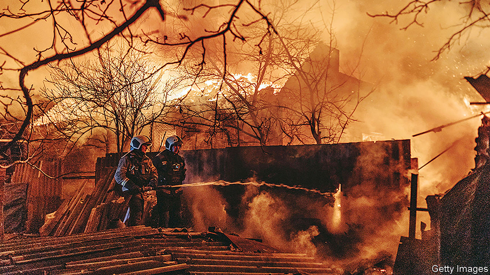
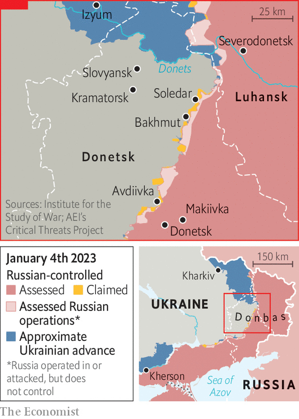

###### Hills to die on?

# A Russian warlord’s savagery is sending a loud message to Moscow 

##### Russia is bleeding, but reinforcing 

 

> Jan 4th 2023 

THE LINE between life and death on the muddy hillocks south of Bakhmut, in eastern Ukraine, is thin. For Yaroslav Hervolsky,  in a Ukrainian evacuation brigade, it can be indistinguishable. For two-and-a-half months now, Mr Hervolsky has headed under artillery fire into the mud to retrieve colleagues, dead or alive. The job has offered little respite. In mid-December a successful Ukrainian surge pushed Russian forces back a kilometre beyond the boundaries of the town. But it made little difference to Mr Hervolsky’s workload,  continuing at the level of dozens daily. Now the Russians are attacking again, and the bodies are piling up. “It’s hard to describe the feeling,” he says. “Forty bodies stacked up on top of one another. Diesel, blood and rotting flesh. It’s a fucking mess, and you never know if you will be next.”

The front line near , a small and tired town 70km (43 miles) north of the city of Donetsk, is currently the most fiercely contested section in Ukraine. It offers little justification for the deaths of so many, which have been running at hundreds daily when Russian losses are included. The town has only limited strategic value, offering little but a source of water and a road-transport hub. 

Its real significance lies far away in Moscow, as a proving ground for President Vladimir Putin’s associate Yevgeny Prigozhin and the Wagner Group, his shadowy mercenary army. Recruiting from convicts and mobilised soldiers, Mr Prigozhin has taken command of the Bakhmut front, and is using it to demonstrate his own bloody vision of the future. But far from everyone in Moscow is happy, not least the military and political leaders whom the warlord has taken to criticising openly. 

The extent of collaboration between Wagner and the Russian armed forces was for a long time unclear. But Wagner found a way of co-operating with Russia’s military hierarchy in late autumn. According to Serhiy Cherevaty, a spokesman for Ukraine’s eastern command, this moment coincided with the appointment of a new operational commander, General Sergei Surovikin, a hardliner whose candidacy Mr Prigozhin had lobbied for. Wagner started to be supported by the regular military logistical network, says the spokesman, and even began to fight alongside elite units of the regular Russian army in strike groups. But recent reverses near Bakhmut and problems with logistics appear to have strained the relationship once again.

In late December Wagner released a video showing two of its fighters voicing a staggering attack on the commander-in-chief of Russia’s armed forces, General Valery Gerasimov. The soldiers, who concealed their identities with scarves but appeared to be fighting near Bakhmut, claimed that Russia’s top soldier was holding back munitions. “We are fighting the entire Ukrainian army, and where are you? There’s only one word to describe what you are—a faggot.” Loyalists condemned the outburst. But Mr Prigozhin later made a point of publicly backing his men. 

A Ukrainian missile attack on a barracks in Makiivka, 60km from Bakhmut, on New Year’s Day has fuelled yet more nationalist criticism of the Russian military leadership. The early-morning strike, courtesy of at least four Western-supplied HIMARS high-precision missiles, killed scores of (mostly newly mobilised) soldiers. Russia has said that 89 died; Ukraine says the figure is at least 400. Igor “Strelkov” Girkin, the eccentric former intelligence officer largely responsible for the outbreak of war in the Donbas region in 2014, said he had warned Russian generals about the likelihood of HIMARS strikes on barracks. “They [the generals] are untrainable in principle,” he barked. Some in Russia have sought to blame the new recruits for their own demise, speculating that Ukraine was able to identify the barracks because the soldiers were, against orders, using their mobile phones. 

 


Mr Girkin has a solid following among nationalists, but officials in Moscow are far more worried about the continued rise of Mr Prigozhin’s star. That concern intensified in October and November, says Tatyana Stanovaya, a political analyst in Moscow, when people in the presidential administration saw the former convict establish a direct channel to Mr Putin. “Prigozhin is attacking governmental institutions with what amount to revolutionary positions, and that is frightening for many of them.” 

The defence minister, Sergei Shoigu, himself a regular target for Wagner’s criticism, appears to be taking few chances, and has sent his own mercenary grouping, Patriot, to fight in the Donbas. Ukraine’s spokesman Mr Cherevaty says the exact role the Patriot force will play is unclear. “It seems likely, however, that they have been sent to counterbalance Wagner.” 

In recent speeches, Mr Putin has underlined the primacy of the regular military leadership. But he appears unconcerned by the dangers of Mr Prigozhin’s uncompromising alternative, says Ms Stanovaya. “Putin sees him as someone able to rouse the nation, and as a representative of some strange civil society.” For the time being, the ex-convict remains firmly in Mr Putin’s orbit. But if Mr Putin was once seen as invulnerable, persistent rumours that he has cancer and doubts about his military judgment mean that is no longer the case. If the position on the battlefield gets significantly worse, a power struggle could break out.

The more immediate response to Russia’s serious and deepening military problems in Ukraine, however, is likely to be a new wave of mobilisation. Ukraine believes that this could start within days; its defence minister, Oleksii Reznikov, suggested last week that it could be accompanied by the announcement of martial law. Bakhmut seems certain to bear the brunt of any increase in numbers, as it already has done for months. “One day they are in disarray, the next they are replenishing, that’s always been the rule,” says Mr Hervolsky. “We struggle on. But there seems to be no limit to the amount of shit they can throw at Bakhmut.” ■


