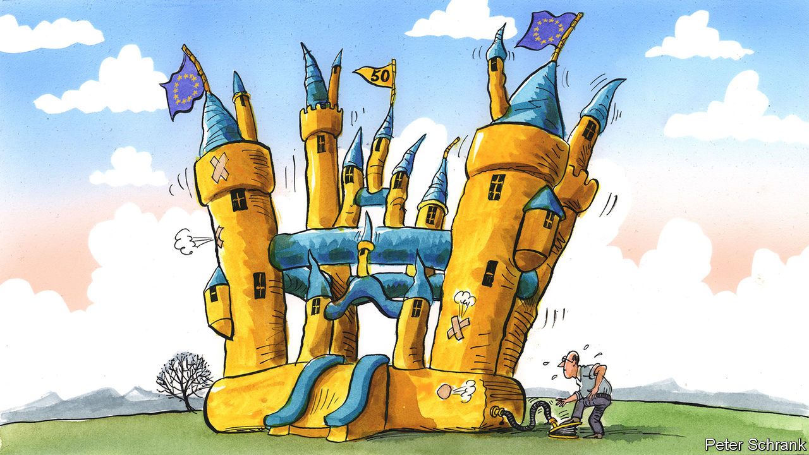

###### Charlemagne

# Fifty years ago, the EU cracked the secret of its current success 

##### Enlargement has kept Europe dynamic and relevant 

 

> Jan 5th 2023 

When six western European countries including France and West Germany created the European Economic Community (EEC) in 1958, their combined population accounted for a touch under 6% of the world’s then 3bn people. A lot has happened in the ensuing 65 years, from German reunification to an extra billion or so Indians and several rejiggings of the global order. One constant has remained: the club today known as the European Union represents a touch under 6% of the world’s now 8bn people.

This is not because of the French authorities’ repeatedly dashed hopes for a continuous baby boom. Rather, of the 447m people now living in the EU, half are from 21 countries that acceded as part of seven waves of new entrants. The start of 2023 marks the 50th anniversary of the first enlargement. This ought to be the cause of champagne-popping in Brussels, a town that rarely misses an opportunity to celebrate a past milestone; a bash was recently held to mark the 35th anniversary of Erasmus, a university-exchange programme. Instead, a muted mood prevails. That is in part because the biggest joiner of the 1973 intake, Britain, later became the only country to leave the club. (Ireland and Denmark remain.) Nor is everyone a fan of enlargement, which has made the EU bigger but also more unwieldy. The prospect of another ten or so entrants being let in—mostly smallish states in the Balkans but also Ukraine, a country of 44m people—is as terrifying to some existing members as it is exhilarating to others.

That mix of (mainly) exhilaration and (a bit of) terror is how Anne Anderson, who joined the Irish diplomatic service just two months before accession, describes the mood in Dublin as 1973 dawned. “We wanted to show Ireland had earned its place at the table,” she said at a recent event in Brussels put on by the Irish and Danish representations to the EU. Like Denmark’s, Ireland’s membership of the club has been a triumph, helping propel the country from agrarian conservative backwater to confident world-beating service economy. Joining the EU has proved “transformative for Ireland in every way: economically, politically, in terms of liberation for Irish women”, says Ms Anderson. For example, an old Irish rule that forced women to resign from the civil service on marriage soon fell foul of EU law. That turned out to be good news for Ms Anderson, who would go on to represent Ireland at the EU, then become her country’s first female ambassador to America. 

Being part of the EU shook up its incoming members. “1973 was a case of saying goodbye to the old world,” says Connie Hedegaard, a former EU commissioner from Denmark. But the new members in turn shook up the club they were joining. The first accession proved that the European project could push beyond the confines of Charlemagne’s empire, the rough footprint of the first six EEC countries (France and Germany plus Italy, Belgium, the Netherlands and Luxembourg). A tradition of common law in Ireland and Britain needed to be accommodated; a friendlier approach to America, too. And a template now existed for future joiners. In the 1980s Greece, Portugal and Spain were let in. All three had been dictatorships just a decade before accession. A big batch in 2004 anchored swathes of eastern Europe to a brighter future. 

Enlargement is sometimes described as the EU’s most successful foreign policy: the prospect of joining the bloc has acted as a carrot, keeping neighbours on the path of reforms needed to do so. That is true, but it also belittles the way in which those countries have strengthened the EU once inside. 

The French in particular complain that an ever-wider union has made it impossible to develop an ever-closer one. To them, enlargement was a British ploy to ensure the EU could become little more than a free-trade area. But size has given the union heft it would not otherwise enjoy. Had the union resisted enlargement, would the vaunted “Brussels effect” exist, whereby regulation devised in the EU capital in effect becomes a global standard? Sanctions against Russia would carry less bite, the single market would stretch less far, trade deals might be less advantageous. True, decision-making can be slow, particularly in areas where unanimity among EU members is needed. When the decisions are eventually taken, however, a larger union makes them more potent. 

Enlargement is not cheap. Of the 19 members let in since 1973, all but three get more money from the EU than they pay into it. Against that, eastern Europeans drive up economic growth as they converge towards Western living standards. Some newer member states—bolshy Poland and autocratic Hungary come to mind—have dampened enthusiasm for later enlargements, not to mention appetite for future ones. But Ireland and Denmark were obstructive too, in their time. Twice in the 2000s Ireland temporarily derailed new constitutional arrangements for the entire EU. Denmark is the spiritual heir to Britain in its approach to Europe: proudly out of the euro and of police co-operation, for example. 

And on to Kyiv

What is worrying now is how poor the prospects for future enlargement are looking. In July it will be a decade since the last member, Croatia, got in—an unprecedented gap since the EU started to expand. None of the ten countries knocking at the club’s door is close to joining. More existing members mean more potential vetoes, given that unanimous consent from national governments is required to admit newcomers. 

Before enlargement Europe was not so much a common polity as a geographical expression. Now citizens in all 27 countries agree that what brings Europeans from across the continent together is more important than what separates them. The same citizens are in favour of welcoming new members, even more so in the wake of the war in Ukraine. A journey started half a century ago in Copenhagen and Dublin should be continued in Tirana and Kyiv. Whatever its shortcomings, the EU should celebrate its most successful policy. ■


