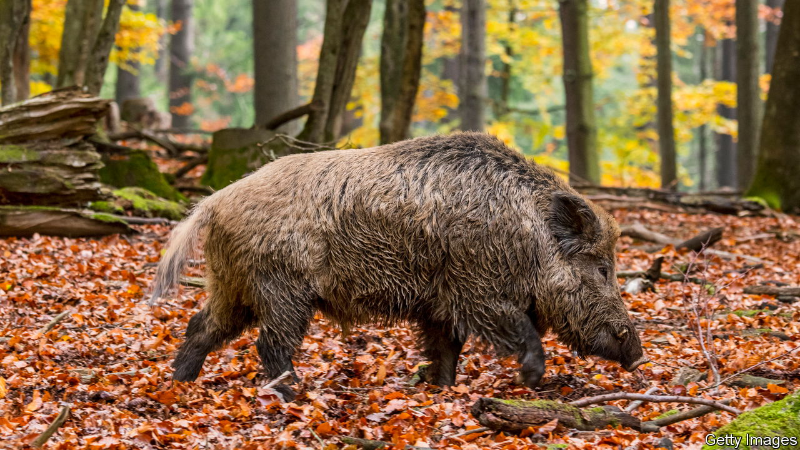

###### Game-shooting in France

# France reviews its hunting rules 

##### Fatal accidents pit hunters against other users of the countryside 

 

> Jan 5th 2023 

Across France, the forests and vineyards in winter are blissfully quiet. Apart, that is, from the periodic sound of gunfire. The season for  (hunting) runs from September to February. Over New Year, when there is less to do in the fields, many farmers and other locals pick up their guns and head out in search of  (wild boar), hares or other game. To the unsuspecting rambler, the sight of a fully grown  fleeing along a footpath can prompt surprise—or worse. The number of accidents caused by hunting each year has triggered an intractable row about the use of the French countryside. 

Game-shooting in France is not, mostly, an elite pastime. Over 1.1m people have hunting permits, making it the third-most-popular sport after football and fishing. For many locals it is at once a social get-together, a sport, a way to fill the fridge and a means of pest control. France’s National Forests Office reckons that half of publicly owned forests have an overpopulation of boar, deer and other game. This can lead to the destruction of saplings and hamper forest regeneration. At an estimated 2m, France’s wild-boar population has grown sixfold over the past 30 years. Rooting for acorns and beech mast or trampling on crops or vines, these long-snouted hairy beasts alone cause some €30m ($32m) of damage to crops each year. Culling them, say forest managers, is part of biodiversity management. In 2021, 842,000 wild boar in France were legally shot. 

Yet hunting also led to 90 accidental shootings of people during the 2021-22 season, and eight deaths. This was more than in the previous season, although a drop from 31 deaths 20 years ago. Most victims are hunters, but passers-by are also at risk. Last season 17% of the accidents involved hunters shooting towards footpaths, roads or dwellings. After the death in 2020 of Morgan Keane, a young man shot while chopping wood near his house in the Lot region, a petition by his friends led to a Senate inquiry into hunting safety. Its report, published last September, made 30 recommendations, such as a ban on alcohol, which it blamed in 9% of the cases.

Despite the powerful French hunting lobby, and a fringe political party that represents it, rules have been tightened. A law passed in 2019 obliges game-shooters to wear an orange fluorescent jacket. In 2021 France’s highest court outlawed the use of glue-traps to snare songbirds, in line with European practice. The government may now go further. Bérangère Couillard, the junior minister in charge, says there is “no taboo”. She will unveil more proposals on January 9th. 

One option would be to extend nationally a ban on hunting on Sundays that exists in some public forests. Green politicians want to outlaw hunting at weekends, on public holidays and in school holidays as well. Such ideas enrage , many of whom also work during the week, and who accuse squeamish city-dwellers of imposing their values on everybody else. ■

