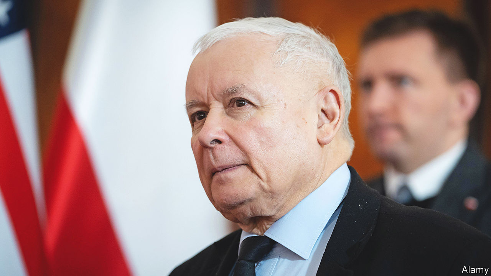

###### Frenemies on the Oder

# Why Poland loves to hate Germany 

##### The two NATO allies can’t stop squabbling 

 

> Jan 5th 2023 

Germany and Poland should be happy neighbours. Bound by close personal ties as well as €150bn ($159bn) in yearly trade, the two are key members of both the European Union and NATO. As Russia’s invasion confronts Europe with the gravest security threat since the cold war, the pair are also, after America and perhaps Britain, Ukraine’s most vital strategic allies. Poland is the main arms conduit into Ukraine and a host to millions of its refugees. Because of their own history with Russia, Poles have been among Ukraine’s most ardent, generous and timely supporters. Germany, Europe’s richest economy, has been slower to react but is now by far the continent’s biggest contributor to the war effort.

Yet on January 3rd Arkadiusz Mularczyk, Poland’s deputy foreign minister, lashed out at Germany. Calling the ostensible ally “disrespectful” and “unfriendly”, he accused Berlin of trying to turn Poland into a “vassal state”. He also called on the United Nations to intervene in support of Poland’s claims against its neighbour.

Mr Mularczyk is particularly familiar with these claims. He helped write a three-volume study that tots them up. Sponsored by his Law and Justice party (known by its Polish acronym PiS) and published in September, it puts the bill for damages caused to Poland by Germany during the second world war at a colossal €1.3trn, about double Poland’s GDP. On October 3rd Poland formally presented this demand to Berlin. The German response is a firm . 

No one disputes the monstrosity of Nazi crimes in Poland. But they took place eight decades ago. Since then, Germany has ceded vast tracts of land to Poland and signed deals with varied Polish governments to close the books on the war. So the timing and blindness to precedent of the mounting Polish campaign against Germany, of which the reparations demand forms just a part, do raise questions. 

There is a simple answer to all of them: Poland’s polarised politics. Opinion polls show a slow slide in support for United Right, the coalition dominated by the nationalist, socially conservative PiS that has run the country since 2015. Strains have grown inside the coalition since it won a second term in 2019. Micro-parties on the far right whine that their bigger ally has gone soft, failing to stand up to what they see as bullying from the EU. With elections looming in autumn 2023, PiS is keen both to rally its base and to hold this alliance together. 

Souring relations with Germany should be seen in the context of Poland’s European policy, explains Piotr Buras of the European Council on Foreign Relations, a think-tank. As Brussels has pressed Poland, particularly over the government’s efforts to quash judicial independence and enforce traditional “family values”, PiS’s leader, Jaroslaw Kaczynski, has increasingly pointed to Germany as a behind-the-scenes source of trouble. In December 2021 he claimed that its real agenda is to turn the EU into a “Fourth Reich”. (Tellingly, Dmitry Medvedev, Russia’s former president, put precisely the same contention in a New Year’s message.) Even months after Russia invaded Ukraine, Mr Kaczynski was still suggesting that Berlin is colluding with Moscow to “enslave” Poland.

Neighbours with history

Such dark suspicions are not the only excuses to bash Germany. Mr Kaczynski’s main sparring opponent on the left, Donald Tusk, Poland’s prime minister from 2007 to 2014, happens to have partial German ancestry (quite common in western Poland) and served as president of the European Council. PiS and its allies, whose strongholds are in the rural east, have not shied from tarring Mr Tusk as a treacherous Germanophile. “This may sound crazy, but it makes sense in their particular bubble,” says Wojciech Przybylski of Res Publica, a Warsaw research group.

Germany has also attracted blame to itself, and not just for failing to pay Poland the humble respect it has shown to others, such as Israel and France, in recognition of Nazi crimes. Mr Kaczynski is hardly the only eastern European to wag a “we told you so” finger at a generation of German leaders who blindly trusted Vladimir Putin, Russia’s president, so saddling Germany with a feeble army and a dangerous dependence on Russian energy. 

Mr Kaczynski draws strength from this sense of moral superiority, says Mr Buras. The irony is that he chooses to flaunt it just when Germany has at last admitted the error of its ways on Russia, and just as the two countries’ policies converge more than ever. Despite responding heroically to Ukraine, it is Poland that is making trouble for the broader Western alliance. 

When Germany found that the weapons it gives Ukraine are so heavily used that they often break down, Poland proved hesitant to allow the Bundeswehr to build a repair centre on its territory. This vital facility opened in Slovakia instead. When a stray Ukrainian rocket fell in Poland in November, killing two farmers, Germany hastened to offer its neighbour a battery of sophisticated Patriot air-defence missiles. The Polish government at first welcomed the offer, but Mr Kaczynski then said no, adding that German soldiers would anyway be too sissy to shoot at Russian aircraft. Only after an embarrassing week-long muddle did Poland back down, allowing the system to be deployed. 

As elections approach, flip-flops by PiS may grow more common. Another occurred just before Christmas, when the government announced a compromise that would allow the release of some €36bn in EU grants and loans that have been stalled by a long quarrel between Brussels and United Right over judicial independence. Then came a sudden reverse, as PiS appeared to bow to objections from ultranationalist coalition allies. The issue remains unresolved. 

United Right’s anti-German drumbeat, gleefully echoed by state broadcasters, has clearly influenced Polish public opinion. An annual barometer of sentiments finds that last year, for the first time, more than half of Poles said relations with Germany are not good, with 35% describing them as downright bad. In December, perhaps in an effort at damage control, Andrzej Duda, Poland’s largely titular president, a former PiS MP who often acts as a “good cop” to soften Mr Kaczynski’s bluntness, paid a cordial visit to his even less powerful German counterpart, Frank-Walter Steinmeier. But it will take more than diplomatic niceties, dismissed by Mr Mularczyk as “fairy tales”, to fix the current mess. ■

