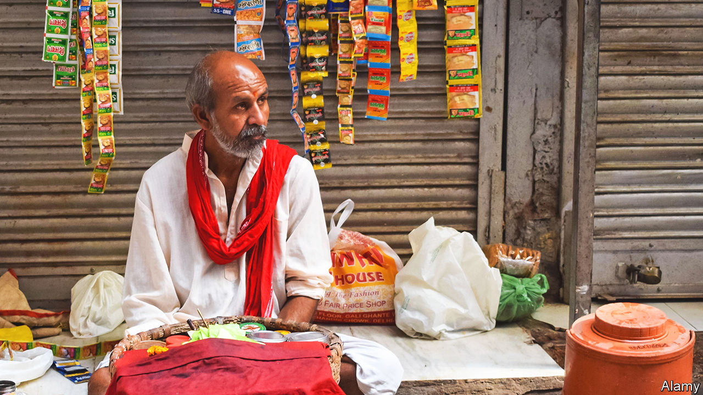

###### The sound of silence

# Imagine an India without hawkers 

##### A great informal economy appears to be formalising 

 

> Jan 5th 2023 

India’s vast informal economy is both a blessing and a curse. The hundreds of millions who toil in it—without contracts, outside the tax system, often on miserable incomes—are the human engine for the country’s farms, hawker stands and rickshaws, providing food, transport and even phone repair and currency exchange. They shape how India looks (the crowded markets), sounds (the buzz of bargaining) and smells (the snack carts lining the roads). And it is the sector’s resilience that keeps the country operating even in the most difficult times, soaking up unemployment. 

But these sights, sounds and smells may be less pervasive in future, for there are signs that work in India is undergoing a transformation. Data from a range of sources suggest the country’s workforce is becoming increasingly formal. In the first half of India’s fiscal year, concluding in September, the number of employees registered with the national pension fund rose by 35%, compared with the same period the year before—a rise equivalent to 9m people. The number of firms paying the goods-and-services tax, an indicator of formal business creation, has risen from 8m to 14m since 2017. Online postings on recruitment sites, such as Monster, suggest a similar rise in formal employment.

The shift is so large and sudden that it has left observers scratching for an explanation. Inevitably, there are quirks in the data. Registration with the pension fund is required for firms with more than 20 employees, meaning an increase of just one person could boost recorded roles by 21—a technicality that may exaggerate swings during an economic upturn. And as it rebounds from covid-19, India’s economy is growing quickly. Estimates suggest that gdp rose by around 7% in 2022. Yet quirks can only explain so much. As Rahul Bajoria of Barclays, a bank, notes, the swing is sufficiently big, and appears across such a wide range of indicators, that significant, real-world change is probably afoot.

Payroll data registered with the pension authorities provide insight into the new employees. There are gains in every age group, but the biggest are for people aged 18 to 25, suggesting the additions may come from new jobs, rather than the transfer of old ones to a formal footing. The largest category, accounting for 38% of the new hires, is “expert services”, which includes coders and clerks, and reflects the country’s growing importance as a destination for technical and back-office services. The second-largest is “cleaning and sweeping services”, precisely the kind of jobs that previously would have gone unregistered.

Powerful business trends are likely to explain the shift. India has transformed its financial architecture. A goods-and-services tax introduced in 2017 makes companies pay a tax on purchases that can be offset against sales. Getting this cash back is an incentive to register with the authorities. Meanwhile, a government-backed electronic-payment system has grown quickly since it was set up in 2016. It leaves a trail that can be monitored, reducing evasion.

Multinational giants now account for a greater share of employment—and are not generally the type to dodge taxes. Housing being built near Chennai by Foxconn, a Taiwanese electronics manufacturer, will accommodate more than 60,000 workers. Dixon Technologies, an Indian Foxconn-like subcontractor with dozens of foreign clients, has grown from 1,500 to 20,000 employees in the past five years. The smaller firms servicing such regimented enterprises, from the food consumed by workers to the endless trucks that underpin logistics, must be formal enough to fit into their payment and tracking systems.

The Centre for Monitoring Indian Economy, a research firm, reckons that another factor behind the increase in formal employment is growth in people-heavy industries, notably tourism and hospitality. These increasingly include chains rather than independent guesthouses. It is a boon for the Indian state that more of those working in hotels and restaurants will contribute to the public finances. And it may be a surprise for future holidaymakers when the country that greets them is a little less raucous than it used to be. ■


