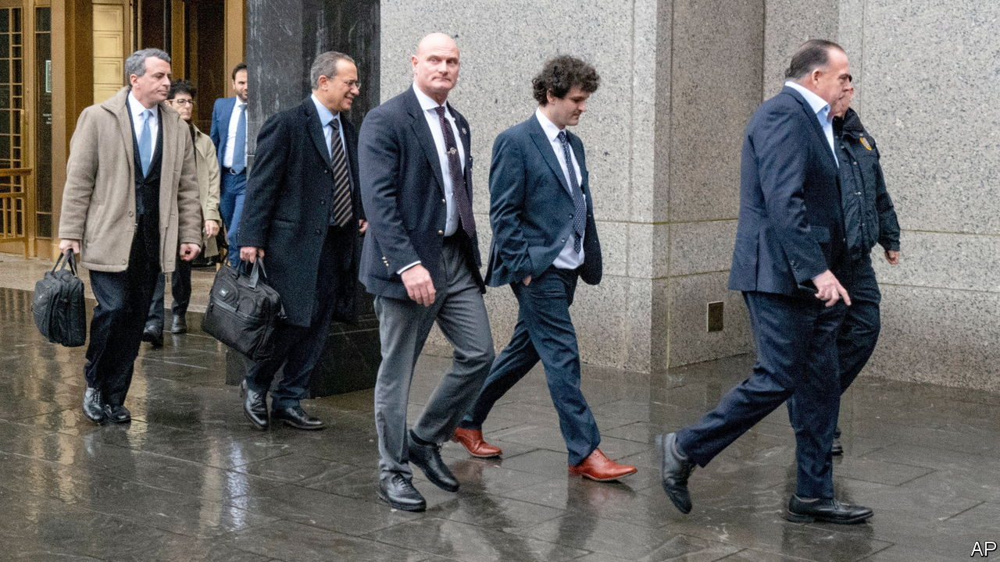

###### Whydunnit?

# Sam Bankman-Fried pleads not guilty 

##### Despite the avalanche of information about his crypto blow-up, one big question remains 

 

> Jan 3rd 2023 

In one way the holiday season in Joseph Bankman and Barbara Fried’s house was like many others. Adult children who have fled the nest often return home for the festive period. Their son, Sam Bankman-Fried, the founder of ftx, a now defunct crypto exchange, did the same. He flew to Palo Alto, California, on December 22nd and departed shortly after New Year’s Day.

Yet he did so in slightly different circumstances from most. After the collapse of his empire in November, Mr Bankman-Fried was arrested in the Bahamas, before being extradited to New York to face . He flew to California on December 22nd only after a judge in the South District court of New York agreed to release him on a $250m “appearance bond”, which his parents and two other people agreed to pay if he did not comply with the terms. These require him to appear in court, wear an ankle monitor and live with his parents. On January 3rd he returned to New York—this time to plead not guilty to the various charges he faces.

A provisional date of October 2nd was set for the trial. But it is possible that Mr Bankman-Fried, who continues to claim he did not intentionally defraud anyone, will strike a plea deal. If there is a trial he will face the testimony of his former colleagues: Caroline Ellison, who ran Alameda, the hedge fund Mr Bankman-Fried founded and majority-owned, and Gary Wang, a co-founder of ftx, both of whom are now co-operating with the authorities. On December 21st Ms Ellison pled guilty to seven charges which could carry a maximum sentence of 110 years in prison, including wire fraud and conspiracy to commit money-laundering. Mr Wang, meanwhile, pled guilty to fraud charges which could carry a maximum of 50 years.

The evidence the two provided to prosecutors helped inform the criminal charges against Mr Bankman-Fried and the civil complaints from the Securities and Exchange Commission (sec) and the Commodities and Futures Trading Commission (cftc), two regulators. Their submissions suggest that since ftx was set up in 2019, Mr Bankman-Fried improperly channelled customer deposits to Alameda. They also suggest he directed Mr Wang to exempt the hedge fund from important ftx procedures. The rules were designed to ensure that trading positions customers had borrowed money to open were closed if trades moved against them. The exemption allowed Alameda to have a negative balance on the exchange; in other words, it let the firm borrow customers’ assets.

In addition, the complaints against Ms Ellison suggest Mr Bankman-Fried instructed his business partner (and former romantic one) to prop up the price of the ftt token. Mr Bankman-Fried had created this cryptocurrency himself, and given it to Alameda for nothing, so that the hedge fund could use it to borrow even more money from other crypto institutions. Having set up ways for Alameda to borrow as much as possible, Mr Bankman-Fried then used the firm as his “piggy-bank”, according to the sec—disbursing donations, buying property and making investments. 

Given the amount of information revealed since , the most interesting question about the demise of the firm and Mr Bankman-Fried’s empire is no longer what happened. It is clear that billions of dollars of customers’ assets ended up at Alameda, either because they were channelled there directly or because of the special treatment the firm enjoyed. The bigger question, which is still unanswered, is exactly why Mr Bankman-Fried and his colleagues did this.

Mr Bankman-Fried’s not-guilty plea prepares the ground for a possible trial that may get observers closer to the answer. Or perhaps the truth will come out by a different route. Another peculiar feature of the holiday period at the Bankman-Fried home is that parents and son were reportedly visited by Michael Lewis. The celebrated journalist has been following Mr Bankman-Fried since the middle of last year for a book. The purpose of his latest visit was, apparently, to discuss the film rights. ■


