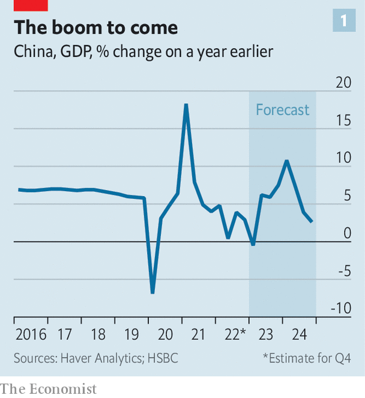
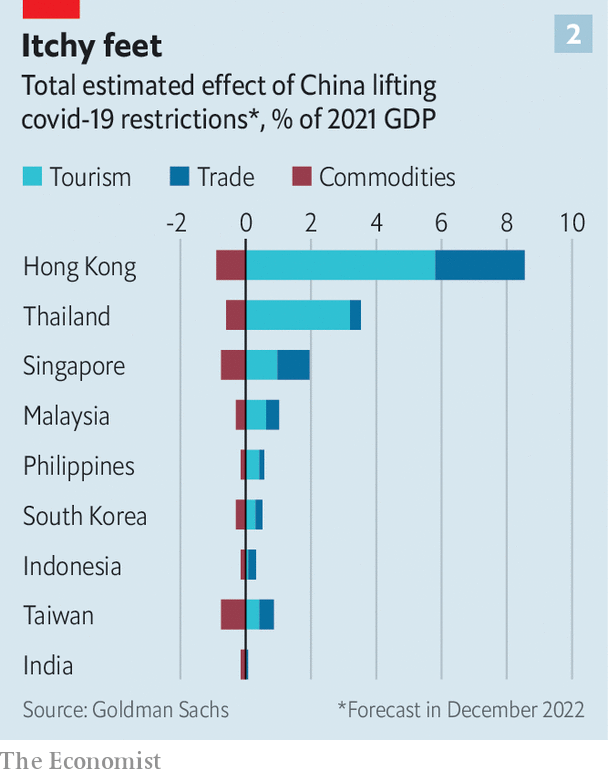
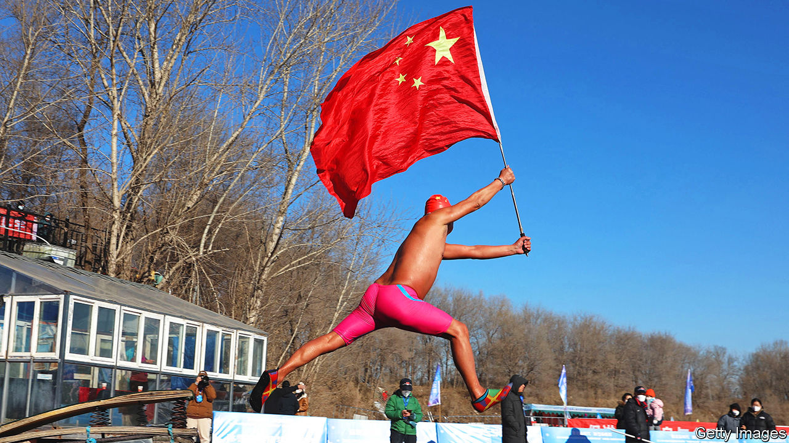
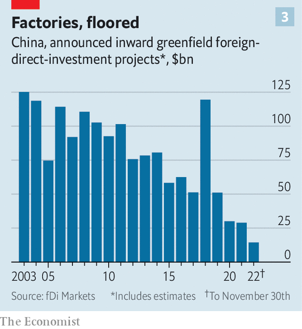

###### Life after covid-19

# What the great reopening means for China—and the world 

##### This year’s biggest economic event is already under way 

 

> Jan 2nd 2023 

When its borders open on January 8th, China will have spent 1,016 days closed to the outside world. The country’s “zero-covid” policy has been a social and economic experiment without precedent: a vast  that mostly kept the disease at bay; Xi Jinping’s pride and joy; and, by the end, a waking nightmare for many of China’s 1.4bn people. 

Armies in white hazmat suits have been deployed to collect tens of billions of throat and nasal swabs. Millions were quarantined or hauled off to fever camps, often arbitrarily. Fear of isolation sent people fleeing from offices and factories where cases were found. Amateur videos captured residents leaping to their deaths from apartment blocks after weeks of seclusion. In major cities daily life stood still for months on end. A cosmopolitan class of young, wealthy Chinese was forced to come to grips with a life without international travel. Foreign entrepreneurs and executives were barred from returning to their homes and businesses in the country.

Before vaccines were widely available, officials could argue this approach was needed to save lives. By the end, the experiment offered a bleak existence at an . China’s economy probably grew by less than 3% in 2022. Over the past 18 months, it has forgone about $1trn-worth of gdp, according to Oxford Economics, a research firm, compared with what it would have produced had its reopening resembled the rest of the world’s. Restrictions on movement snarled the most advanced global supply chains. In November profits at industrial firms dropped by 9% year on year. Meanwhile, exchanges between China and the outside world fell to their lowest in decades. Few foreign students remain. Overseas tourism has collapsed. Mr Xi has only recently resumed foreign travel after remaining in China for two-and-a-half years. 

Zero-covid lasted longer than anyone initially expected, then collapsed faster than anyone could have imagined. In a matter of weeks China has gone from some of the world’s strictest restrictions to almost none. For the population at large, fear of lockdowns and quarantine has vanished. Following a period of turbulence,  is likely to rebound sharply. Increased demand for energy and commodities will be felt around the world. Investors and multinational executives will soon be able to visit offices and factories. The great reconnecting of China with the outside world marks the end of an era: that of the global pandemic. 

Normality will not arrive immediately. According to one estimate,  are catching covid. Hospitals are overwhelmed. So are crematoria. Officials acknowledge few deaths—and face an immense challenge keeping production lines running. Tesla, a carmaker, halted operations at its factory in Shanghai on December 24th. Local officials may seal off towns to keep cases down, worries an executive. The economy could contract in the first three months of opening up, says Tommy Wu of Commerzbank. But the recovery will arrive earlier than analysts had expected. Many think the period of volatility will draw to a close by the end of March. At that point, a recovery will begin that should gain strength as the year progresses. 

Li Pengfei, until recently a product manager at an industrial-software firm in Beijing, is among those desperate for a return to normality. Mr Li lost his job in February when restrictions made basic duties, such as travelling to meet clients, near-impossible. He spent part of last year living with his sister, but was forced to return home to Jilin province in China’s far northeast, where economic prospects were dismal even before the pandemic. “Things seem so volatile that even the big companies are downsizing,” he says. 

Elsewhere in the world bosses worry about a “great resignation”, with workers quitting jobs or dropping out of the labour force altogether. This is less of a concern in China. The government did not hand out stimulus cheques willy-nilly, as America’s did, during the pandemic. People who lost jobs, such as Mr Li, will return to work when the opportunity arises, economists believe, helping to steady factory output.

Xi’s spending spree

Consumption will rise, too. Incomes have fallen, but zero-covid also squashed spending, as people avoided travelling and eating out. All told, households saved one-third of their income last year. Many will be getting back on their feet after job losses, stagnating pay and declines in the value of their homes, meaning the splurge will be limited. But Jacqueline Rong of bnp Paribas, a bank, reckons household consumption will grow by about 9% in 2023—a big improvement on the previous year’s growth rate, if not full retribution for the enforced abstemiousness of recent years.

Reopening will also benefit China’s troubled property sector, though quite how much depends on political decisions. In November, as covid restrictions were relaxed, policymakers eased property developers’ access to financing. This should help stronger firms avoid default and at last finish building flats they have already sold to homebuyers. At China’s Central Economic Work Conference in December, policymakers promised to support “fundamental demand”, as opposed to speculative purchases. To that end, they may make further cuts to mortgage rates and down-payment requirements.

Forecasts for the performance of the property sector, broadly defined to include construction, services and furnishings, range widely. Activity in the industry could grow by 3% this year, according to Jing Liu of hsbc, a bank—enough to add 0.9 percentage points to China’s gdp growth. A more optimistic scenario has activity expanding by 5%, she thinks, adding 1.5 points to growth. Some households might decide that now is a good time to “buy the dip”, before prices revive or regulatory restrictions on home purchases return. 

The economic implications of reopening extend further afield. Zero-covid kept a lid on China’s demand for global goods, services and commodities. During the lockdown of Shanghai in the first half of last year, for instance, the country’s oil demand fell by 2m barrels per day. In the past, such drops in Chinese spending would have deprived the world economy of a crucial engine of growth. The covid downturn has been different. It coincided with an  and an interrupted  across Europe. “At least this time China isn’t contributing to inflation,” says Louis Kuijs of s&amp;p Global, a rating agency.

 


China’s recovery will lift global growth for the simple reason that the country is a large part of the world economy. hsbc reckons that one year from now, in the first quarter of 2024, China’s gdp could be as much as 10% higher than it will be in the first three troubled months of 2023 (see chart 1). According to our rough calculation, a recovering China could account for two-thirds of global growth in that period. 

In time, however, China’s recovery may have unfortunate side-effects. In other big economies, the binding constraint on economic expansion is monetary policy, as central banks raise interest rates to suppress inflation. If China’s reopening looks like raising global demand and therefore price pressure to an uncomfortable degree, central banks elsewhere may have to respond by tightening policy to offset the threat. In such a scenario, the impact of China’s reopening on the rest of the world may show up not in higher growth but in higher inflation or interest rates. 

China’s most direct channel of influence is through commodities. It consumes almost one-fifth of the world’s oil, over half of refined copper, nickel and zinc, and more than three-fifths of iron ore. On November 4th the mere rumour of a reopening caused a 7% increase in the price of copper by the end of the day. As the rumours are realised, China’s demand for metals, crops and energy will help exporters of commodities, hurt importers and give the world’s central banks another headache in their fight against inflation.

Heavy metal demand

China’s appetite for metals remained strong during zero-covid, as the government encouraged spending on electric vehicles, renewable energy and other forms of green infrastructure, all of which require lots of aluminium, copper and other metals. But buyers lacked the confidence to stock up on these materials: inventories of copper fell to their skimpiest in 15 years. Reopening will encourage restocking. In November Goldman Sachs, a bank, reckoned the price of copper would increase to $9,000 per tonne within 12 months. Now it thinks the price will reach $11,000. 

Demand for energy proved less resilient, particularly towards the end of zero-covid. China’s imports of liquefied natural gas (lng) fell by about one-fifth in the first 11 months of 2022, compared with the same period of the previous year. This allowed Europe to increase purchases to make up for the . Thus China’s zero-covid policy acted as a counterweight to Russia’s invasion of Ukraine—one blunder helping to save Europe from the other.

Analysts assume a modest rise in Chinese lng imports this year, based on the contracts buyers have already signed and their reluctance to buy lng when prices are high. If imports recover faster, Europe could feel the pinch. In a stress test in December the International Energy Agency (iea), an official forecaster, assumed Chinese demand would increase by about a quarter in the year ahead, returning to 2021 levels; Russia would cut off piped gas to Europe entirely; and winter would start punctually. In such a scenario Europe would face a shortfall of 27bn cubic metres of gas, equivalent to 7% of annual demand, even after its current efforts to increase supply are taken into account. The iea warns that if nothing else is done, Europe may be forced to introduce rationing. 

The impact on oil could also be significant. If China’s economy makes a full recovery in 2023, it will gradually increase crude imports throughout the year until it has added an average of 1m barrels a day, reckons Soni Kumari of anz, a bank. This will compensate for reduced demand in Europe and America, both of which are courting recession. Indeed, Goldman Sachs forecasts that China’s increased appetite could push up oil prices by about $15 per barrel. The price of Brent could exceed $100 again in the third quarter of this year, it reckons, making the global battle against inflation still more difficult.

Higher commodity prices will be a boon to exporters like Chile and Brazil, but hurt China’s energy-importing neighbours. For India, the loss from higher prices may cancel out gains from increased exports to the mainland. Other countries, more tightly enmeshed in China’s manufacturing supply chain, seem better placed to benefit. But raw statistics can be deceptive. Although Taiwan’s merchandise exports to the mainland were equivalent to more than 15% of gdp in 2021, many were components for products that are ultimately sold to customers outside China, and may thus be unaffected by the change of policy.

 


The biggest boost to neighbours will come not from selling goods to China but from selling tourist destinations to Chinese citizens (see chart 2). Ni Na, a mother of two from Shanghai, travelled overseas about five times a year pre-pandemic, often spending three or four months a year outside the country. She attempted to travel once within China in 2022, only to give up owing to restrictions. When quarantine requirements are lifted, Ms Ni will get back on the road. She has renewed her passport and her sons’ travel documents in anticipation. 

 


Thailand, a popular destination, could enjoy a three-percentage-point boost to growth once China has fully reopened, reckons Goldman Sachs. That would remove the uncertainty weighing on local asset prices, including the currency, says Arup Raha of Oxford Economics, reducing pressure on the central bank to raise rates—welcome freedom in a country where output is still below potential. But the biggest winner will be Hong Kong. Increased exports, which include tourism, could boost its gdp by almost 8% after full reopening. The city used to attract more than 4m mainland visitors a month. Without them, it has felt roomier but poorer.

The Communist Party is deft at rewriting history. Yet Mr Xi will struggle to shake the  in 2022. The clumsy enforcement of zero-covid, followed by its hasty abandonment, will go down as an error for the ages. Many investment houses adjusted their risk assessments for China, and will allocate less to the country over the next three years unless they are compensated for it. About $18bn of foreign exchange flowed out of China in November, up from $11bn in October. These outflows are expected to reverse when China’s economy stabilises in 2023, but a swift return to the type of inflows witnessed before the pandemic is unlikely.

 


Deep damage has been done to parts of China’s supply chain. A covid outbreak, followed by protests, at a plant making Apple’s iPhone 14 in central China has delayed orders for the product. For foreign firms, the crisis was the first time that central policy interfered with local officials’ commitment to keep factories running. Many companies are now willing to pay more to manufacture elsewhere. Take the process of launching new products, which requires an almost continuous flow of researchers and scientists between headquarters, usually in the West, and plants in China. The covid years made this dance impossible. Engineers stopped visiting; fewer new products were launched in the country. Multinational firms have been forced, often reluctantly, to launch elsewhere.

But after years of zero-covid, bosses have become more comfortable with moving away from China. Inbound investment in new “greenfield” factories has plummeted (see chart 3). At the same time, the number of firms moving operations out of China has jumped, says Alex Bryant of East West Associates, a supply-chain consultant. Most of the moves Mr Bryant’s firm has assisted with over the past year have been outbound. He thinks the reopening of China is unlikely to lead to an immediate turnaround in the direction of traffic.

A thousand meetings

Policymakers are waking up to the danger. Officials and businessfolk from Fujian, Guangdong, Sichuan, Zhejiang and elsewhere are planning trips abroad to win back investors, according to a state-media report. “A meeting is worth a thousand emails,” it said. In December China’s leaders announced a focus on attracting foreign money, emphasising that local governments should prioritise finding investors. Such language has not been used at a Politburo meeting in many years, notes Robin Xing of Morgan Stanley, a bank. “They clearly want to keep their place in the global supply chain,” he says. Nevertheless, making up for the chaos of 2022 will require an awful lot of meetings. ■


