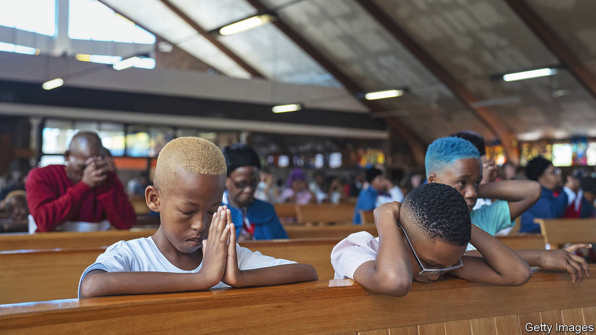
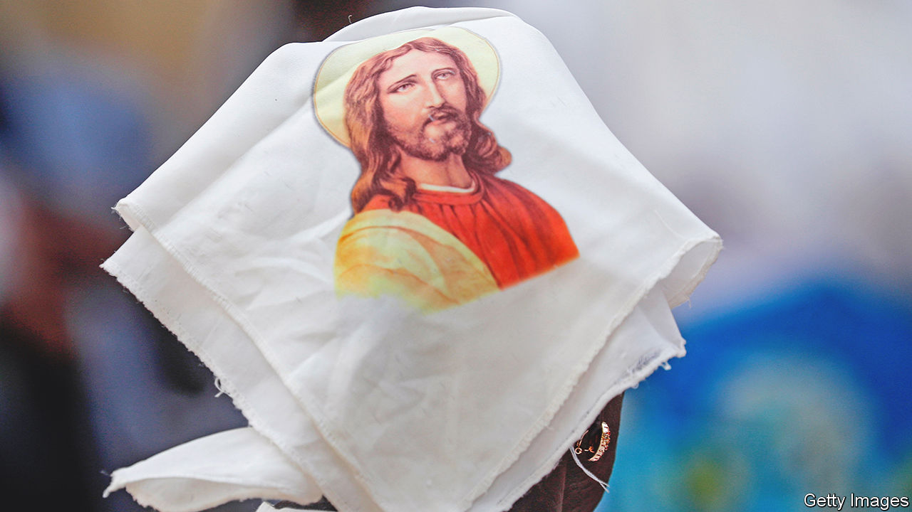
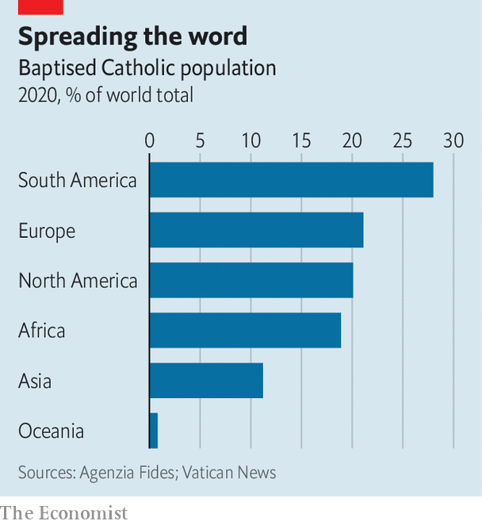

###### Late prelate

# The death of Pope Benedict removes a problem for liberal Catholics 

##### But the battle over the church’s future goes on 

 

> Jan 2nd 2023 

THE MOON was high over the avenue that stretches away from St Peter’s, yet a stream of visitors was still issuing from the great basilica. Inside, the body of  was laid out for people to pay their respects before his funeral on January 5th. Vatican officials were reportedly taken aback by the size of the crowds. On the first day, January 2nd, visitors had to queue for three hours. By the next evening, they were still waiting for 40 minutes.

Many were tourists drawn to a unique occasion. Benedict, who resigned in 2013, was the first pope in almost 600 years to quit before his death. Others who came were religious admirers. “Theologically, he represented a reawakening of the conscience of the modern, Western world,” said Stefano Crescentini, who had travelled to Rome from Perugia in central Italy. “He stood for fundamental, non-negotiable values,” added his wife, Susanna.

The death of a pope has far-reaching consequences, even when the pontiff in question has not led the Roman Catholic church for ten years. In the case of Benedict’s, the most obvious is to relieve his more liberal successor, Pope Francis, of a source of periodic irritation.

Francis has had to provide spiritual guidance to the world’s 1.4bn baptised Catholics in the knowledge that a prelate with immense authority and  was living a few hundred yards away, in the Vatican gardens. Benedict continued to wear the all-white habit of a pontiff and styled himself “Pope Emeritus”. He made few public appearances, and his relations with Francis were said by Vatican insiders of all persuasions to be genuinely affectionate. But he continued to make his beliefs known.

The tally of Benedict’s post-papacy sermons, letters, messages to conferences, inter views and other texts comes to around 30. In some, he implicitly contradicted his successor. More overtly, in 2020 he co-wrote a book defending  just as Francis seemed to be edging towards easing the ban on married priests. Only after controversy did Benedict have his name removed from the cover.

While alive, he was a symbol of traditional values who served as an inspiration for the critics of Francis’s papacy. Some even questioned whether Francis’s election could be valid when a predecessor was still alive and in possession of his faculties. Almost as controversially, Benedict’s personal secretary, Archbishop Georg Gäns wein, suggested in 2016 that the two popes represented a new kind of expanded ministry, with one “active member” and another “contemplative” one.

The other discernible effect of Benedict’s passing is to make it possible for his successor to step down in turn. (If having two living popes was regarded as unfortunate, having three was unthinkable.) Francis shows no sign of wanting to resign. But he signed a resignation letter shortly after his election, to take effect in the event of his incapacity. His health has deteriorated in recent years and, at 86, he is older than Benedict was when he stepped aside.

Two-thirds of the cardinals who would elect Francis’s successor, were he to step down now, are men on whom he has conferred the red cap of “a prince of the church”. That proportion will grow as time passes and the cardinals appointed by Benedict and John Paul die or reach 80, the age at which they lose their right to vote. It is thus easy to see Benedict’s death as heralding a more liberal era in the Catholic church, in which Francis has a freer hand to introduce the sort of reforms for which liberal believers yearn. But such an interpretation is too simplistic—and too parochial for a church that increasingly draws its flock from Africa and Asia rather than its traditional European heartlands.

Holy chalk and cheese

Start with the first point. One effect of Benedict’s death has been to remove a source of division between Francis’s critics. They may have revered Benedict’s conservative theology, his loathing of moral relativism and advocacy of dogmatic certainty. But many were appalled by his resignation, which broke a long tradition. The last pope to resign had been Gregory XII, in 1415, when the hot new technology was the English longbow.

 


The ten-year “cohabitation” between the two popes also acted as a brake on the more extreme conservatives. It was hard to depict Francis as an illegitimately installed antipope with his predecessor manifestly demurring. As more than one Vatican-watcher has observed, Benedict’s death strips a layer of protection from his successor. From now on, any decision Francis takes will be his alone. It could also mean that an already profoundly divided church will become yet more openly polarised. Francis may be no keener than in the past to impose radical change.

No pope wants to preside over a schism. Yet the portents of a split are discernible in Germany, where most bishops support reforms that include letting women become deacons (a rank below a priest) and letting priests bless same-sex marriages. They are also perceptible in America. Catholics account for a fifth of voters. Elements of the Catholic agenda, particularly its disapproval of abortion, chime with the aims of conservative politicians.

Benedict’s influence on Catholicism remains strong in America, partly because of the appointments he made as pope. His conservative protégés, and those of his predecessor, now dominate the American bishops’ conference. In the presidential election of 2016 the tacit approval of conservative bishops probably won Donald Trump some crucial votes. In June a Supreme Court tilted to the right by judges appointed by President Trump overturned a long-standing ruling that had declared abortion a constitutional right.

Abortion is just one of several issues over which bishops appointed by Benedict have clashed with his successor. In line with Catholic teaching, Francis often reiterates his opposition to abortion. But he does not elevate it above other issues. Instead, he has sought to cast the fight against poverty and the rights of immigrants as “pro-life” issues in their own right. Some conservative bishops have joined him. Others have raged against this change of emphasis.

 


Such views are normally expressed in private. Yet this summer, Archbishop Joseph Naumann of Kansas City said the Vatican’s opposition to a plan by some American bishops to deny communion to pro-choice politicians showed “[Francis] doesn‘t understand the US, just as he doesn’t understand the church in the US. ” Criticism of Francis is a reminder that, outside its western European homeland, Catholicism is at least as “Benedictine” as it is “Franciscan”. That matters, since growth in new places and decline in old ones has made Catholicism more widely spread than ever before

Indeed, if you were looking for the new face of the church, it would not be a frustrated German priest, glumly tending a diminishing flock, but someone like Father John Ruban from Tamil Nadu in India, walking away from St Peter’s after bidding farewell to Benedict. “He was a very strong pope who would not abandon the basics of the Catholic church. I think people in India loved him more than people in Europe.”

Before his elevation, Benedict was , the church’s theological overseer. The nuances of his conservativism earned him the respect of many in poor countries. Father Tom Reese, a former editor of , a Catholic magazine, who speaks for the liberal camp, has pointed to the differences between Benedict’s thinking and that of American non-Catholics. Benedict’s encyclical,  (Charity in Truth), published in 2009, thoroughly irritated American conservatives. In it the pope made clear his opposition to abortion. But his emphasis was on global poverty and inequality. Many American conservatives thought it far too critical of free markets and capitalism.

Other things being equal, Francis’s even greater emphasis on themes such as poverty should mean he is yet more respected outside the rich world. But his apparent ambiguity on some issues clashes with a desire for clear doctrinal guidelines in much of the rest of the world.

In this respect, Francis’s home continent of Latin America, home to around a third of the world’s baptised Catholics, is the in-between continent. Not quite a part of the rich world, it increasingly resembles western Europe in the secularisation of its Catholic population. In 1995, 80% of people in Latin America identified as Catholics. Today, only 56% do. And Latin America’s Catholics are not as conservative as is often assumed. A survey soon after Francis became pope found that Africans and Asians were more traditional in matters of doctrine. Many Latin American Catholics were more likely to endorse same-sex marriage than those in Italy or Poland.

All this will have a bearing on the election of Francis’s successor. Though most of the cardinal-electors will owe their position to the current pope, many will be more in tune with the thinking of the previous one. The next conclave, moreover, will teem with cardinals who, like Francis, are drawn not from the Vatican but from the pastoral periphery. Most are strangers to one another, thus more susceptible to the influence of a punchy lobby. Benedict is dead. But it is far too early to write off the brand of Catholicism he embodied.■

