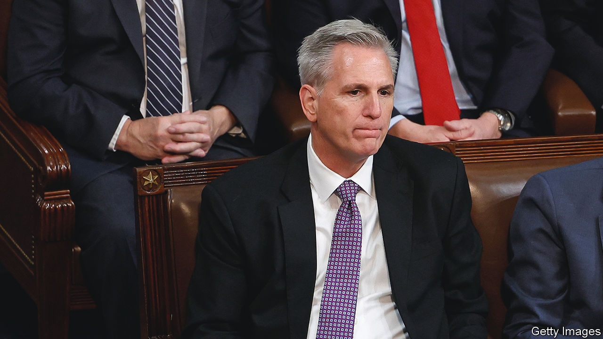

###### Unspeakable

# What the Kevin McCarthy saga means for America’s Congress 

##### Power struggles, public humiliation and a government shutdown may follow 

 

> Jan 4th 2023 

With the anguish of someone who has spent a decade pursuing a prize, only to see it , Kevin McCarthy told his colleagues in the House Republican caucus, “I’ve earned this job.” And, in a way, he had. The Republican from Bakersfield has kissed an army of frogs, including lobbyists, donors and cranks like congresswoman Marjorie Taylor Greene, to shore up his position, only for 20 House Republicans to turn around and accuse him of infidelity. This tale has its comic side: at one point Matt Gaetz, one of the “Never Kevin” Republican members, wrote to the Architect of the Capitol complaining that some guy called Kevin had moved his desk into the Speaker’s office and that it should be removed forthwith. But the McCarthy saga—the kind of power tussle and public humiliation that Washington loves—also augurs ill for the progress of important legislation in the 118th Congress.

Choosing the Speaker of America’s House of Representatives, an important office whose holder is second in line for the presidency, ordinarily requires only one round of voting. The last exception to this was a century ago, when progressive Republicans held up their party’s candidate. With no Speaker, no legislation can progress and no new members can be sworn in. This leaves the people temporarily without representation. The move is therefore a drastic one for the Never Kevins to make. So why did they do it?

Not, surely, in opposition to Mr McCarthy’s proposed agenda. Released before the midterm elections in November 2022, his “Commitment to America” would struggle to fill a postcard with policies that are within the power of Congress to enact. Nor do the Never Kevins have much of an agenda themselves. Instead, the plan seems to have been to break the toys so that nobody else can play with them. That dynamic has been present in the Republican caucus for a while. John Boehner, who was besieged by the “Hell No” caucus of House Republicans when he was Speaker from 2011 to 2015, observed: “What they’re really interested in is chaos…Every time they vote down a bill, they get another invitation to go on Fox News or talk radio. It’s a narcissistic—and dangerous—feedback loop.” And it is getting worse.

While this was going on, Democrats  behind Hakeem Jeffries, a moderate Democrat from New York. After his elevation to Minority Leader-elect, Mr Jeffries said po-faced things about the chaos on the other side being a sad day for democracy, while his colleagues tittered at the McCarthy spectacle. If they were less concerned with extracting partisan advantage, Democrats might settle on some sensible Republican to back as Majority Leader and hope that a few Republicans could support the same candidate. There is no constitutional reason why the moderates in both parties could not club together, seize control of the legislative agenda and tell the extreme wings of their parties to lump it. Alas, party discipline, tribal loyalty and the threat of primary challengers combine to make this impossible. Instead, Republicans will struggle on until they have a Speaker.

A weakened Speaker will make it even harder for Congress to pass contentious legislation this year. One beholden to the House Republicans’ berserker caucus could find it difficult to avoid a government shutdown, to raise the debt ceiling or to provide additional support to Ukraine’s armed forces. This comes after Congress had been on a winning streak, reforming the process for certifying elections and reaffirming gay marriage as the law of the land in 2022. Even divided Congresses can sometimes . But this one is setting out with lead weights attached to its boots. ■

