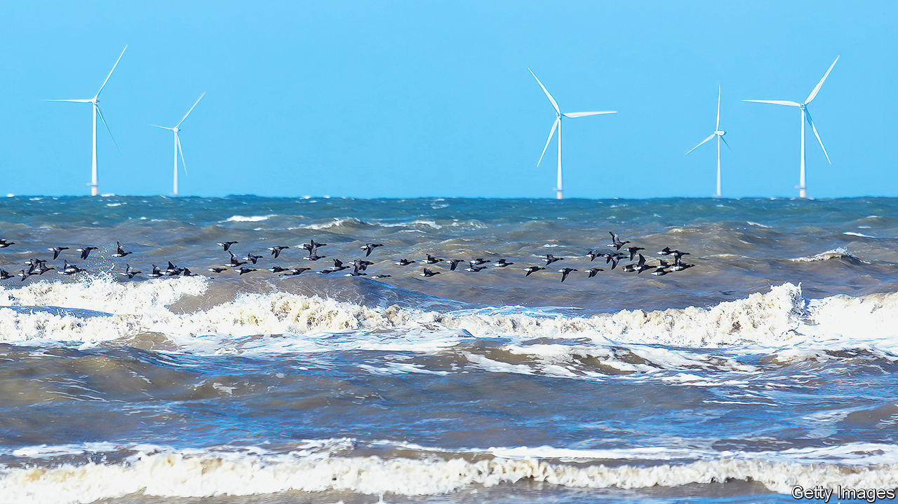

###### Northern delights

# Why the gusty North Sea could give Europe an industrial edge 

##### Wind power is breathing life into a new green economy on its coasts 

 

> Jan 5th 2023 

Fears about the fate of European industry abound. Russia’s invasion of Ukraine and the ensuing gas crunch have dealt it a . basf, the world’s largest chemicals-maker, is shifting production away from its headquarters in Ludwigshafen in Germany. Nearly a quarter of the country’s revered firms are reported to be considering moving part of their operations abroad. And even as energy prices have fallen back, America’s protectionist and subsidy-laden Inflation Reduction Act is feeding fresh worries that industry might be lured away from the old continent. 

One unlikely bright spot is the part of Europe with the grimmest weather. As we report this week, a new  is taking shape in and around the North Sea. Rather as hydropower fuelled Lancashire’s cotton mills and cheap coal the Ruhr valley’s steel furnaces in the early days of industrialisation, the promise of cheap, abundant wind power is attracting industry and infrastructure to Europe’s northern coasts. If this fledgling economy thrives, it could give the continent a new, greener industrial edge.

The North Sea’s strong winds and relative shallowness together make it a huge basin of potential energy. Thanks to taller and more powerful wind turbines, more efficient undersea cables and other technological advances, it is now increasingly being tapped. A group of nine countries near this body of water has plans to install 260gw of offshore wind power by 2050—nearly five times that produced worldwide today, and enough to power all of the European Union’s nearly 200m households.

All this is breathing life into a new coastal economy. Esbjerg, a town in south-west Denmark that some consider the capital of the North Sea economy, now boasts companies that make equipment to build and maintain wind turbines. Many once supplied the offshore-oil-and-gas industry, but have shifted their attention to greener customers. 

Nordic countries are beginning to attract energy-hungry battery plants and data centres. On Germany’s North Sea coast, a plan is afoot to build facilities to turn easier-to-transport ammonia into hydrogen, to fuel factories in nearby industrial parks. Even parts of steelmaking could eventually move north, as hydrogen replaces coal or gas in the manufacturing process. 

For this economy to take off, though, Europe will need to focus its energies. A good start would be to cut red tape: getting a permit to build a new wind farm can take ten years, or even longer. Countries bordering the North Sea will need to work together to ensure that the seabed does not become overcrowded with cables and pipes and that infrastructure is looked after. The rise of the new coastal economy could be fiercely resisted in the old industrial heartlands. It will fall to governments to ease the transition. 

A favourable wind

The pay-off will be handsome. Done right, the North Sea economy could be a model for other parts of the continent, including the Iberian peninsula, with its huge solar potential. Such shifts in its economic geography will not only help Europe achieve its climate ambitions and rebalance its energy mix away from Russia and other autocracies: they could even give rise to the sort of green corporate giants that Europe badly needs. ■


