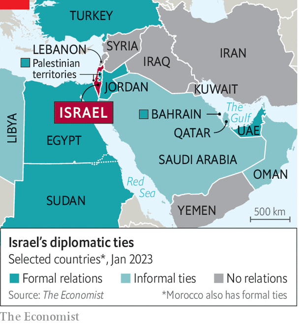

###### Nothing’s gonna stop us now

# Israel’s new government will test the ties with Arab states 

##### Even a right-wing cabinet stocked with ultra-nationalists may not derail the deepening relationships 

 

> Jan 3rd 2023 

In his past work as a lawyer, Itamar Ben-Gvir (pictured) represented Israeli Jews accused of hate crimes against Palestinians. He heads a party that promotes Jewish supremacy between the Jordan river and the Mediterranean. Yet on December 1st he was invited to celebrate the national day of the United Arab Emirates (uae) at a hotel in Tel Aviv. 

One month later the UAE had to denounce its guest. On January 3rd Mr Ben-Gvir, by then Israel’s national-security minister, went to the Temple Mount, Jerusalem’s most volatile flashpoint, since it is the Jews’ holiest spot but also sits beside the al-Aqsa mosque, sacred to Muslims. Arab states decried his visit. The uae called it a “serious and provocative violation”.

Binyamin Netanyahu’s new government is the most right-wing in Israel’s history. Many Israelis fear what it means for their democracy. Palestinians expect it will wreck their few remaining hopes for an independent state. And yet a cabinet stocked with ultra-nationalists and far-right radicals may still not unravel the developing ties between Israel and the Arab world.

For decades, it would have been met with a torrent of Arab condemnation. Until 2020 Israel had official ties with just two Arab states, Egypt and Jordan. 

 


Then came the Abraham accords, which in 2020 saw Israel agree to establish formal relations with Bahrain, Morocco, Sudan and the UAE (see map). Many Israelis, especially on the right, saw this as a sign that the Palestinian cause had lost its salience. Arab governments, in the UAE in particular, argued that this new relationship would give them influence in Israel, a way to soften its worst policies.

Mr Netanyahu’s new government offers a chance to test these competing theories. Along with Mr Ben-Gvir, it includes the likes of Bezalel Smotrich, the finance minister, who once called for segregating Jews and Arabs in maternity wards lest his wife be forced to give birth next to an “enemy”.

If the personalities are radical, so are the policies. Mr Netanyahu wants to expand Jewish settlements in the occupied West Bank. He is the first Israeli leader to promise his coalition partners that he will work towards annexing the West Bank, the heart of a future Palestinian state.

So far, however, few Arab leaders seem eager to push back, at least in public. The rulers of Egypt and the UAE called to congratulate Mr Netanyahu after he was sworn in. Bahrain’s foreign minister said Israel’s prime minister “firmly believes in peace”. Mr Netanyahu hopes his first foreign trip will be to Abu Dhabi, the UAE’s capital. 

Many Arabs still support the Palestinian cause: witness the displays of solidarity at the World Cup in Qatar. A poll by the Washington Institute for Near East Policy, a pro-Israeli think-tank, found that just 25% of Emiratis and 20% of Bahrainis now approve of the Abraham accords, down from 47% and 45% in 2020. 

But views have also shifted in other ways. Israel, says one Saudi businessman, offers a strategic partnership against Iran and investment opportunities in everything from agriculture to tech. “What do the Palestinians give us? Headaches.”

Maybe so. But Mr Ben-Gvir’s early-morning visit to the Temple Mount was a reminder that Israel can induce those, too. A visit there in 2000 by Ariel Sharon, then the Israeli opposition leader, helped spark a furious Palestinian (uprising).

Such incidents may erode public enthusiasm for the Abraham accords. Mr Netanyahu’s planned trip to Abu Dhabi has been postponed. His office cites logistics; it may have more to do with Mr Ben-Gvir’s antics. One Israeli diplomat thinks Saudi Arabia, long rumoured to be considering formal recognition, will wait to see how inflammatory Mr Netanyahu’s government proves to be before making any decisions.

In public, the Saudis insist recognition of Israel would only follow the creation of a Palestinian state. Privately, few Saudis believe this. Mr Netanyahu has already visited the kingdom and met Muhammad bin Salman, the crown prince and de facto ruler. They share a hostility towards Iran, and a sense that America is no longer a reliable protector. Formal ties with Israel would give the Saudis an overt security partner, a boost to their troubled standing in Washington and economic benefits to boot.

Mr Netanyahu himself expects a second wave of diplomatic agreements during his tenure. In an interview last month with al-Arabiya, a Saudi-funded news channel, he spoke about his hopes for an imminent deal with the kingdom. “It will be a quantum leap for an overall peace between Israel and the Arab world,” he said.

He probably overstates the case. Few other Arab states are queuing up to join the accords. But a deal with the Saudis would be significant. Even if they are wary of Mr Netanyahu’s government, they are not rushing to distance themselves from it.

In 2021, when the planned eviction of Palestinian families in East Jerusalem led to clashes at the al-Aqsa mosque and an 11-day war in Gaza that killed hundreds of Palestinians, Israel’s new Arab friends issued unhappy statements. When the guns fell silent, it was back to business as usual. ■

