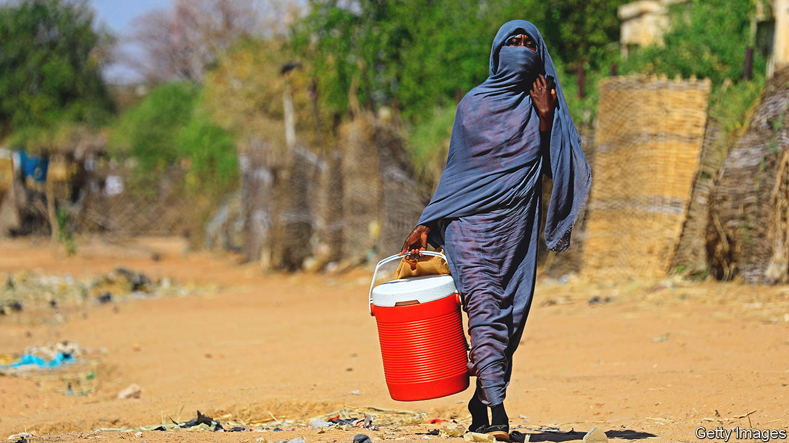
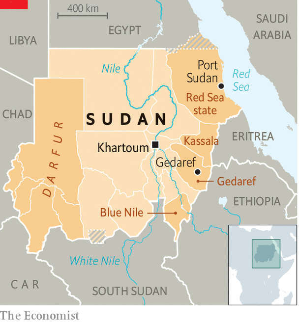

###### The cost of the coup

# Sudan’s troubled east is a microcosm of a wider crisis 

##### Its democratic transition has stalled and its economy is failing 

 

> Jan 5th 2023 

In the central marketplace of Gedaref, eastern Sudan, Mohammed Siddig counts the cost of the past year’s turmoil. The price of fuel, which he needs to run his farm near the border with Ethiopia, is up by about 300%. School fees, which he pays for four of his children, have increased by 400%. Yet just as unrest at nearby Port Sudan hurt farmers’ exports, the state-owned agricultural bank cut their subsidies. “It’s totally unprofitable,” Mr Siddig laments. His sesame and sorghum harvest recently fetched about half what it had the previous year. Now he is in debt, which he underscores by slapping onto the counter a bag of chickpeas that he is buying on credit. 

Sudan’s economy, already in a tailspin, tipped into recession last year. Although this may have brought inflation down a bit, it remains in triple digits, among the highest rates in the world. Roughly one-third of Sudanese (some 15m of a population of 44m) need emergency aid such as clean water, shelter or food, according to the UN. Almost 12m people are going hungry. Eastern Sudan, in theory the country’s breadbasket, should be faring relatively better. But the long-standing neglect of the region by successive rulers in Khartoum, Sudan’s capital, left deep wounds. The latest crisis threatens to reopen them.

Although the price shock triggered by Russia’s attack on Ukraine did not help, the main reason for Sudan’s political and economic trouble is its second coup, which came less than three years after protesters precipitated the fall of Omar al-Bashir, a brutal Islamist dictator who had ruled the country for three decades. Amid huge uprisings, the army, led by General Abdel Fattah al-Burhan, now the president, seized power. When demonstrations continued, the generals agreed to share power with leaders of the protests and promised elections in 2022. But, eager to avoid the fate of Mr Bashir (who is now on trial), they soon began blaming their civilian partners for mismanaging the economy and public services. In October 2021 they staged a second coup. Protesters have been on the streets almost every week since.

The putsch hastened the economy’s collapse. Western donors and multilateral banks held back tens of billions of dollars they had pledged to rescue Sudan’s economy and support its transition to democracy. The government responded by increasing taxes and slashing public spending, which prompted waves of strikes and protests. “The economy has ground to a halt,” says Volker Perthes, the UN’s special representative in Sudan. 

The coup also made chronic instability worse. Instead of iron-fisted order, crime and lawlessness have spread. Between January and October last year more than 265,000 people were forced from their homes by violence. “The government is weak,” complains Khalid Musa, a merchant in Gedaref whose house was recently burgled in broad daylight.

Worst-affected is the Darfur region, where government forces and the Janjaweed, a militia since rebranded as the Rapid Support Forces (RSF), committed genocide in 2003. But the east, especially Blue Nile state, has also seen a spike in violence over land and political representation.

Part of the explanation for the disorder is a power vacuum in Sudan’s poorer peripheral states. “The centre lost its grip on power,” says Waleed Madibo, a political scientist in Khartoum. Some 11,000 police have resigned over low pay. Others have been transferred to the capital. Because of this, “Anyone can do what he wants,” says Abbas Bashir, a teacher in Gedaref.

But many suspect that politicians and generals are themselves behind some of the trouble. They have long governed far-flung states through networks of provincial aristocrats and traditional leaders known as “native administrations”. Dating from the colonial period, these were later fostered by Mr Bashir as instruments of control. Many were unhappy about his overthrow. According to a tribal chief in Gedaref, two out of four native administrations in the state backed the coup in the hope of reinstating the old regime.

What price loyalty?

“Some of these tribal leaders are trying to play politics, or are being used to play politics, in Khartoum,” argues Mr Perthes. In 2021, for instance, leaders of the Beja tribe in Red Sea state imposed a six-week-long blockade on Port Sudan, exacerbating food and fuel shortages in the capital. Just one week after the coup, the blockade was lifted. Prices duly fell. 

 


More recently, the deputy head of Sudan’s junta and arguably its most powerful man, Muhammad Hamdan Dagalo (better known as Hemedti), has been cutting deals in the east. The notorious commander of the RSF, who is from Darfur, is probably attracted by the region’s strategic importance. Gedaref and Kassala states are rich in fertile land and gold. The Red Sea coast has ports that Russia and the junta’s backers in the Gulf are eyeing.

Last year Hemedti toured the region, reportedly distributing land-cruisers to tribal leaders in exchange for loyalty. Since then the Beja High Council, a group of eastern tribal leaders responsible for blockading the port, has splintered. Some accuse Hemedti of being behind the divisions.

In December leaders of the civilian bloc and the junta signed a new accord promising a fully civilian government and elections in two years. If implemented, it should bring respite for Sudan’s economy by paving the way for foreign aid and debt relief. “If you look at it objectively, it’s actually a pretty good deal,” says a Western diplomat. The generals, for their part, are bullish. The accord has been “accepted all over the world”, says General Ibrahim Jaber, who is in charge of foreign policy. 

But the agreement also opens up dangerous faultlines. Pro-democracy activists view it as a lifeline for the junta. They vow to demonstrate until the generals leave power. Yet they find themselves in the awkward company of several leaders from the peripheries who backed the coup. These include former rebels such as Jibril Ibrahim, now the finance minister, and Minni Minnawi, the new governor of Darfur. They are unhappy about the agreement’s pledge to revisit another pact, signed in 2020, which brought rebels from Darfur and southern Sudan into the power-sharing government.

Also lined up against the deal are tribal leaders from the east, such as Sayeed Tirik, the Beja High Council’s head, who denounced it as un-Islamic and a tool of foreign powers. He has drawn closer to disgruntled Islamists from Mr Bashir’s former regime. He has threatened armed opposition if his demands, which include separate negotiations for the east, are not met. Such threats may now ring hollow, but they cannot be ignored: eastern Sudan suffered from a long-running insurgency until the mid-2000s. “Our assessment is that the centre of opposition…will come from the east,” says a UN official. 

Talks are under way in Khartoum to appoint a new civilian prime minister. Negotiations over thorny issues, including the prosecution of the generals for genocide and crimes against humanity, are also due to begin soon. “We are very committed to transitional justice,” says General Jaber. But satisfying the diverse coalition of those unhappy with the direction of Sudan’s fragile transition will be tricky. “Deluded are those who think that they could rule us from Khartoum,” said Mr Tirik in a recent speech. It is a refrain with echoes through Sudanese history—and one which serves as a reminder of how little has changed since Mr Bashir’s fall. ■

