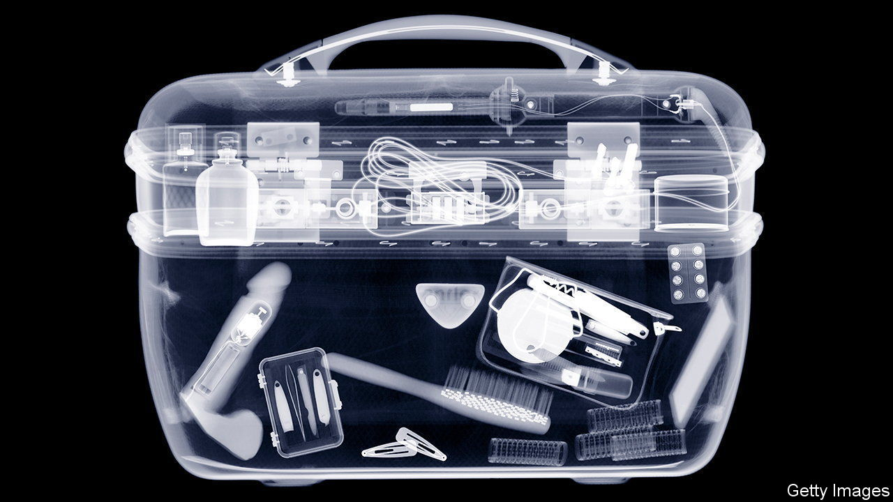

###### Sex toys and taboos

# Women in the Middle East are leading a revolt against prudish men 

##### More of them want to claim control of their own sexuality 

 

> Jan 5th 2023 

Even the act of defiance has to be discreet. On the wall of a private art gallery in Dubai, the raciest city in the United Arab Emirates (uae), is a set of office pigeon holes. They contain photographs of homemade sex toys: mere photographs because if they were real, Dubai’s police might seize them; they are home-made because importing them is banned.

In recent years sexual taboos have been broken across the Middle East. Receptionists no longer check that couples sharing a Saudi hotel room are married. Last year the uae decriminalised premarital sex. A growing enthusiasm for sex toys reflects women’s rejection of the idea that men should control their sexuality.

In Dubai customs inspectors scour the bags of incoming travellers, particularly women of Arab origin, and seize any sex toys. Most are let off with a warning. But under the country’s indecency law, they can be fined up to 50,000 dirhams ($13,000) and put in prison.

Similar colonial-era laws prevail across the Middle East. Every year customs officers throughout the region confiscate dildos, vibrators and fluffy handcuffs. Many religious preachers reinforce such attitudes. Most consider masturbation to be  or forbidden. The leading ayatollahs of Shia Islam, Ali Khamenei in Iran and Ali al-Sistani in Iraq, have issued  specifically prohibiting sex toys. Sunni scholars also fulminate against them. An Iranian mullah has warned women against peeling aubergines lest it inspire improper thoughts. “Self-pleasure is the biggest taboo here,” says Christina Lindea, a Finnish sexologist based in Dubai.

And yet people find ways around the bans. Some lingerie shops in Dubai’s malls double as under-the-counter sex shops. Online shops offer “wellness enhancements”, advertising vibrators as electric face massagers. Global demand for sex toys soared during the pandemic. Sexologists and retailers in the Middle East have seen similar trends. A vibrator called Deem goes for $85 online; it has sold out twice.

The recourse to sex toys is part of women’s desire for greater empowerment, says Sura, the founder of Mauj, a website run by Arab women, whose name means “wave” (of sexual pleasure) and which sells Deems. In places like Dubai, expatriates, who make up 90% of the uae’s population, are accelerating the shift. 

More open-minded religious figures are also playing a part. Unlike their Christian counterparts, Muslim clerics have long insisted that their religion encourages sex for pleasure, not just procreation. Sheikh Muhammad Fadlallah, an influential Shia Lebanese cleric who died in 2010, argued that female masturbation is not  because no semen is spilled. Dildos make a legitimate substitute, he added, if the husband is absent or unable to satisfy his wife. Others are now making similar arguments. Ebrahim Desai, a Sunni cleric from South Africa, endorses sex toys if used for foreplay between married couples. Some Saudi clerics say vibrators are acceptable if they are not “invasive”. 

New platforms launched by women promote self-pleasure as an act of female liberation. Online videos are filling the sex-education gap by normalising taboo words such as clitoris (in Arabic; in Persian). Love Matters, an Egyptian platform, challenges the stigma surrounding women’s sexuality. “The tides are turning in the Middle East,” says Sura. “We’re tackling the culture of shame that governs our bodies and lives, and helping women explore their sexuality head on.” If all else fails, counsels another website, “use your...fingers. They’re free—and they aren’t banned!” ■

