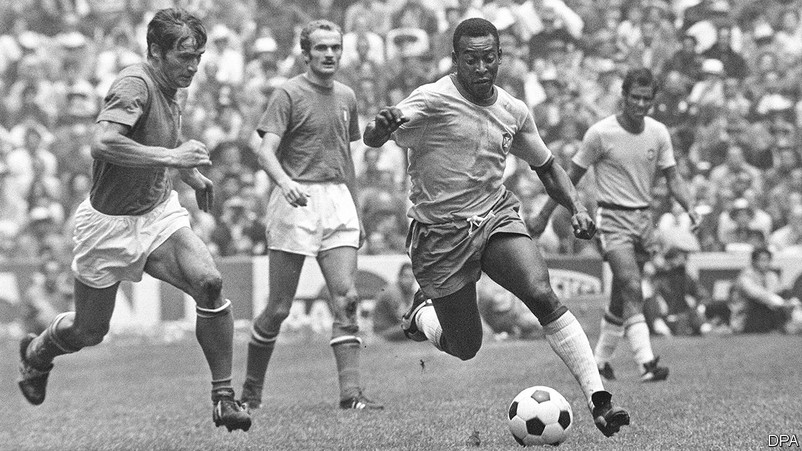

###### King of the beautiful game

# Pelé went from poverty to football superstardom 

##### Brazil’s best-loved player died on December 29th, aged 82 

 

> Dec 30th 2022 

He was just a boy, only 17. Yet in the World Cup final of 1958 Edson Arantes do Nascimento, better known as Pelé, showed the poise and supreme skill that would mark his career. As Brazil led Sweden, the hosts, by two goals to one he received a high pass in the penalty area. With a defender on his shoulder, he caught the ball on his chest, took one pace and flipped the ball high over another defender before running to meet it and driving an unstoppable volley low into the net. 

Though he said so himself, it was a nice goal. After looping in another, realising they were about to win the whole tournament, he passed out with emotion on the pitch. He felt he had achieved everything, all his dreams come true—even to a fling with a blonde, blue-eyed Swedish girl who was crazy for this little black as he loved to call himself.

This was only the first of three World Cups he won, more than any other player. It might have been four, but in 1966 the Bulgarian and Portuguese defenders kicked him to pieces, the referees didn’t protect him and Brazil, he thought, were badly prepared anyway, so they crashed out. 

Three Argentines—Alfredo Di Stéfano, Diego Maradona and Lionel Messi—all had their claims to be the world’s greatest footballer. But he held the world record for goals, 1,279 in 1,363 matches, and that was unlikely to be surpassed. Even a goal he didn’t actually score, against England in the 1970 World Cup, became famous, because few—including him—could work out how Gordon Banks had managed to save it. Ever confident, he shouted “Goal!” as he launched his header. It was scooped over the bar. 

As a forward he was not that tall, but he was strong, fast and had thighs as thick as his waist. He could read the game like a book, and control the ball as if it was drawn to him like a magnet. He could also tell exactly where he was needed, and when, and what the opposition might have in mind to try to block him. All this seemed to make him a natural captain, but he never wanted that role officially. He would just show the team his best moves, organising by example, and was happy to provide the killer pass for others to finish. 

Dribbling was his great skill, flummoxing defenders with feints and sudden stops and starts. He could shoot for goal powerfully with either foot and despite his height, or lack of it, was a spring-heeled header of the ball. He jumped so easily over Tarcisio Burgnich, the Italian marking him in the 1970 World Cup final, that Burgnich doubted he was flesh and bone at all. Then he scored the first goal. He knew he was the best player in that tournament and, with the next World Cup four years away, he declared he wouldn’t play any more.

He retired, he felt, at his best, and before football stopped being fun. His World Cup goal at 17 had been nothing but joy, no nerves, no responsibility, but his thousandth goal, in 1969 from a penalty, was completely different. His legs shook, the whole of the Maracanã stadium was yelling, and he was suddenly crushed by the thought that he, three times world champion, most famous footballer, could not miss this. He had never felt pressure like it.

Nor had he imagined he would face it. He was born in poverty in a town in the south-west of Minas Gerais state; his great-grandparents had been slaves. His first trainer was his father, a professional footballer whose career at Vasco da Gama was ended early by injury. His mother preferred him to be unhurt and earning proper money. Even a ball was too costly: he played with anything roughly round, socks stuffed with paper, mangoes or a bundle of rags. His lifetime love took root then, and never left him. The nickname “Pelé”, a classmate’s tease, annoyed him at first (“Edson” was more serious, after Thomas Edison), but he liked it better when he learnt it meant “miracle” in Hebrew. And miracles followed. At only 15 he was snapped up by Santos, his first professional club. Largely because of him it became the best team in the world in the early 1960s, winning two Intercontinental Cups. 

Several big European clubs begged him to join them: Real Madrid, AC Milan, Bayern Munich. But Santos and Brazil’s government refused a transfer. Besides, life was so nice at Santos that he didn’t want to change, and he went on playing for the club long after he left the international game. He played before football was a global business: half his career was in black and white. In today’s game he would have been a billionaire. As it was, he had a sharp eye for money in deals off the pitch. At 34 he came out of retirement to help launch “soccer” in the United States, joining the New York Cosmos because, he said, Henry Kissinger persuaded him. By 1977, when his tenure ended, he was being called “O Rei”, “The King”—the very name that the playwright Nelson Rodrigues, a towering figure in Brazil, had given him years before when he had first seen him play for Santos. 

Santos was always close to his heart; as was Vasco, where his father had taken him as a toddler to watch training sessions. In 1994 he even accepted a job as sports minister in the democratic government of Fernando Henrique Cardoso. He piloted a law to clean up Brazilian club football, but it was neutered in the Congress, where a powerful lobby defended the corrupt state of things as they were. The activities of that bunch of crooks and the poverty he saw in his rich country often made him cry. 

His life off the pitch was complicated, with three marriages and at least seven children, one of whom—a daughter born of an affair with a cleaner—he refused for a long time to recognise. Women aside, though, he kept his life simple. He hoped to pass as an ordinary guy at airports, and never used the red diplomatic passport President Lula gave him. His way of winding down was to go fishing or to play  with the wooden top he always carried, spinning it on his palm as long as he could. He was never an activist; just by being himself, he embodied black dignity. And he revelled in the beautiful game he played. His one regret was that he had never scored in the World Cup with a bicycle kick. ■


