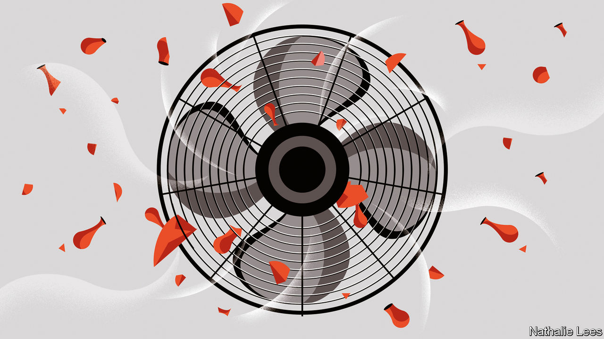

###### Killing SARS-CoV-2

# Acidifying the air may protect against covid 

##### A soupçon of nitric acid could do the trick 

 

> Jan 4th 2023 

In China, one sign a respiratory disease is doing the rounds is a rise in sales of vinegar. Folk medicine says that when you boil it, the acetic-acid-rich fumes clear the air of whatever nastiness is bringing on the cough. And there may be a grain of truth in this belief, for one sure way to render airborne viruses, such as SARS-CoV-2, the cause of covid-19, harmless, is to make the droplets of fluid which carry them more acidic.

Tamar Kohn of the Swiss Federal Institute of Technology in Lausanne, and Thomas Peter of its Zurich counterpart, reckon, though, that this can be done well only by a stronger acid than acetic—nitric, for example. They observe in a study just published in  that once inside a droplet, nitric acid creates conditions which viruses find really hard to take.

Dr Kohn, Dr Peter and their collaborators experimented with various viruses suspended in liquids of the kinds that natural virus-carrying aerosols are made of—lung fluid and nasal mucus in particular—to see how acidic these would have to be to inactivate different viral species. Based on previous experiments on the diffusion of compounds into such droplets, they also calculated how easily nitric acid would enter them.

The logical next step would have been to study the effect on aerosol-borne viruses of air rich in nitric acid. They were, however, prevented from doing this by biosafety regulations, so instead they used a computer model based on the results they had collected.

For influenza viruses, the model suggested, normal room air is already quite harmful. Flu bugs are inactivated by it in minutes. SARS-CoV-2, however, is a harder nut to crack. In normal room air it can remain active for days. But invulnerable it is not. Droplets become death traps for it in under a minute if the acidity of the air is increased sufficiently. And that suggests an intriguing idea. Injecting nitric acid into a building’s air, via its ventilation system, might, the model indicates, reduce the chance of infection for people 1,000-fold.

That would involve people breathing in strong acid. But this should not be harmful. The concentration required to destroy SARS-CoV-2 is less than a tenth of the legal safe level for workplaces in America and much of Europe. 

Whether, even with that reassurance, people would actually be willing to accept acidic air in exchange for viral protection remains to be seen. But one clear consequence of this work is that it is worth considering wearing a mask in buildings such as museums and libraries which are filled with things that acid is bad for, and thus have their air treated to reduce, rather than increase, its acidity.■


