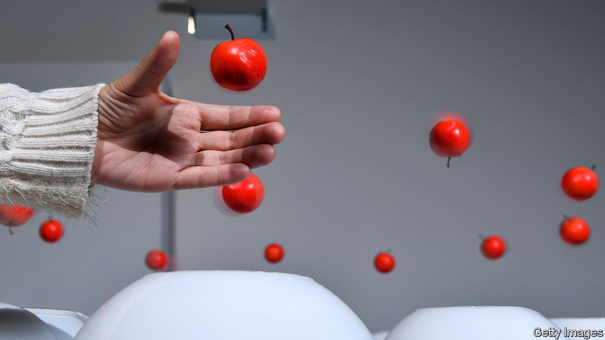
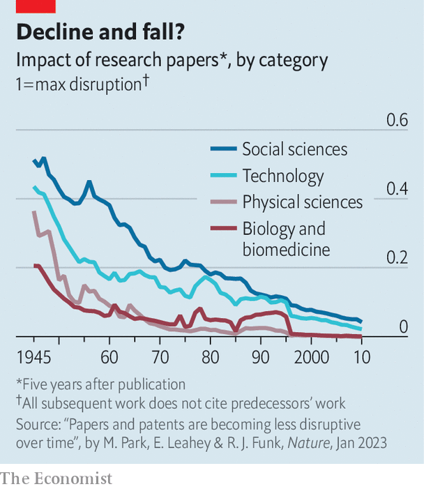

###### The changing nature of science

# Papers and patents are becoming less disruptive 

##### Why that is, is a mystery 

 

> Jan 4th 2023 

“Ideas are like rabbits,” John Steinbeck said. “You get a couple and learn how to handle them, and pretty soon you have a dozen.” Scientific and technological progress is often viewed in this way. Current ideas build on previous ones. And ideas, along with papers and patents, have indeed proliferated in the recent past. 

Yet despite—or perhaps because of—this productivity (papers published and patents issued each year now number in the millions), it has been documented that innovation within specific fields has been in decline. For example, a paper titled “Science in the age of selfies”, published in 2016, warned of a shifting incentive-and-information landscape in biology, particularly neuroscience, that has diluted the number of high-impact discoveries. 

Michael Park and Russell Funk of the University of Minnesota, and Erin Leahey of the University of Arizona, have set out to determine whether this decline holds for science and technology in general. In a study published this week in  they analyse 45m papers and 3.9m patents published and filed between 1945 and 2010. 

The measurement they use for this work, known as the CD index, quantifies how “consolidating” or “disruptive” each paper or patent is. A paper is consolidating (a low CD score) if later work citing it also cites the papers that it, itself, cited. Discoveries and inventions of this sort—like a patent awarded in 2005 for genetically modified soyabeans—serve to propel science forward along its existing trajectory. By contrast, a paper is disruptive (a high CD score) if it is cited by later work in the absence of citations of its predecessors. A classic example of that was the study published in 1953 by James Watson and Francis Crick on the double-helical structure of DNA. High-CD papers disrupt the status quo, fundamentally altering a field’s trajectory or creating a new field altogether.

 


Both consolidating and disruptive work are needed for scientific progress, of course, but science now seems to favour the former over the latter in a potentially unhealthy way. Mr Park and Drs Leahey and Funk found that the average CD score for papers has fallen by between 92% and 100% since 1945 (see chart), and for patents between 79% and 92%. These declines are not mere artefacts of changing publication, citation or authorship practices; the researchers controlled for that. Why, then, has science become less disruptive?

One hypothesis is the low-hanging-fruit theory—that all the easy findings have been plucked from the branches of the tree of knowledge. If true, this would predict different fields would have different rates of decline in disruption, given that they are at different stages of maturity. But that is not the case. The decline the researchers found was comparable in all big fields of science and technology.

Another idea is that the decline in disruptiveness stems from one in the quality of published work. To test this, the researchers looked at two specific categories: papers in premier publications and Nobel-prizewinning discoveries. “If there were a pocket of science where the quality might have declined less, or hasn’t declined,” said Mr Park, “it would be in those places.” But the downward trend persisted there, too. 

A more likely reason for the change, the researchers argue, is that scientists and inventors are producing work based on narrower foundations. They found that citing older work, citing one’s own work, and citing less diverse work all correlate with less disruption. As the amount of published science grows, the effort required to master a pool of knowledge that is both deepening and narrowing as the years roll by may inhibit the ability to form creative connections between disparate fields. Here is an argument for the rebirth of the renaissance human.

Mr Park maintains there is room for optimism. Though the average disruptiveness of discoveries has declined, the number of “highly disruptive” ones has remained constant. Humanity does not appear to be reaching the end of science. Albert Michelson, winner of the 1907 Nobel prize in physics for his work on the immutability of the speed of light, which underlay Albert Einstein’s special theory of relativity, is as wrong now as he was in 1894, when he said that it was “probable that most of the grand underlying principles have been firmly established”. ■


