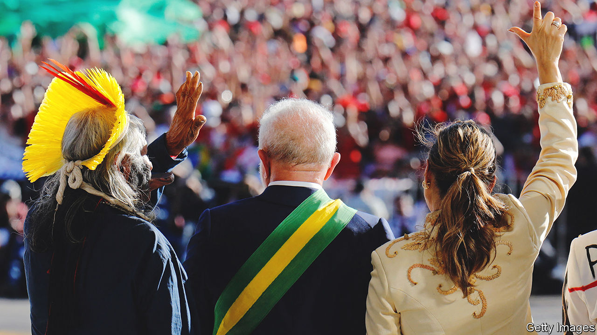
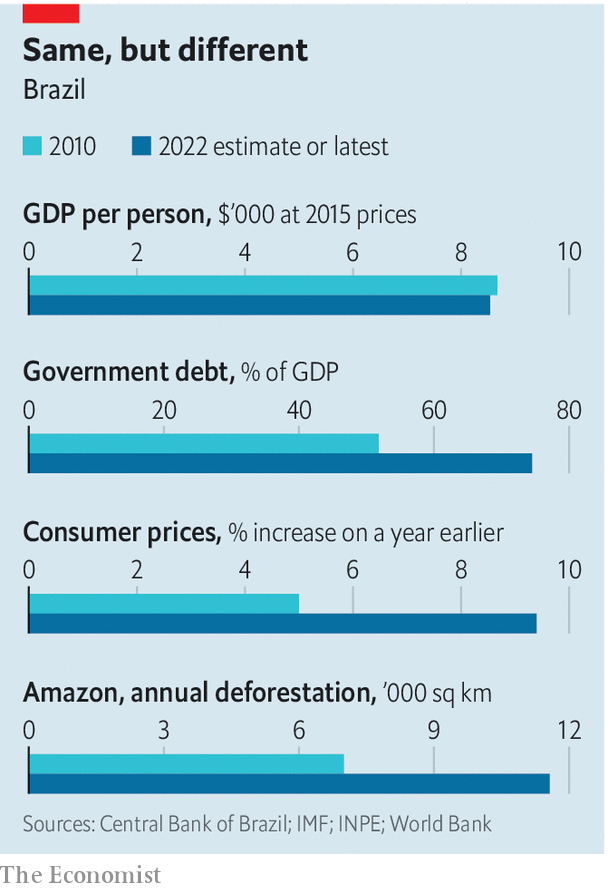

###### Big plans, not much money

# Brazil’s new president faces a fiscal crunch and a fickle Congress 

##### Luiz Inácio Lula da Silva was sworn in on January 1st, 20 years after first taking office 

 

> Dec 31st 2022 

On January 1st  looked out from the ramp at Planalto Palace, the Brazilian president’s office, at a sea of supporters dressed in red. The crowd resembled the one that greeted him at his first inauguration in 2003. Brazil’s fortunes have risen and fallen since then. So have those of Lula, as the former union organiser and founder of the left-wing Workers’ Party (PT) is known. He left office in 2010 with an 83% approval rating. From 2018 he spent 19 months in jail on corruption charges that were later annulled. In October 2022 he completed a remarkable political comeback by beating Jair Bolsonaro, the right-wing populist incumbent, in a  presidential election.

Now he must govern. In fact, he has spent the past two months acting as if he were already president. That is partly because Mr Bolsonaro spent the transition sulking. He never explicitly conceded defeat in an election he suggested, without evidence, would be rigged against him; and his party tried unsuccessfully to have the result overturned. In December, while most Brazilians were watching the World Cup, hundreds of  protesters stood outside the army headquarters in Brasília, the capital, calling for a coup. Mr Bolsonaro decided he would rather be abroad, in Florida, on inauguration day. The presidential sash, which is supposed to be passed from one president to the next, was given to Lula by a group representing Brazilian society, including a ten-year-old boy and an indigenous chief. 

Lula has a daunting task ahead because of the economic mess which Mr Bolsonaro . Copious pre-election stimulus spending helped boost growth in 2022; according to the central bank, it will be 2.9%. But it is expected to drop to 1% in 2023. Inflation has fallen from a peak of 12% in April to 6% in November. However, the share of Brazilians who do not get enough to eat has risen from 6%, just before Mr Bolsonaro took office in 2019, to 16%. His government promised liberal economic reforms but, apart from putting state pensions on a sounder footing, failed to enact most of them. 

 


Inflation has helped reduce the burden of government debt, by swelling the size of national income. But high inflation has also pushed up the government’s borrowing costs and eroded confidence in long-run macroeconomic stability, leaving the new government with less room to manoeuvre in dealing with the debt burden, which, at 75% of GDP, remains uncomfortably high (see chart).

The resulting fiscal crunch will complicate Lula’s ambitious policy plans and the speed with which he hopes to enact them. “It’s not fair or right to ask for patience from someone who is hungry,” Lula said, through tears, in his inauguration speech. He wants to revamp various social policies started under his previous administration. These include a conditional cash-transfer scheme known as Bolsa Família (Family Fund), a subsidised-housing initiative, and a programme to provide jobs and upgrade Brazil’s shoddy infrastructure. 

Lula also plans to reduce illegal deforestation in . The pace of tree-clearing rose by 60% under Mr Bolsonaro, as officials turned a blind eye to illegal logging, mining and land-grabbing. Among Lula’s first decrees upon taking office were ones to restructure environmental bodies gutted by his predecessor, reverse a plan to legalise wildcat mining in protected areas and reactivate the Amazon Fund, by which Norway and Germany help pay for environmental policing and sustainable-development projects. The new environment minister is Marina Silva, who did the job between 2003 and 2008 and is expected to launch the kind of co-ordinated enforcement effort that helped Brazil curb deforestation in the 2000s. Yet the ministry’s budget is roughly a quarter of what it was when Lula left office in 2010, when adjusted for inflation. 

Lula has had to scramble to fill a hole in the budget for 2023 of the order of 1.7% of GDP, caused by Mr Bolsonaro’s pre-election profligacy. Left unfilled, it would have forced him to slash spending on health, education and cash transfers which keep 22m of the country’s poorest families afloat. The president-elect spent much of the transition period rallying support in Congress for a constitutional amendment to exclude roughly that amount from a federal spending cap passed in the wake of a fiscal crisis and a recession in 2014-16, during the tenure of Lula’s hand-picked successor, Dilma Rousseff. The cap limits any increase in government spending to the previous year’s inflation rate. 

Give and take

Lula’s amendment passed on December 21st, the eve of the congressional recess. Having to change the constitution in order to make a budget add up is a symptom of Brazil’s political dysfunction. The charter has been changed 140 times since it was drafted in 1988, usually to allow the government to borrow more, rather than to allow reforms that might increase the efficiency of spending. 

That Lula has had to deal with all this before taking office is “not normal”, said Marcelo Castro, the senator overseeing the budget bill. Still, Lula’s methods—haggling with the leaders of more than 20 parties and doling out cabinet jobs to those who agree to back him—show his awareness that the first step towards achieving his ambitious plans is to establish a stable relationship with Congress.

This has not been easy, despite Lula’s reputation as a skilled negotiator. The PT has just 12% of seats in Congress. As is typical in Brazil’s legislature, a majority coalition must be built via  (“give and take”), the grubby process of making deals with opportunistic centre-right parties and giving them positions of power. One PT senator throws up his hands in exasperation at the “exaggerated” number of ministries each party demanded in return for backing the government. Lula has created 14 new ministries, including a fishing ministry, bringing the total to 37.

Congress has also become more powerful since Lula stepped down in 2010. Although Mr Bolsonaro initially eschewed , he later took the practice to an extreme, giving decision-making power over tens of billions of reais of the federal budget to Arthur Lira, the president of the lower house, in exchange for shielding the president from impeachment. Mr Lira funnelled the cash to his political allies in the states for vote-winning projects such as paving roads and buying tractors. 

During the campaign Lula decried this “secret budget”, which the Supreme Court says is unconstitutional. It sucks money away from ministries and creates opportunities for graft. Once elected, however, Lula changed his tune, allowing the “secret budget” to be turned into two separate transfers controlled by congressmen. He also started negotiating with Mr Lira. That surprised many, given the congressional leader’s loyalty to Mr Bolsonaro. But Mr Lira, like Lula, is a pragmatist. He quickly recognised Lula’s victory; other  politicians followed suit. 

Indeed many politicians who once supported Mr Bolsonaro have now decided to back Lula. “Being opposition to the government when it’s going well is like being opposition to the country,” says Luciano Bivar, the president of União Brasil, one of the parties that will give Lula a majority in Congress. Even some members of Mr Bolsonaro’s Liberal Party may vote with the government. “The party has some influence over its members, but the government is much more powerful,” says Sóstenes Cavalcante, one of its deputies.

Even so, Simone Tebet, a senator who campaigned for Lula in the run-off and who is now his planning-and-budget minister, predicts that congressional goodwill will not extend to every issue. Lawmakers are eager to back Lula’s efforts to boost growth, for example, but many will not champion leftist social causes. Conservative types may attempt to override several decrees passed by Lula upon taking office, including a ban on the purchase of certain kinds of guns and a temporary suspension of the opening of new shooting clubs. 

And the broad coalition that Lula has built will be unstable. Brazilian presidents’ strength in Congress depends on their popularity, which in turn depends on the economy. Neri Geller, the vice-president of the agricultural caucus in Congress, predicts that infrastructure projects such as improved roads and ports and subsidised credit lines from BNDES, the state development bank, may endear Lula to farmers, who tend to be . But Brazil’s fiscal situation and the prospects for the global economy are more difficult than when Lula was last president, during a commodity boom.

Fernando Haddad, Lula’s finance minister, has promised to deliver a new fiscal rule to replace the spending cap, which will allow the government to borrow more (while establishing new rules for fiscal responsibility in an attempt to calm market jitters). He also wants to implement a tax reform to boost growth, even though this has eluded governments for decades. An initial reform would simplify a byzantine tax code, for example by combining several levies into a single value-added tax. Mr Haddad has said that the government might later try to make taxes more progressive, for example by taxing inheritance.

Man of the momentum

Faster growth than Brazil’s lacklustre 0.5% annual average of the past decade is crucial to fund the social programmes that Lula is planning. But many fear that the PT’s  will stifle it. The financial markets will be “far less forgiving” with Lula than they were with Mr Bolsonaro, says Aline Contar de Souza of Ágora, a consultancy. Brazil’s currency lost ground after Mr Haddad was nominated, though it later rebounded. The share price of Petrobras, the state oil giant, fell by 6% the day after the inauguration because of Lula’s decision to continue fuel subsidies launched by Mr Bolsonaro, and to revoke preliminary studies into the privatisation of eight state companies.

Lula can kickstart parts of his economic agenda through executive orders and decrees. He could launch employment programmes and expand lending by BNDES, which the PT hopes will spur consumption and boost growth. But big reforms will require buy-in from Congress. 

In Brazil, as elsewhere, a buoyant economy boosts politicians’ support for the government. During crises, the opposite tends to happen, making difficult reforms all but impossible. “We’re betting a lot on Lula’s political skill,” says Humberto Costa, a PT senator. The new president will have to prove himself quickly. ■

