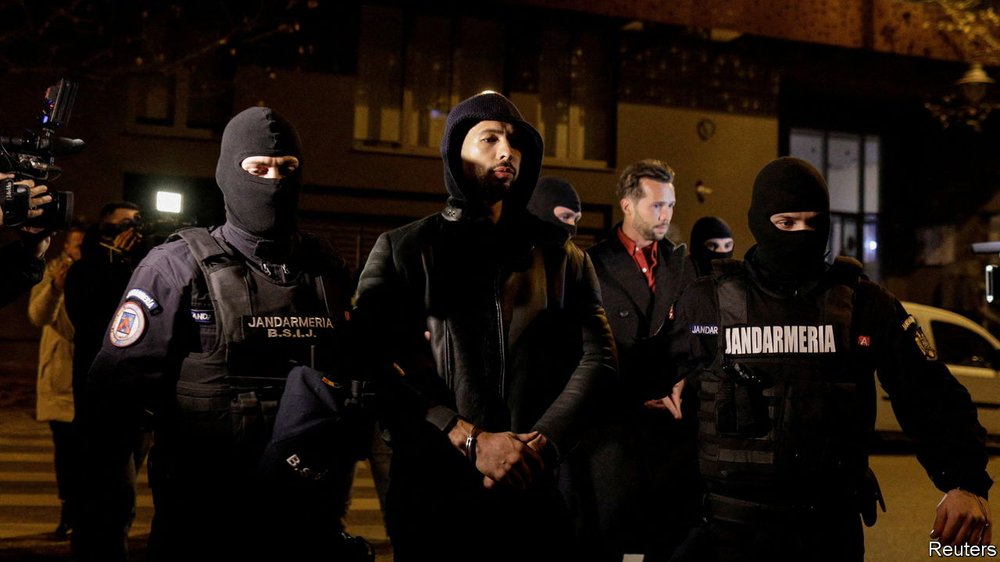

###### The Economist explains

# Who is Andrew Tate, the misogynist hero to millions of young men? 

##### The social influencer has been arrested on suspicion of human trafficking 

 

> Dec 30th 2022 

“THIS IS WHAT happens when you don’t recycle your pizza boxes,” tweeted Greta Thunberg on December 30th, following the arrest of Andrew Tate on suspicion of human trafficking, forming an organised crime group and rape. Three days before, Mr Tate had trolled the teenage environmentalist on Twitter about how many cars he owned. After Ms Thunberg asked him to email her at “smalldickenergy@getalife.com” Mr Tate released a bizarre video response, in which he goaded her with non-recycled takeaway containers. Rumours that prosecutors in Romania—where he was sheltering—had tracked him down via those pizza boxes, appear to be misplaced.

The British-American former kickboxer rose to fame after a brief stint on the British version of “Big Brother”, a reality television show, in 2016. He was booted off that programme after a video emerged of him appearing to attack a woman with a belt. Styling himself as a self-help guru for young men, he went on to become a mainstay of alt-right online spaces, which propelled him to social-media fame. In video clips posted to TikTok, the 36-year-old outlines a worldview that includes his preference for dating only 18- and 19-year-old women, his belief that rape victims should “bear responsibility” for their assaults, and a defence of Donald Trump’s admission in 2005 that he likes grabbing women “by the pussy”. By the time Mr Tate was eventually banned from the platform in August 2022, videos of him had been viewed 11.6bn times. 

Mr Tate is part of a chauvinistic online ecosystem, and has hung out with the likes of Alex Jones, a prominent conspiracy-theorist, Donald Trump Jr, the former president’s eldest son, and Paul Joseph Watson, a far-right YouTuber. But what sets Mr Tate apart from other alt-right social-media personalities and previous anti-feminist online movements is the extent to which his views have found a ready audience among teenage boys. 

His videos play on young men’s insecurities. He offers advice on how to be sexually successful, arguing that if a man cannot attract a woman, this is a problem that can be solved through self-improvement. His sales patter is rooted in “hustle culture”: modern vernacular for pulling oneself up by the bootstraps. He mixes this with a huge dose of misogyny, and suggests that men must be hypermasculine to succeed. 

In 2021 Mr Tate established Hustlers University, an online platform where young men could take courses in business and investing for $49.99 a month. It also gave students financial rewards for promoting Mr Tate’s misogynist ideas via a now-suspended affiliate marketing programme. Thanks to a continuing stream of fan-generated content, his views have proliferated on social media even though most platforms have banned his accounts. 

Part of the reason why Mr Tate has found success specifically on TikTok is that its algorithm is uniquely predictive, appearing not only to rely on the content users watch and recommend, but making assumptions about their potential interests. This can push users—in this case dissatisfied young men—towards extremist content such as Mr Tate’s. That has made him the most popular influencer among American Gen-Zers, according to a twice-yearly survey of 14,500 of the country’s teenage boys and girls by Piper Sandler, a finance company that researches consumer data. Teachers have reported boys as young as 11 praising and emulating him. 

For some young men growing up in a post-#MeToo world, Mr Tate offers an alternative worldview that objectifies women as inferior creatures. Whatever the outcome of the criminal case brought against him, the effects of his poisonous preaching will be measured not just by the number of young men and boys exposed to it, but in their sexual and social relationships with women for years to come. ■

