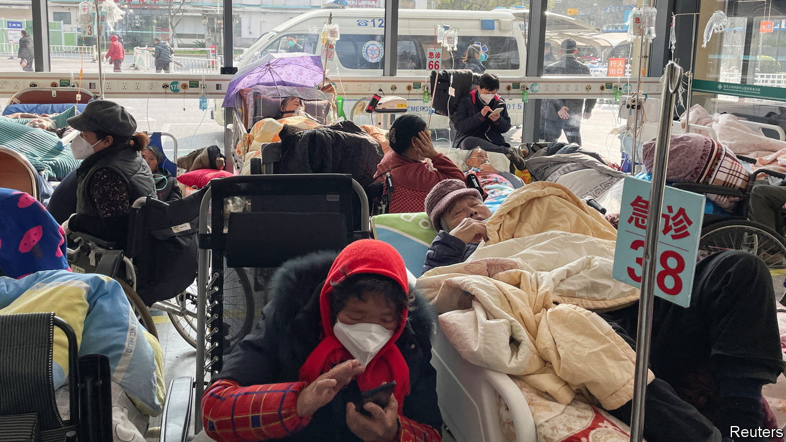

###### The world this week

# Politics and business 

#####  

 

> Jan 5th 2023 

After nearly three years of self-imposed isolation,  said it would  on January 8th. People arriving from abroad will no longer have to quarantine. The move comes as covid-19 tears through the country. Hospitals are struggling to deal with the sick. The outbreak is now spreading to smaller cities and rural areas with fewer medical resources. Several countries, including America and Britain, are now demanding that incoming travellers from China take a covid test first.

 ushered in the new year with a  on a Russian barracks in occupied Donetsk province. At least 400 soldiers were killed, Ukrainian sources said, though Russia has admitted only to 89 losses. For its part, Russia continued its strikes on civilian targets, but to limited effect as Ukraine becomes steadily better at interception.

 prime minister, Albin Kurti, called on NATO to increase its presence in the country. Ethnic Serbs living in north Kosovo began dismantling road blocks they had set up in December in protest against the arrest of a former Serb policeman. The removal of the barriers has eased a spike in tensions between Kosovo and Serbia. 

The euro becameofficial currency on January 1st. The south-eastern European country is the 20th member of the euro zone. 

Thousands of  travelled to  to attend the funerals of three Kurds shot dead by a man who said he wanted to “murder migrants”. Kurds clashed with police in the French capital after the attack. 

The British government in Westminster seemed set to clash with the government in Edinburgh over the Scottish Parliament’s approval of an act allowing people to  with little fuss. The British government is considering whether to block the law or refer it to the Supreme Court, which could spark a big constitutional row. 

 junta announced another amnesty to free thousands of prisoners. It was not clear if any political prisoners would be among them. Aung San Suu Kyi, who was ousted as leader two years ago, has been handed a further seven years in jail in relation to trumped-up charges of corruption. In December the UN Security Council passed its first resolution on Myanmar since the coup, calling on the army to end the country’s violence. 

 was inaugurated as  president, exactly 20 years after he first took office. Lula plans to expand social-welfare programmes for the poor and to reduce deforestation, which increased under the watch of his predecessor, Jair Bolsonaro. Mr Bolsonaro broke with tradition by spending inauguration day in Florida. 

 and , two countries in the Sahel run by military dictatorships, soured relations with countries supporting them in battling jihadists. Burkina Faso kicked out the UN representative and asked France to withdraw its ambassador. It is seeking closer ties with Russia. Mali imposed long prison sentences on soldiers from Ivory Coast it accused of being mercenaries. The soldiers were supporting a United Nations peacekeeping mission. 

 was sworn in for a sixth time as s prime minister. His cabinet is the most right-wing in the country’s history. 

America’s Supreme Court ruled that  should stay in place until it has had a chance to hear arguments and give its opinion on the policy. Title 42 was introduced as a pandemic measure in March 2020 and allows American officials at the Mexican border to swiftly expel illegal migrants. It was set to expire in late December. 

The Republicans’ control of the House of Representatives got off to a chaotic start when  bid for Speaker was blocked by a group of hard-right congressmen. 

Appearing at a federal court in Manhattan,  pled not guilty to fraud and money-laundering charges in relation to the collapse of FTX, a crypto exchange that he ran. Mr Bankman-Fried is currently on bail of $250m. His criminal trial is set to start on October 2nd. 

ExxonMobil filed a lawsuit at the European General Court against the EU’s new  on oil firms, arguing that only individual countries have such power. Exxon, which made huge profits in 2022, also claims that the tax impairs investment in the industry. 

The post-pandemic retrenchment of tech firms continued into the new year.  confirmed that it is cutting 18,000 jobs, mostly in its e-commerce division. , a software giant, announced that it is laying off 10% of its workforce. Its CEO admitted that he had “hired too many people” heading into an economic downturn. 

 ended 2022 on a low note. During the year the S&amp;P 500 fell by 19%, the tech-heavy NASDAQ composite by 33% and the Dow Jones Industrial Average by 9%, their worst performance since 2008. Apple shed $846bn in market value and Amazon $834bn. It wasn’t all bad news. Despite big falls in March and September, Britain’s FTSE 100 actually finished 2022 slightly above its mark at the start of the year. 

