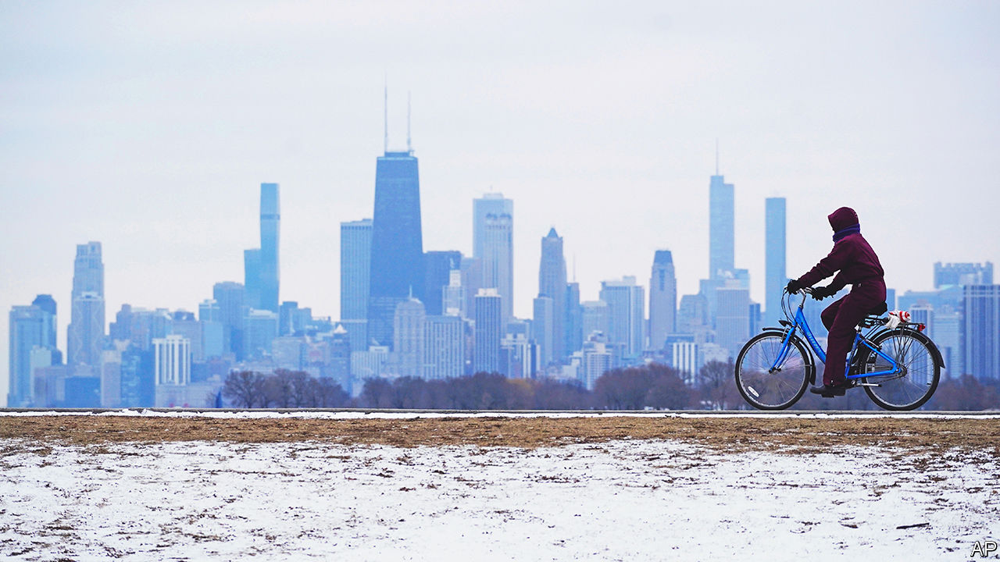
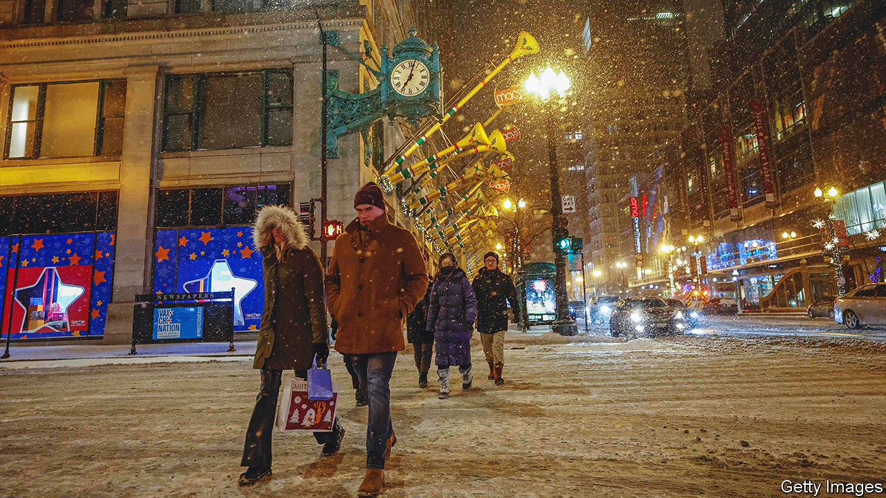

###### Making little plans

# Chicago’s woes are over-hyped 

##### In fact, the Windy City could offer a model for change across America 

 

> Jan 5th 2023 

For a sense of what is thriving in Chicago, it is worth visiting the offices of Hazel Technologies, a firm based in Fulton Market, about a mile west of the city’s downtown Loop. Across most of one full floor of a fancy new office building, the usual desks and cubicles have been replaced by a laboratory. Around three dozen scientists use it to design prototypes of packets of chemicals that help keep fruit and vegetables fresh by controlling the creation of ethylene, a gas that induces ripening. On another floor, commercial staff sell the chemicals to clients all over the world. Hazel, founded in 2015 by three PhD students at Northwestern University, in the northern suburbs, has grown in the past few years to over 100 employees. In 2021 it raised $70m in venture financing, and it now works in a dozen countries.

Few Chicagoans have heard of Hazel—even the city’s bigwigs are barely aware of it. And yet the West Loop district, where Fulton Market is, is bustling with new firms like this, quietly doing lucrative things. The workers they are hiring are filling up not only offices but also dozens of new apartment buildings. And more are coming. Across the street from Hazel’s offices, cranes are already working on turning what is currently a patch of wasteland into yet another shiny tower of glass and steel. Patrick Flynn, the firm’s co-founder, says even he is bemused by the pace of change around him. When he was a teenager in Chicago in the late 1990s, this far west of the Loop was an area you would be careful walking in at night at weekends, he says. Nowadays, the neighbourhood is so trendy it even has a branch of Soho House, an expensive London members’ club that reliably opens up anywhere in the world seen as hip by management consultants.

And yet this story is not the one you hear in the city’s boardrooms. Instead, many people in Chicago think that the city is entering a spiral of decline. “There is a general sense out there that our city is in crisis,” said Chris Kempczinski, the CEO of McDonald’s, which is based in the city, in September. In June, Ken Griffin, the billionaire founder of Citadel, a hedge fund, moved himself, his money and many of his staff out of the city to Miami. Less than a year before, he had claimed that “Chicago is like Afghanistan on a good day.” In the past year, Boeing and Caterpillar have also moved their headquarters in the Chicago region out—to the Washington, DC, area and to Texas, respectively. Even the Chicago Bears, the city’s NFL team, are proposing to leave their home at Soldier Field, on the lakefront, to move to the suburbs. As the city prepares for its mayoral and city council elections in February, this sense of doom is infectious. But is it justified? 

According to Rob Paral, a demographer at the University of Illinois, Chicago has long had “this neurotic worry about whether it is going to become another rustbelt city”. But the growth in the West Loop shows how overdone this is. Between the two censuses of 2010 and 2020, an area Mr Paral calls the “Super Loop”, taking in the traditional city centre as well as the neighbourhoods immediately around it, grew in population by 18%. Even more remarkably, the number of housing units grew by 23%. Roughly one in eight Chicagoans now live around the city centre, up from an almost negligible number just a generation ago. According to data from the state of Illinois, the number of jobs in a roughly analogous “outer business ring” grew by 33% from 2011 to 2020 (though it then fell back sharply in 2021 because of covid). 

 


Look at “Chicagoland” as a whole—not only the city’s 2.7m people, but also the other 6m or so in its suburbs—and it is true that the city’s performance looks far more middling. As a share of America’s total GDP, the region declined from 4.3% to 3.7% between 2001 and 2020. Coastal cities such as New York, San Francisco and Seattle have all grown much faster, as have southern sunbelt cities like Austin and Houston, which is on course to overtake Chicago’s population within the next decade. Troublingly, it has even lagged behind a few other midwestern cities, such as Columbus, Ohio, which is now home to 900,000 people, and Indianapolis, Indiana, which is home to 800,000. That is worrying for the region. But when the city proper is growing fast, the chance of it entering a death spiral—as residents leave and taxes cannot cover services, causing more to leave—is low. In fact, the city of Chicago is poaching residents and businesses back from the suburbs. Between the two censuses, the state of Illinois as a whole lost population; Chicago gained it.

A similar dynamic applies to the biggest obsession of politicians and the business world: crime. In absolute terms, Chicago has more murders than any other American city—over 800 in 2021 and 723 in 2022. Other high-profile violent crimes, in particular car-jacking, have soared since the pandemic, generating ugly headlines. Yet crime has soared all over America, and not much more in Chicago than elsewhere. Compared with New York or Los Angeles, Chicago is an appallingly violent place. But the murder rate is still lower than in many other large cities, such as Washington, DC, Indianapolis and Atlanta. Crime ought to concern Chicago’s leaders: the human damage done is enormous. But it is harder to argue that it is a threat to the core economic basis of the city. The violence is concentrated in a few of the poorest neighbourhoods, mostly on the South Side and West Side of the city, where a legacy of segregation has left neighbourhoods abandoned. There, it is getting worse. Murder rates in the city’s wealthier neighbourhoods, including downtown, are hardly higher than elsewhere in America. 

Don’t say provincial 

What Chicago has, says Aaron Renn of the Manhattan Institute, a right-leaning think-tank, is an identity crisis. “Chicago feels like it deserves to be considered one of the big important global cities,” he says. But whereas its culture, museums, restaurants and much else can be considered truly global, its economy is not, quite. Where cities on the coasts have specialised in finance or tech, Chicago is a diversified economy. It has tech: Google is busy renovating a modernist office block, the Thompson Centre, downtown to house over 2,000 workers. It has finance: the Chicago Mercantile Exchange remains a hub of derivatives and commodities trading. It even still has a relatively large manufacturing industry. But no sector dominates, and the city has few top-tier firms headquartered there. Instead of being a truly “global city”, its economy tends to reflect America’s at large. Its greatest asset, Mr Renn says, is affordability—which means that upper-middle-class professionals can have the sort of affluent urban lifestyles scarcely possible in New York or San Francisco.

And according to Pete Saunders, an urban planner and commentator, that failure to escape its true Americanness is the source of much of the city’s angst. “Chicago has tried to climb the heights that most of the coastal cities have but we haven’t quite gotten there, and there’s a frustration”, he says. Half of the city is doing exceptionally well, he says, but the other half is struggling—like cities across the rustbelt—with a legacy of deindustrialisation, segregation and impoverished local government. Whereas a neighbourhood like River North added over 20% to its population in the decade to 2020, Englewood, on the far South Side, lost 20%, most of them black residents. Even though the city overall may not be in a death spiral, in such places it can feel as if it is. In the decade to 2020, Chicago lost 85,000 black residents, more than any other big city except Detroit. 

In time, simple mathematics suggests that Chicago’s population could grow rather fast. Put brutally, the poorest neighbourhoods such as Englewood do not have many people left to lose. Deindustrialisation can continue only until there is no industry left to lose. By contrast, the growing parts of the city can continue to grow—with far fewer of the NIMBYish constraints that are strangling coastal cities, and without the costs of sprawl now afflicting places like Austin, Texas. As the West Loop shows, when demand is there, there is no shortage of land to build fancy new condos or office blocks. “We have room to grow,” says Samir Mayekar, the city’s deputy mayor, who argues that even the proliferation of derelict lots ought to be seen as an opportunity, because it means there is always space to build. That is before even accounting for unknowable benefits as climate change worsens, such as access to fresh water, a stable (if miserably cold in winter) climate, and a strong electricity grid, which could make Chicago more attractive in the future than it has been.

The challenge for Chicago is focusing on that longer-run vision, and ensuring that the wealth being created in the city can jump across its old racial barriers to benefit everyone living there. It is an aim that the city’s civic leaders, too focused on immediate difficulties, typically fail to articulate. The election in February seems sure to almost entirely skip discussion of a long-term vision, and whoever wins will find the same political constraints that every Chicago mayor has. But in a way that hardly makes the place unique. In fact, it represents the challenge facing all America, in microcosm.■


