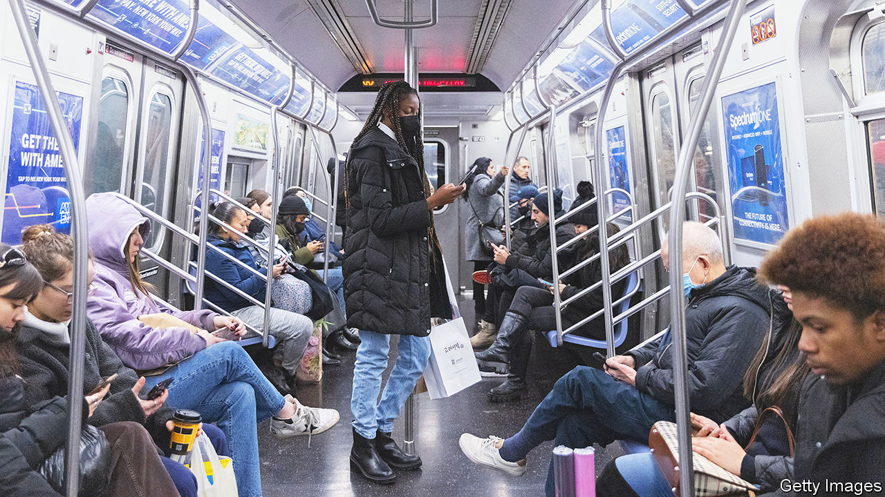

###### Business time

# Eric Adams and Kathy Hochul have grand plans for New York City 

##### Can office blocks be converted into places to live? 

 

> Jan 5th 2023 

By 2023, NEW YORK’s leaders had hoped, America’s biggest city would be as strong as ever, the pandemic’s impact as fleeting as clouds over its skyline. If only. As of mid-September only half of Manhattan office workers actually go to work in Manhattan. Spending at restaurants and bars in the city’s big business districts is 23% below its pre-pandemic levels. As fewer commuters ride trains, the subway system is cutting its service on Mondays and Fridays. It looks unlikely that New York will return to its old version of normal. The question now is how the city might advance to a better one. 

That is the goal set by Eric Adams, New York’s Democratic mayor, and Kathy Hochul, the state’s Democratic governor. Last month a panel convened by the mayor and governor presented a plan to transform New York City, with 40 initiatives to reinvent three broad areas: business districts, commuting and housing, and to do all this with equity as well growth in mind. Local governments specialise in reports on the future, but this one stands out. 

That is in part because Mr Adams and Ms Hochul are collaborating—a seemingly small feat but an unusual one in New York, where prior governors and mayors specialised in enmity. Business leaders also seem to back it; many top executives sat on the panel. And because the report’s recommendations are particularly bold. 

That is especially evident in the proposals for the city’s business districts. Lots of cities are struggling with empty offices as people continue to work at least partly from home. In Manhattan the office vacancy rate is at record high. Many shops, from retailers to dry-cleaners, and restaurants, which rely on office workers for custom, are closed or are struggling.

Rethinking and reimagining business districts as vibrant 24/7 places, with more of a mix of residential and office space, is a key part of the stabilising plan. Among the panel’s recommendations is to create tax incentives to encourage landlords to convert offices into residential spaces or to update office space. Less restrictive zoning laws will be needed. Some of the recommendations require legislative changes, which is always complicated.

It will be difficult if not unfeasible to convert many of the larger office buildings into residential use. Nicole Gelinas of the Manhattan Institute, a think-tank, doubts that there will be much converting. “Apartments without windows or apartments without kitchens? I don’t think that’s a good idea,” she says. Dylan Burzinski of Green Street, an analytics firm, says only about 20m square feet (1.8m square metres) can be converted to residential space, which is not a lot compared with Manhattan’s 420m square feet office market. A good chunk of the city’s office buildings are functionally obsolete and energy inefficient. Tear downs will be necessary—the average building is 75 years old.

Conversion probably would not generate the same tax revenues for the city either. Manhattan’s business districts generate 59% of citywide office and retail-property tax revenue. A decrease could eventually affect city services. The future looks bleak. A recent paper co-authored by Stijn Van Nieuwerburgh, “Work from Home and the Office Real Estate Apocalypse”, estimates that office valuations will be 39% below 2019 values by 2029. Many companies, such as Meta, are downsizing office space. 

Reinvention is part of New York’s DNA. Its bustling port gave way to humming factories, which gave way to skyscrapers full of office workers. The panel’s co-chair, Dan Doctoroff, when working for former mayor Michael Bloomberg, used the rebuilding of Lower Manhattan after the 2001 attacks as a catalyst to rethink and rezone much of the city. He says “the key thing is execution. We gotta hold elected officials responsible, accountable.” Happily, he says, Mr Adams and Ms Hochul are fully behind the plan. With recession looming and companies such as Goldman Sachs announcing layoffs uncertainty abounds. Ironically, says Kathryn Wylde of the Partnership for New York City, this is starting to drive people back to the office. ■


