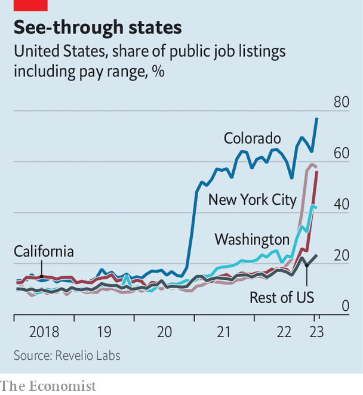

###### Wealth warning

# Pay-transparency laws do not work as advertised 

##### Which is a pity, as California and Washington have just adopted them 

 

> Jan 5th 2023 

THE SALARY negotiation has long been one of the trickiest parts of hiring or being hired. Ask for too little and you may leave money on the table; ask for too much and you may not be offered the job at all. In America, this delicate balancing act is becoming less perilous. On January 1st California and Washington became the latest states in the country to require employers to include minimum and maximum pay ranges in all job advertisements. Similar laws aimed at levelling the playing field in salary negotiations and reducing gender and racial pay gaps have been passed in Colorado, New York and a handful of cities. In November New York City began enforcing its own law. Yet despite the popularity of such pay-transparency laws—they now cover roughly a fifth of the American labour force—their effects are still widely misunderstood.

 


Labour advocates champion pay-transparency laws on the grounds that they will narrow pay disparities. But research suggests that this is achieved not by boosting the wages of lower-paid workers but by curbing the wages of higher-paid ones. A forthcoming paper by economists at the University of Toronto and Princeton University estimates that Canadian salary-disclosure laws implemented between 1996 and 2016 narrowed the gender pay gap of university professors by 20-30%. But there is also evidence that they lower salaries, on average. Another paper by professors at INSEAD, UNC Chapel Hill, Cornell and Columbia University found that a Danish pay-transparency law adopted in 2006 shrank the gender pay gap by 13%, but only because it curbed the wages of male employees. Studies of Britain’s gender-pay-gap law, which was implemented in 2018, have reached similar conclusions.

Another misconception about pay-transparency laws is that they strengthen the bargaining power of workers. A recent paper by Zoe Cullen of Harvard Business School and Bobby Pakzad-Hurson of Brown University analysed the effects of 13 state laws passed between 2004 and 2016 that were designed to protect the right of workers to ask about the salaries of their co-workers. The authors found that the laws were associated with a 2% drop in wages, an outcome which the authors attribute to reduced bargaining power. “Although the idea of pay transparency is to give workers the ability to renegotiate away pay discrepancies, it actually shifts the bargaining power from the workers to the employer,” says Mr Pakzad-Hurson. “So wages are more equal,” explains Ms Cullen, “but they’re also lower.”

Perhaps the biggest misunderstanding about pay-transparency laws is that they are hard to evade. In New York City, for example, the law applies to nearly every employer—only those with fewer than four employees are exempt. Companies that violate the law can face fines of up to $250,000. But data provided to  by Revelio Labs, a workforce intelligence firm, show that just 58% of New York City-based job advertisements published in November and December, the first two months the law was in force, included pay ranges. Some sectors were more law-abiding than others. In information and transport the compliance rate was nearly three-quarters; in the utilities, manufacturing and retail sectors it was under half.

So what is the upside to these new regulations? Ms Cullen of Harvard says that to the extent they inform job applicants about which firms and positions pay more, and which pay less, they may lead to more efficient matching between job-seekers and employers. Though anyone who hasn’t worked that out already will be at a disadvantage in any salary negotiation.■


