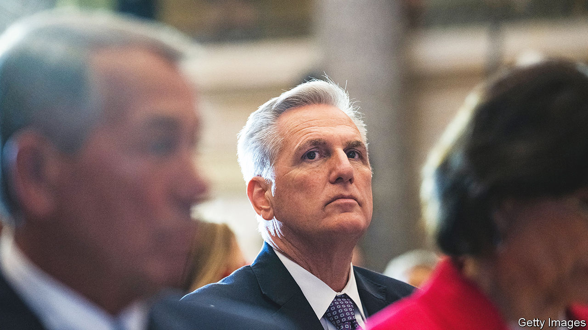

###### McCarthy and the new House

# Republicans struggle to elect a speaker of the House 

##### Kevin McCarthy’s floundering bid for the role augurs more dysfunction in Washington 

 

> Jan 4th 2023 

AMERICAN AND British conservatives are distinct species. But in one respect—a cannibalistic impulse to kill and consume their leaders—they are similar. On January 3rd Kevin McCarthy, the Republican congressman who for the better part of a decade has yearned to be elected speaker of the , found himself on the receiving end. Though Republicans secured a narrow majority in  in November, a contingent of hardline congressmen have banded together to deny their party leader the absolute majority he needs to obtain the speakership.

It is a historically bad start for the new Congress. The last time a vote for speaker failed on its first attempt was a century ago, when Frederick Gillet clinched it after nine rounds of voting. Still, that was not as bad as the drama of 1855, when the House, mired in conflict over slavery, took two months and 133 rounds of voting to pick a speaker. At the time of publication, Mr McCarthy had failed to win on his sixth attempt and the House had adjourned voting until Thursday.

Without a speaker, the House exists in a primordial, inert state: unable to consider legislation or even formally swear in new members until the question is resolved. The spectacle, reminiscent of a papal conclave minus the smoke, is remarkable: a century-old format of political jockeying, revived. The ultimate outcome—the election of a Republican speaker, whether Mr McCarthy or someone else—is not in doubt. But the saga proves that Republicans remain in disarray as they navigate an identity crisis induced by Donald Trump.

Some of this is comeuppance. Absence of principle and naked pursuit of power are unremarkable traits in the halls of Congress, but in Mr McCarthy they are remarkable because of how completely they encapsulate his method of politics. The would-be speaker has gone through serial reinventions during his time in Congress, including after his first serious bid to become speaker failed in 2015. The Freedom Caucus, the farthest-right contingent of Republican representatives, thwarted him then. After that Mr McCarthy began assiduously courting his detractors with glad-handing, backslapping and prodigious fundraising. He coveted the endorsements of Jim Jordan, a hard-charging congressman from Ohio and former arch-antagonist, as well as Marjorie Taylor Greene, a notoriously conspiratorial congresswoman from Georgia.

When the winds shifted, Mr McCarthy took care to do so too. After the attack on the Capitol on January 6th 2021, Mr McCarthy said Mr Trump bore responsibility and told colleagues that the former president ought to resign. Three weeks later he was kowtowing to the kingmaker in Mar-a-Lago, the former president’s Florida estate. When Liz Cheney, once the number-three-ranking Republican in the House, became an outspoken critic of Mr Trump’s attempts to overturn his election loss, Mr McCarthy endorsed her ejection from the leadership and later campaigned against her re-election.

It is ironic, then, that after all the grovelling of the past few years, Mr McCarthy once again finds himself mistrusted and embarrassed by the Trumpiest contingent of his own party. On the day of the votes for speaker, their contempt was plain. Bob Good, a congressman from Virginia, called him a member of the “uni-party swamp cartel”. Scott Perry, a Pennsylvania congressman who was perhaps the most personally involved in efforts to overturn the election results in 2020, said that “in his 14 years in Republican leadership, McCarthy has repeatedly failed to demonstrate any desire to meaningfully change the status quo in Washington.” Matt Gaetz, an ultra-Trumpy congressman from Florida, called him the “biggest alligator” in the Washington swamp.

The detractors are ostensibly holding out for policy changes. They want any single member to be able to call a vote of no confidence in the speaker, and demand more hawkish fiscal policy. Parse their words, however, and it is clear that their objections are also personal.

In a last-ditch speech to fellow party members ahead of the vote, Mr McCarthy reportedly told them that “I earned this job” and “I am not going to go away”. For him, the repeated stalemate is preferable to loss. Mr McCarthy had been reluctant to enter into negotiations with his detractors months ago in the hope that he could simply steamroll them into submission. In the final days before the vote he began to capitulate to their demands—but that had the perverse effect of diminishing whatever respect they had for him and hardening their resolve to deny him the speakership.

It seems that Mr McCarthy committed an error that Niccolo Machiavelli, an Italian political philosopher with many secret students on Capitol Hill, wrote about 500 years ago. Writing in “The Prince”, Machiavelli pondered the question of whether one should attempt to rule with love or with fear. “It may be answered that one should wish to be both, but, because it is difficult to unite them in one person, it is much safer to be feared than loved.” Lately, Mr McCarthy has attempted to be both, a feat beyond his talents.

Whoever eventually becomes Republican speaker seems set for a hellish experience. The previous two—John Boehner and Paul Ryan—had to battle against hardliners in order to avoid inflicting grievous damage on the country, like defaulting on debt payments or going into government shutdowns. Averting disaster regularly required resorting to help from Democrats in Congress. That enraged the Freedom Caucus types, leading both men to cut short promising political careers. As the drama with Mr McCarthy demonstrates, that patricidal dynamic in the caucus has only worsened. It will make the necessary work of legislating all the more difficult. The chaos Congress is only getting started. ■


