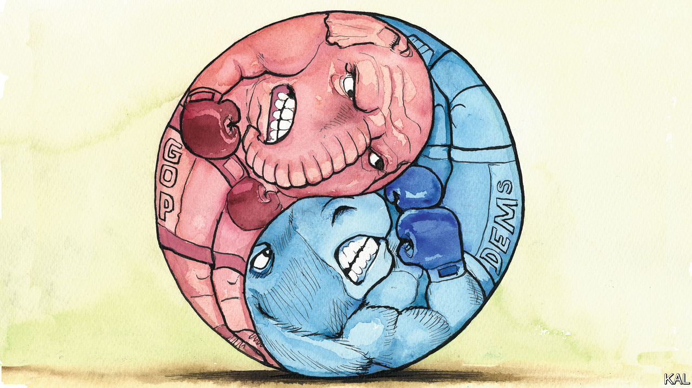

###### Lexington

# The great mystery of American politics 

##### Why is the country divided so evenly? What might change that? 

 

> Jan 5th 2023 

Titillated if not surprised, America’s political obsessives saw some justice in Kevin McCarthy’s struggle to amass enough support to become speaker of the House of Representatives. Mr McCarthy has evaded the encumbrance of principle for so long that, to at least some politicians, it seemed fitting that conservatives would torture him by withholding a few votes, all but making faces while dangling the job just beyond his reach. 

The torment of Mr McCarthy is easy to explain. But it points to a mystery, one this column will outline but—with apologies—not solve: why is it that each party’s grip on power, once attained, has become so fragile? Everyone knows America is polarised. Yet that does not explain why it is also so evenly divided.

With the exception of three previous, brief periods of national fickleness, one party or the other held clear majority control throughout American history. The present partisan equilibrium has lasted 40 years, since Ronald Reagan broke the Democrats’ New Deal coalition. No president since his predecessor, Jimmy Carter, has kept unified control of Congress past a midterm. 

There are few swing states, swing districts or swing voters left, yet the government swings constantly because the balance is so fine. “There’s nothing like our current era as you look back through US history,” says Frances Lee of Princeton University, who studies Congress. “I’m mystified fundamentally by it, to be honest. How do we have all these constituencies that are safe for one party or the other, yet somehow it adds up to 50-50 nationally?” 

Each election seems to sharpen the knife’s edge upon which American governance teeters. The slim Republican House majority is owed to 6,670 votes out of 107m cast, according to “Inside Elections”, a nonpartisan publication. Elections have become so unpredictable, and policymaking so volatile, because profound outcomes result from slight shifts: a change of less than 1% of votes would have switched control of the White House in 2016 and 2020, and of the Senate in 2020.

Democrats say the game is stacked against them. No Republican has won the popular vote for president since 2004, they note, and Democratic senators, who tend to represent more populous states, can command millions more votes in aggregate. But the rules have also benefited Democrats: in 2022 Republicans did better nationally than their seat tally suggests because they “wasted” votes in safe districts. And, even conceding Republicans get a boost because thinly settled states also get two Senate seats, that goes back to the original question: why does that boost happen to result in an almost perfect split? Why has it not yielded four more safe seats for Republicans, or four fewer? Neither party has held a Senate majority for more than eight years since 1980, a span without precedent, the s Ronald Brownstein has noted. 

Even profound changes in what it means to be a Democrat or Republican seem to return the parties to their equilibrium, as though obeying some thermostat. Donald Trump is no George W. Bush, but Mr Trump eked out a comparable electoral-college win. 

Polarisation has hardened partisan identities, which helps explain why Republicans stuck with Mr Trump. But that does not explain why the hefty demographic, economic and technological change between those two presidencies did not tilt the balance. In this century Democrats lost ground in the countryside and gained it in the cities, Republicans squandered support in the Silent Generation and acquired it among Millennials, Democrats alienated white voters without college degrees and Republicans alienated white voters with them—and that all netted out, roughly, to parity. 

It is hard to overstate how the Reagan revolution transformed politics. Here is an index: the then House Republican leader, John Rhodes, stepped down after the 1980 election in shock that his party had funded a challenger to the Democratic speaker. “There’s no way I’d be against Tip O’Neill,” he said. “I love him.” Those are not words a Democratic leader will say of Mr McCarthy.

Reagan took not just the White House but broke Democrats’ grip on the Senate for the first time since 1954, making Republicans believe they could win the House. Though they would not accomplish that for 14 years, this sense of possibility led to what Ms Lee calls “insecure majorities”, in her book of that name. What now seem like intrinsic practices date to the competition that began in 1980. Regular caucus meetings to plot partisan strategy, legions of communications aides, “message” bills that are intended to fail: these new tools were meant to heighten confrontation, undermine bipartisanship and sabotage the majority. They worked. 

Going berserk

Maybe four decades of sharper “messaging” have split the electorate. What seems more probable, though, is that it has consolidated partisans, while leaving those voters who are less inflamed by posturing unconvinced that there is much difference between the parties. Barack Obama failed to end Mr Bush’s wars or rescind his tax cuts; Mr Trump failed to end Mr Obama’s health-care plan; Joe Biden has not touched Mr Trump’s big legislative achievement, his tax cuts, while continuing Mr Trump’s China policy and delivering on a central promise he broke, investing in infrastructure. 

Now, as the Republican House squares off with Mr Biden within the arena of the 2024 campaign, its official agenda seems ill-suited to supply the black-or-white contrast that might break the impasse. If two impeachments of Mr Trump could not transform the underlying political dynamic, investigations of Mr Biden have little chance of doing it. The same is true of Republican assurances of being tougher on China or creating more manufacturing jobs. 

All bets are off, however, if the Republican berserker caucus that tormented Mr McCarthy succeeds in commandeering the party. If Republicans try to cut entitlements and impose a national ban on abortion, they could open a path for the Democrats back to a durable majority.■


