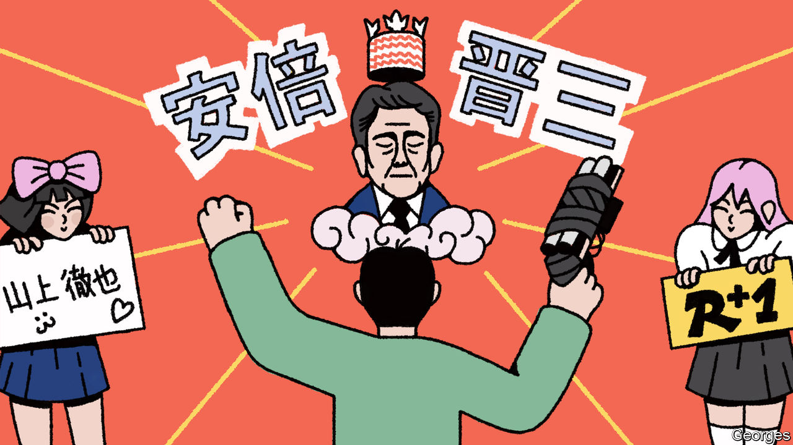

###### Banyan

# Abe Shinzo’s assassin achieved his political goals 

##### In Japan, political violence looks worryingly effective 

 

> Jan 12th 2023 

“Revolution+1”, a new Japanese film, opens with actual footage of the killing of Abe Shinzo, Japan’s former prime minister, last July. The grainy frames show Abe giving a stump speech in Nara while his assassin, Yamagami Tetsuya, approaches from behind wielding a homemade gun. The feature film proceeds to portray a sympathetic protagonist named Kawakami, whose biography bears a striking resemblance to Abe’s actual killer: his father committed suicide, as Mr Yamagami’s did, and his mother fell under the spell of the Unification Church (uc), a cultlike group. 

The film shows the extent to which Mr Yamagami, who said he murdered Abe because of his links to the church that ensnared his mother, has captured the Japanese imagination. The killer is seen by some as a dark hero, a crusader for the country’s underclass. Online, he is sometimes referred to as Yamagami Resshi, or Yamagami the Martyr. Female fans who fawn over him are known as “Yamagami Girls”. The prison where he is being held has reportedly run out of space to store the gifts sent to him. Even denunciations of his deed are often only throat-clearing. “Of course, it’s bad to kill people,” a female viewer of “Revolution+1” mused after a recent screening in Yokohama. “But for Yamagami murder was the only way to achieve his goal.” 

That illustrates a grim truth: Mr Yamagami’s political violence has proved stunningly effective. Until last summer few in Japan gave much thought to the uc, a Korean outfit often known as the “Moonies”. Now the country has become obsessed with it. The most searched “what is” query on Google in Japan in 2022 was “what is the Unification Church?” Television talk shows have featured people whom the group allegedly manipulated into making large donations. Japanese media have pursued stories about ongoing ties between the group and members of the ruling Liberal Democratic Party (ldp). 

The government has scrambled to respond. One official told Banyan late last year that it was spending half its time trying to clean up the issue. An inter-agency consultation centre for victims of the church was launched in September. Two months later the education ministry opened an investigation of it—the first such probe of a religious group—setting the stage for the uc to be stripped of its tax-friendly religious-corporation status. A new law aimed at defanging it and similar groups came into force last week: it bars them from soliciting donations through fear. It also gives recusant members a right to claim back their tithes. The ldp conducted an internal inquiry to suss out ties between its legislators and uc members; three ministers had to resign over such links. 

The political fallout may not be over. Kishida Fumio, Japan’s prime minister, saw his ratings drop from over 50% to the low-mid 30s, in part due to his handling of the issue; his premiership has been so diminished that political insiders suggest he may struggle to make it through the year. The continued high profile of Mr Yamagami’s case will make that even harder. On January 10th court psychiatrists pronounced the killer fit to stand trial; prosecutors are due to file an indictment by January 13th. Mr Yamagami faces charges that could land him in prison for decades. (Though Japan has the death penalty, it is rarely handed down in cases with one victim.)

Political violence seldom fulfils so many of its perpetrator’s aims. The previous killing of an elected leader in Japan, the shooting of Nagasaki’s mayor by a local gangster, led only to a crackdown on the yakuza. An attacker stabbed Abe’s grandfather, Kishi Nobusuke, in 1960 amid fractious debates over Japan’s security treaty with America, but neither killed him nor halted the treaty’s passage. The director of “Revolution+1”, Adachi Masao, was himself once a member of the Japanese Red Army, a militant leftist group responsible for a massacre at Lod airport in Tel Aviv in 1972; two of the attackers were killed, a third wounded, and the Palestinian cause they supported was not advanced. 

To find an equally consequential act of political violence in recent Japanese history, one must look to the 1930s. At that time, far-right groups within the armed forces carried out a string of assassinations that helped plunge Japan into fascism. Mr Yamagami, at least, acted alone and seems to have had no ideological bedfellows. Yet it is all too easy to imagine another malign individual taking inspiration from his twisted and lamentably effective crime.


