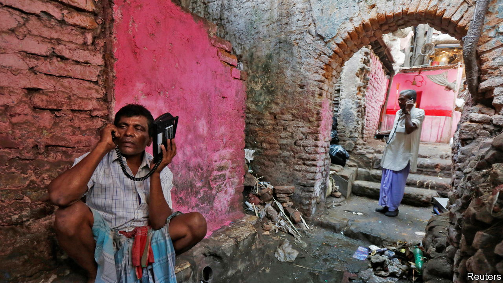

###### Digital dead zones

# India’s rocketing internet-user growth has stalled 

##### That is a major worry for a country pushing digitisation 

 

> Jan 12th 2023 

When india implemented its first lockdown in 2020 and its schools moved over to online learning, Sharmila found herself in a quandary. She is a maid in the posh western suburbs of Mumbai; she had enrolled her son and daughter in a fee-paying school. But her family possessed a single smartphone. So her children would either both have to skip some online classes or one would have to miss them all. Happily, her employers gave her a second smartphone, at a cost of 10,000 rupees ($122). That is more than Sharmila’s monthly wage.

Most Indians lack such a benefactor. Of the country’s roughly 1bn mobile-phone users, a third still use old-fashioned dumbphones, mainly for voice calls. And recent data suggest that they are not about to upgrade them. All but a tiny proportion of Indian internet users get online using their phones. Yet the number of wireless broadband connections is flat. In October last year, the latest month for which figures are available, the telecoms regulator counted 790m wireless broadband connections, barely exceeding the previous peak of 789m, which was recorded in August 2021. (The number of subscribers is lower than this, because many people have more than one connection.)

Smartphone sales are down. After growing for a decade, sales peaked at 161m units in 2021, according to idc, a market researcher, which reckons that last year the number fell to 148m. Meanwhile the average smartphone price has surged, from $163 before the pandemic to $220 in 2022. 

Prices are rising in part because of global factors, including supply-chain bottlenecks, Chinese lockdowns and rising component costs. But it is also because manufacturers no longer find it worth their while to sell ultra-cheap phones, says Navkendar Singh of idc. The market share of smartphones costing less than $100 dropped from 30% in 2019 to 12% last year, according to Counterpoint, another research firm. Before the pandemic some 5m people traded up from a dumbphone to a smart one every month. That dipped last year to about 3m, says Shilpi Jain, an analyst with Counterpoint. Mobile subscriptions are getting dearer, too. In the year to June 2022, prices rose 28%. The number of converts, from dumb to smart, is expected to fall again this year.

Stalling growth in internet use will have profound implications for millions of poor families. The government has increasingly defaulted to online solutions, including for booking covid-19 vaccinations. Most adults under 45 without a smartphone were at first told to trek to a government office to get registered. Only after an uproar were walk-in vaccinations permitted.

And that row has not tempered official enthusiasm for digitisation. A new programme aims to give every Indian “a hassle-free method of accessing and sharing your health records digitally”. The government is enthusiastically promoting digital payments through its Unified Payments Interface, a cashless system that has gained widespread popularity. Its biometrics-based national identity system now covers nearly every Indian resident and is all but mandatory when interacting with the state. A covid-tracking app was also voluntary in name only. 

A number of recent studies point to the scale, and deep unfairness, of the digital shortfall. gsma, a telecoms trade body, estimates that half of adult Indian men owned a smartphone in 2021. Only a quarter of Indian women did. Another divide is between rural and urban India. The internet penetration rate is 103% in cities (because of individuals with multiple connections) and 38% in the countryside. Three-quarters of graduates have a mobile phone of some sort, while three-quarters of those with primary-school education do not.

These disparities risk upending what have been very promising efforts to improve Indian governance through digitisation. “The evaluation of what makes it better should be from the point of view of the average Indian,” says Apar Gupta of the Internet Freedom Foundation, a digital-rights organisation. “And the average Indian, especially in rural areas, does not have access to the internet.”■

