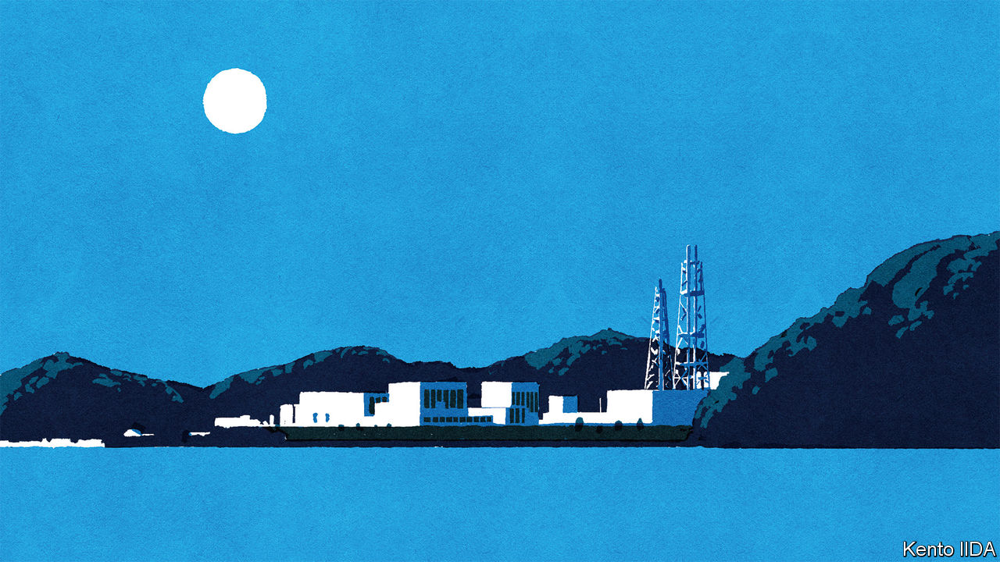
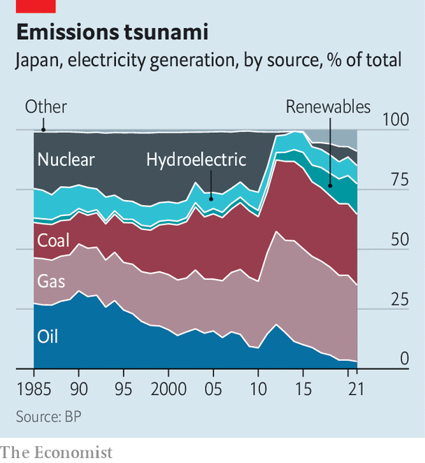

###### Land of the riven atom

# Japan pivots back to nuclear power 

##### But it risks turning away from renewables 

 

> Jan 12th 2023 

From the grounds of Onagawa Nuclear Power Station, a plant in northern Japan, waves can be heard lapping at the nearby shore. They serve as a reminder of the tragedy that struck on March 11th 2011, when a giant earthquake triggered a massive tsunami that flooded Japan’s eastern coast. While the Onagawa reactors managed to shut down safely, the Fukushima Daiichi plant, 180km down the coast, suffered a meltdown. After the disaster Japan shuttered all of its nuclear reactors. Since then only a handful have been turned back on. Onagawa is among the nuclear plants that remain idle.

This will soon change. Onagawa recently received a safety sign-off from the new independent regulator set up in the wake of the disaster, thanks in part to the facility’s new 29-metre-high seawall. In 2020 local officials also gave their approval to a restart. Tohoku Electric, the plant’s operator, could begin generating power again by early next year (after finishing some repairs). “Recently, the electricity crunch and rising resource costs have made people across Japan think,” says Suda Yoshiaki, Onagawa’s mayor. “Is there any other way to supply large amounts of energy in a stable manner? There is no alternative…In terms of the big picture, nuclear power is needed.”

Restarting reactors such as those at Onagawa is the first step of another drastic reversal in the energy policy of the world’s third-largest economy and fifth-largest carbon emitter. In December Kishida Fumio, Japan’s prime minister, codified a new ten-year road map for Japan’s “gx”, or “Green Transformation”, which includes measures to revive the nuclear industry, strengthen the country’s grid and begin introducing carbon pricing. Terazawa Tatsuya, chairman of the Institute of Energy Economics Japan, a think-tank in Tokyo, argues that Japan is finally “putting meat on the bones” of a pledge made by Mr Kishida’s predecessor, Suga Yoshihide, to make the country carbon neutral by 2050. It is a delicate task, which requires striking a fine balance between safety, energy security and environmental concerns. 

 


As an island nation with scant natural resources, Japan has long been in a precarious position when it comes to energy. Heavy dependence on Middle Eastern oil fuelled Japan’s rapid economic growth after the second world war, then backfired during the oil crisis of 1973-74. That spurred Japan to expand its nuclear fleet, develop liquefied natural gas (lng) and make forays into renewable technologies under the banner of the “Sunshine Project”. By 2010 nuclear had emerged as the core of Japanese energy policy, with 54 reactors providing about 25% of electricity production; the government aimed to expand the share of nuclear and hydropower to 70% by 2030. The Fukushima crisis scuppered those plans. New laws were instead passed to help stimulate solar power. The share of renewables in electricity generation doubled from 10% in 2010 to over 20% last year. Yet Japan has mainly filled the gap by turning to lng and coal (see chart). 

The war in Ukraine has revived memories of the first oil crisis, with Japan again finding itself heavily dependent on imported fuel in an unstable world. The only country less energy self-sufficient than Japan among the 36 members of the oecd, a rich-country club, is small, landlocked Luxembourg. Mr Kishida’s administration has used this latest shock primarily to justify a revival of nuclear power. Its new energy-policy road map calls for “maximising the use of power sources that contribute to Japan’s security and are highly decarbonising”, including both nuclear and renewables. Nuclear accounted for around 8% of the electricity supply last year; the latest government targets envision the share bouncing back to 22-24% by 2030. The government has also announced plans to extend the operating lifespan of reactors from 40 to 60 years and to build new ones. Together, the changes amount to a “U-turn” back towards nuclear power, says Tom O’Sullivan of Mathyos, a Tokyo-based energy consultancy. 

Turning on well-regulated nuclear plants in order to phase out coal is sound policy. But there is a risk that the turn will also slow or reverse the recent momentum behind expanding renewables. “The real issue is how to aggressively and rapidly install more solar and wind,” says Iida Tetsunari of the Institute for Sustainable Energy Policies, a think-tank in Tokyo. “Japan is falling behind the global curve.” Japan generates about half as much electricity from renewable sources as its European peers. Experts who seek to explain this are divided into two camps. One focuses on geographical limitations: a lack of flat land for solar panels and deep ocean shelves that make it relatively hard to install offshore wind turbines. The other reckons the barriers are primarily political: onerous regulation, vested interests and a system of regional power monopolies that do not share power effectively across the country. Under Mr Suga, reformist ministers sympathetic to the latter camp drove the recent progress on renewables; under Mr Kishida, voices from the former camp have once again come to dominate the policy debate. 

The latest plans for renewable expansion are accordingly far less ambitious than many want. The government envisages the share of renewables in electricity growing to 36-38% by 2030, just over half the level the eu is projecting. Mr Kishida’s strategy also earmarks money for a big upgrade of transmission lines, including between the windy but sparsely populated northern island of Hokkaido and population centres around Tokyo. But efforts to make the grid operate more flexibly and nimbly have stalled, Mr Iida laments. Plans to implement carbon pricing, while a welcome step, may be too little too late: Japan’s carbon tax will only come into force in 2028, and at levels that will probably be too low to make very much of an impact. 

Nor is Mr Kishida’s planned nuclear revival a sure bet. Restarting plants is subject to regulatory and local approval processes that the central government cannot short-circuit. Public opinion has begun to shift in its favour. According to polls by , a business newspaper, 53% of Japanese support restarting reactors so long as safety can be ensured, the first time a majority has been in favour of this in more than a decade. Some people living near the reactors would like to keep them and the subsidies they bring. Yet mistrust is widespread; plenty of others fight the reopening. In Onagawa, residents have sued to prevent the restart, claiming that the government’s disaster-evacuation plan is gravely flawed. Of Japan’s 33 remaining reactors, only ten have restarted. Mr Kishida wants seven more to come online this year; to reach the 2030 target, he would need another ten or so beyond that. Many energy gurus suspect that this will be impossible.■


