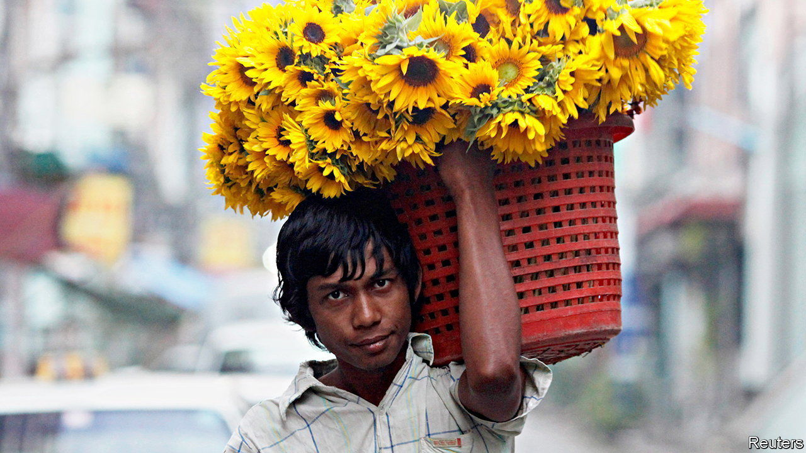

###### The hidden powers of flowers

# Myanmar’s generals are deeply superstitious 

##### They hope sunflowers will bring them good fortune 

 

> Jan 12th 2023 

For centuries the Htilominlo Temple in Myanmar has been a site of pilgrimage for would-be rulers. One such excursion took place in the twilight of Myanmar’s democratic era: General Min Aung Hlaing, the army chief, attended a ceremony there in 2020 to venerate the pagoda’s tip—a gilded spire known in Burmese as an “umbrella”, itself a symbol of royal power. Standing beside a Buddhist monk believed to be his astrological adviser, the general sprayed the pagoda with banknotes. A year later he seized power in a coup. 

Min Aung Hlaing has not just put his country back under the armed forces, which ruled Myanmar from 1962 to 2015. He has also restored the high-level mumbo-jumbo for which previous military dictators were known. This does not augur an end to the country’s civil war. It suggests the dictatorship regards the mystic realm as a more important fount of legitimacy and staying power than public opinion (which is against it). 

Deference to fortune-telling is widespread in Myanmar. Many of its 54m people practise , the ritual of following astrological instructions. The country still marks independence on January 4th at 4:20am, a date and time selected by fortune-tellers in 1948. And the country’s generals appear to be especially superstitious. It was in part at an astrologer’s urgings that Than Shwe, who ruled the country from 1992 to 2011, moved the capital in 2005 from Yangon to Naypyidaw, a city built from scratch in the jungle. (A deadly cyclone which hit Yangon three years later looked like divine vindication.) An explosion of coerced sunflower cultivation took place across Myanmar around that time, allegedly because Than Shwe’s soothsayers believed it would prolong his rule (“sunflower” in Burmese is a homophone for a word that means “long-lasting”). 

Than Shwe’s lucky number was 11. On his watch, the junta developed a preference for handing out 65-year prison sentences to dissidents, and announcing them at days and hours containing or adding up to 11. Min Aung Hlaing is said to be enforcing his writ through an even more brutal superstition. The high number of people killed in recent unrest from bullets to the head is reported to be a tactic suggested by his astrologer. 

The junta also appears to be leaving nothing to chance when it comes to sunflower production. It fell during the years of civilian rule. This year the regime aims to cultivate 1.5m acres of the crop, up from 600,000 acres in 2021. It says it wants to produce more sunflower oil and curb expensive imports of palm oil. But no equivalent targets exist for other edible-oil crops like sesame or peanuts, notes a Burmese official.

The regime’s opponents also resort to superstition. As riot police prowled around after the coup, protesters strung up women’s clothing, which it is bad luck for men to pass under. After reports of villagers being coerced into sunflower-planting, online dissidents shared images of lotus buds, the Burmese name for which translates as “It won’t last long”.

