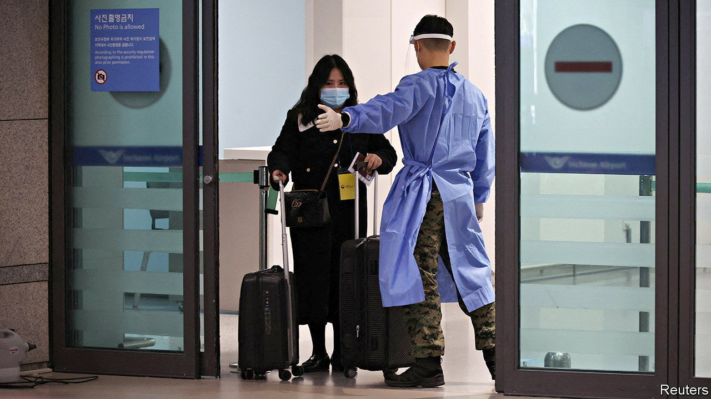

###### No fly zone

# South Korea’s travel spat with China 

##### China uses a row over visas to probe for South Korean weaknesses 

 

> Jan 12th 2023 

It has been tough these past few years for the shopkeepers around Gyeongbokgung Palace, once home to Korea’s Joseon dynasty and now the most prominent tourist attraction in Seoul. In 2019 6m Chinese tourists visited South Korea, filling the cash registers of local restaurants in the South Korean capital and the shops that rent out (traditional Korean garb in which tourists pose in the palace grounds as if in their favourite historical drama). With the pandemic, Chinese visits fell to nearly nothing. So when the government in Beijing suddenly abandoned its draconian lockdowns and tight restrictions on foreign travel, Chinese snapped up tickets to South Korea. Expectations in Seoul soared. Now a spat between the two countries has left Chinese tourists grounded—along with shopkeepers’ hopes.

Worried about the Chinese government’s reluctance to publish accurate covid-19 data, and fearing a fresh outbreak seeded by Chinese visitors, South Korea ruled late last year that travellers from China must test negative both before and after arrival. (Like much of East Asia during the pandemic, South Korea followed strict visa controls and quarantine requirements.) Then on January 2nd it stopped issuing short-term visas to Chinese nationals. This week China responded in kind, refusing to issue even transit visas to South Koreans merely passing through the country. 

Putting on a brave face, South Korea’s prime minister, Han Duck-soo, insisted that China’s decision did not count as “retaliation”. China disagrees. A government spokesperson decried “discriminatory entry restrictions” and described his country’s actions as “reciprocal measures”. China’s measures will be “adjusted” when South Korea corrects its behaviour.

Japan has been treated to similar measures. But dozens of other countries that imposed  on travellers from China have managed to avoid being targeted in this way. China, Japan and South Korea share a complicated and often troubled history. South Korea and Japan are used to serving spells in the doghouse when they do not bend to China’s will. For South Korea’s president, Yoon Suk-yeol, who came to power in May, this spell is probably intended to probe for weaknesses.

All South Korean presidents walk a fine line. America guarantees the country’s security. But China, which is South Korea’s largest trading partner, underwrites its prosperity. It is hard to keep both powers happy at once. Mr Yoon has drawn closer to America on matters of both security and economics, but also wants a relationship with China based on “mutual respect”. That phrase is often used by China itself in its strong-arm dealings with lesser countries. The tit-for-tat visa restrictions suggest it thinks that respect from South Korea is insufficiently ample and unquestioning.

China has stopped visitors coming before. When South Korea agreed to host an American missile-defence system in 2016, the Chinese government initiated a (largely undeclared) consumer boycott of South Korean businesses. Tour groups to South Korea were forbidden. The ban was still in place when the pandemic struck.

Analysts in South Korea think that China is trying to test Mr Yoon’s mettle. South Korea has quietly been looking to move supply chains for critical industries such as semiconductors and batteries away from its overbearing neighbour. The Chinese government has taken note, warning South Korea against “decoupling”. 

Mr Yoon looks to gain by not yielding. Losses for tourism notwithstanding, South Koreans appear happy to be sheltered from any possible outbreak (over a fifth of travellers arriving from China were testing positive). More broadly, recent opinion polls suggest growing dissatisfaction towards China. Stories such as that of a Chinese national who fled a quarantine facility on January 3rd, only to be caught two days later, do not help. The tit-for-tat restrictions will presumably end soon. But Mr Yoon will surely be subjected to other tests in future. ■


