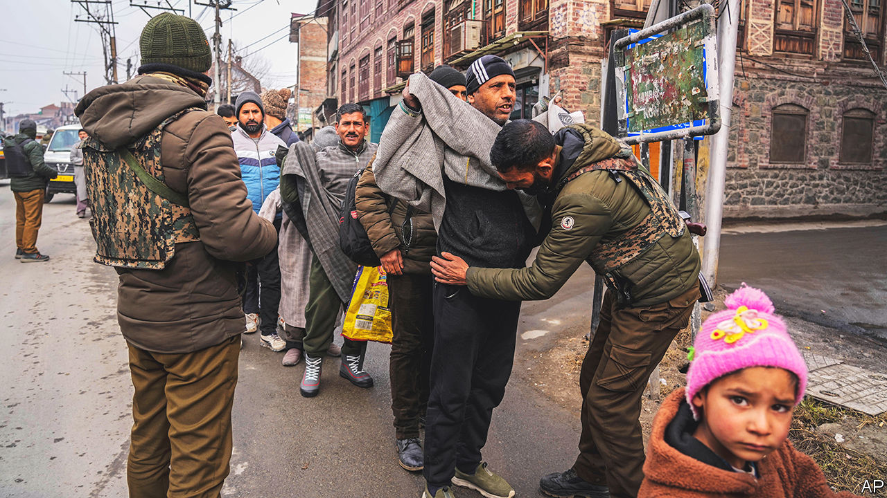

###### Unhappy valley

# The mirage of peace and prosperity in Kashmir 

##### Narendra Modi’s hardline approach has not made the region richer or safer 

 

> Jan 10th 2023 

Things have been going swimmingly in Jammu and Kashmir ever since Narendra Modi, in August 2019, turned off the internet, locked up thousands of politicians and academics, and split India’s only majority-Muslim state into two federally-run units, or union territories. Just ask the government. Where separatists used to put stones and guns into young people’s hands, the prime minister “replaced them with mobiles and laptops by setting up industry and providing employment”, Amit Shah, the home minister and Mr Modi’s chief lieutenant, told reporters during a recent visit to Srinagar, Kashmir’s main city. Where Kashmiris used to live in fear and penury, chimed in Manoj Sinha, the Delhi-appointed governor of the territory, in December, there are now far fewer deaths from terrorism, the press is free and there will soon be elections.

Much of this is untrue, as Kashmiris were reminded in early January when six civilians, including two children, were killed in attacks on a village in south-western Kashmir. And as Ayub Nadaf is reminded daily. The 19-year-old has been in jail in Srinagar for almost 16 months without trial after police accused him of being “complicit” (they did not say how) in the killing of a policeman. His mother wept as she protested his innocence: “Ayub is the only child I have.” Rather than free Kashmir from separatist violence, poverty and corruption, the Modi administration’s hardline approach appears to have made its political troubles even more intractable without making the region obviously safer, less wretched or more prosperous. 

Working out what to do about India’s independent-minded northern corner has been a headache for all India’s governments, especially since an outbreak of separatist violence in 1989. Mr Modi’s tough approach rests upon a two-pronged strategy. To fight terrorism, his government has deployed even more troops to the region—roughly half a million are overseeing a population of 7m—and intensified surveillance and control of Kashmiris’ lives. To accelerate economic development, the government is meanwhile promoting outside investment, especially by stressing the joys of Kashmir as a tourist destination. Yet these contradictory measures seem to be cancelling each other out. 

The extra force has not so much reduced militancy as changed its nature. Terrorists are launching fewer indiscriminate attacks. After a spike in 2018, ahead of Mr Modi’s takeover, the number of civilians killed in the violence is back to the levels of the early 2010s. The militants are instead targeting the many soldiers and, especially, non-Kashmiri guest workers whom the government has sent to Kashmir. This is not reassuring would-be investors. Private investment in Kashmir in 2022 was less than half the level in 2018, according to figures released in December. “It’s still too much of a conflict zone for investment to make sense,” says an academic (who asked not to be named) in Srinagar.

Tourism, it is true, has seen a modest recovery—backed by a government campaign that portrays Kashmir as a peaceful, picturesque place full of colourful tulip gardens and cosy homestays. Visitor numbers in 2022 were roughly the same as in 2018. Yet tourism, which currently accounts for 6% of Kashmir’s GDP, would have to take an almighty leap to be a major driver of growth. Meanwhile unemployment at the end of 2022 stood at 24%, three times the national rate. And public services are languishing with the economy. At a brilliantly lit lakeside tourism show, one wintry recent night in Srinagar, a local admired the dancing but drily wished, given relentless power cuts, that some of the electricity could instead have been supplied to his home.

Life in Srinagar is in many ways grim. Locals report frequent harassment at a proliferating number of checkpoints, such as police confiscating motorbikes whose owners fail to produce the correct paperwork. Mr Nadaf, the imprisoned youth, is being detained under the Public Safety Act (psa), a draconian anti-terror law that allows the state to keep suspects in jail for up to two years without trial. Its use has ballooned since 2019, when the government used it to lock up thousands of Kashmiri politicians, including three previous chief ministers, for several months.

And the psa is still being used against critics of the government. Fahad Shah, a respected journalist, has been in jail under the act for nearly a year after authorities claimed his reports “glorified terrorism”. Patchy evidence suggests that there are either many innocent people in jail or a lot more militants than there used to be: in 2022, there were 841 pending petitions challenging arbitrary detention, mostly related to the psa. Before 2019, the average was around 300 a year, says Bashir Ahmad, a lawyer in Srinagar: “It has got harder to get such cases listed for early hearings.”

Locals suspect the government’s efforts to promote outside investment will not so much spur development as dispossess Kashmiris. “Everything is about snatching land, jobs and resources from locals here and giving them away to wealthy corporate allies of the present dispensation,” says Mehbooba Mufti, chief minister of Jammu and Kashmir until it lost its statehood.

During his visit to Srinagar, Mr Shah promised elections would be held in Kashmir soon. Few Kashmiris believe this, in part because Mr Modi’s Bharatiya Janata Party would struggle to win them. Even if elections are held, Ms Mufti and other local politicians say they will boycott them unless Kashmiri statehood is restored. Which is not on the cards. Kashmir’s immediate future appears to be as an impoverished police state, run from Delhi, with light shows and tulip gardens, but little peace, liberty or prosperity.■

