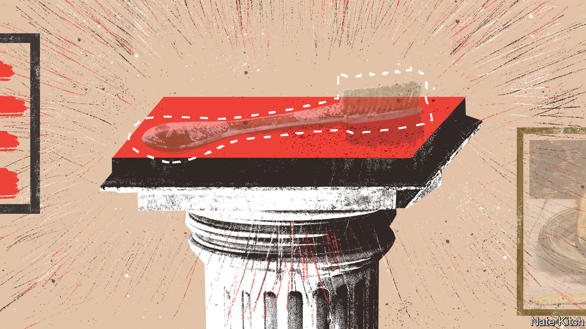

###### Bagehot

# British museums and galleries are dealing with the past, clumsily 

##### What to do (and not do) with shrunken heads and Napoleon’s toothbrush 

 

> Jan 11th 2023 

Forget Cézanne at Tate Modern. Forget Lucian Freud at the National Gallery. If you want to see something on a gallery wall that is really, as arty sorts say, challenging, head to the Wellcome Collection on Euston Road in London. On the white wall of this minimalist space you will find a similarly minimalist exhibit of six small holes; three above and three below. There’s no label, though, and it’s not quite clear at first what they are. 

It is clear what they are not. They are emphatically not part of the Wellcome Collection’s Medicine Man exhibition. Until late last year, this comprised an eccentric display of medical oddments—a glass eye; false legs; Tunisian amulets; Napoleon’s toothbrush—acquired by the Collection’s equally eccentric philanthropic founder, Henry Wellcome. At the end of 2022 the Collection announced that the exhibition “perpetuates a version of medical history that is based on racist, sexist and ableist theories” and shut it two days later. Napoleon’s transgressive toothbrush vanished; racists and ableists everywhere were doubtless chastened.

Poor old Wellcome. The past is another country and they did things differently there, much to the embarrassment of the present, which really would rather that they hadn’t. All British museums and galleries are squirming. Some are alleviating the awkwardness by loaning or : the Horniman Museum in London has handed back its . The British Museum is perpetually in “talks” over the Parthenon sculptures. Others have hidden objects away: the Pitt Rivers Museum in Oxford has removed its shrunken heads from view, explaining that they “led people to think in stereotypical and racist ways” about those who cut off their enemies’ heads and then shrink-dried them.

Most have started to accompany their displays with labels rich in sorrowful subjunctives. In a recent William Hogarth exhibition at Tate Britain, a much-mocked label next to a painting of Hogarth sitting on a chair noted that the chair was made from colonial timbers. Might the chair’s limbs “stand in for all those unnamed black and brown people enabling the society that supports his vigorous creativity”? In the Burrell Collection, in Glasgow, a label observes that contemporary critics of the artist Édouard Manet often compared his paintings of women to pieces of meat. Might we be “seeing more [in this picture] than just a painting of a ham?” asks the label next to a Manet painting of a ham.

The Wellcome Collection tried labels for a while, before deciding that the exhibition devoted to its founder was irretrievable. Henry Wellcome’s collection was a “vast personal project, the privilege of a wealthy white man in the Victorian era”. The exhibition told a story in which “disabled people, Black people, Indigenous peoples and people of colour were exoticised, marginalised and exploited—or even missed out altogether”. So they shut it.

Some of this is sensible. People in the past did awful things; it is right to think about those things, carefully. If objects have clearly been nicked, it is absolutely right that they should go back. But it is absolutely wrong to do what the Wellcome Collection has, and forget the most obvious thing about the past—namely, that it isn’t another place at all. The past is merely the present, yesterday. We, today, will be in it tomorrow. The clumsy closing of the Medicine Man exhibit is in the past already. And it already looks bad.

History rarely looks kindly on those who put the past on trial from the vantage point of the present. Consider Pope Formosus, a ninth-century pope who annoyed a successor, Pope Stephen VI. Stephen’s chief problem with Formosus wasn’t merely that he was irritating; it was that, since the papacy is held for life, he was dead. Undeterred, Stephen had Formosus’s rotting corpse exhumed, dressed in full papal regalia, put on trial, found guilty, mutilated and then tossed into the Tiber. Today the Cadaver Synod is, in a highly competitive field, considered one of the finest examples of Vatican idiocy in history. Museums and galleries that mutilate their collections to conform to present fashions tend to look similarly absurd. People still smirk at the  in Naples, in which the ruder relics of Pompeii were locked away. 

In one sense, mutilating a collection is a curator’s job. Museums are famously icebergs; most of their collections are not on show. It is the job of the curator to cut bits out and put others in. What they cut and what they keep will change over time, as it should. What feels much less right is when it is not art or interest but ideology that is shaping choices.

Un-Wellcome reminders

The job of history is not, as Hilary Mantel once said, to issue “report cards” to the past. The sanctimonious word soup being spread over museum and gallery walls is not necessarily wrong in its conclusions—which are often spot-on. But it is wrong in its aim, which is to tell people what to think. And that is exactly what history should not do. One of the most mocked history books of the 20th century was “Our Island Story”, which was parodied in “1066 and All That” for its habit of briskly dismissing moments in history as “A Good Thing” or a “A Bad Thing”. In contrast, Mantel’s own “Wolf Hall” took Thomas Cromwell, one of history’s most infamous villains, and made him, if not a hero, then at least someone you rooted for. You thought again. You thought at all.

It is the job of history—and therefore of galleries and museums—to make you think. To make you wonder, of any moment in the past: what was the right thing to do? What was the wrong one? Happily, the Wellcome Collection has a temporary exhibit of its own that does just that. Just head over to where Medicine Man used to be. You might have trouble finding it: labels have been stuck over the name in the lifts; in the newly reprinted maps it has already, Soviet-like, vanished. But look carefully and you can still find those six holes on the wall. As you look, it slowly becomes clear what they are: they mark where the sign for the Medicine Man exhibition used to hang. And that does make you think. ■


