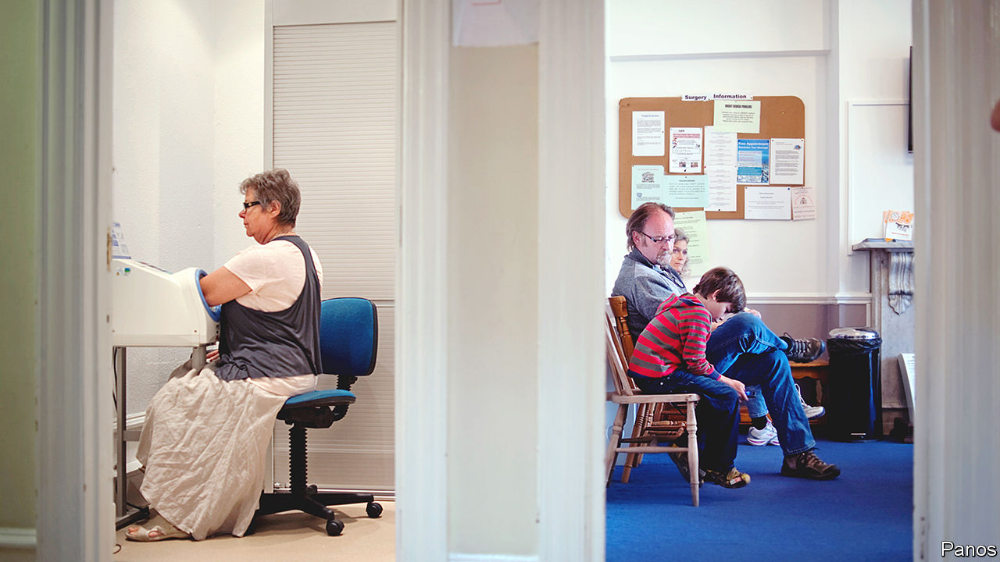
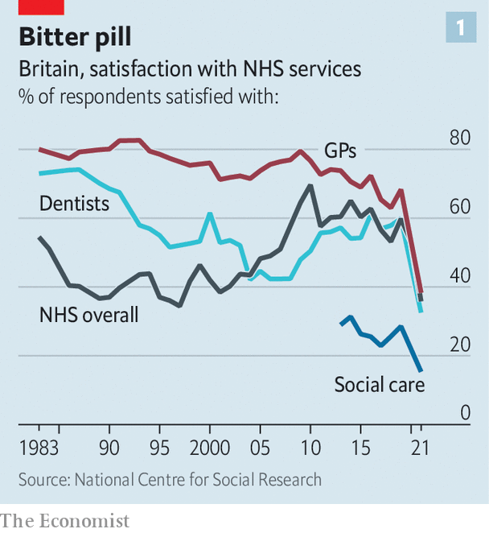
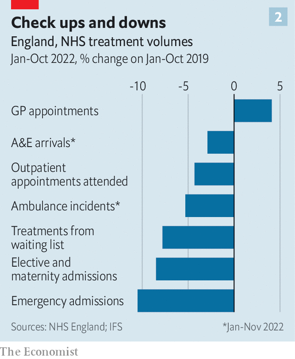

###### Dr no go

# General practitioners are a big part of Britain’s health-care crisis 

##### Public dissatisfaction with GPs is growing fast. Is that fair? 

 

> Jan 9th 2023 

Sajad ahmad seems to have a nice life. He makes good money working as a part-time general practitioner (GP), a family doctor, in the small town of Mountain Ash in southern Wales. From a fancy Scandinavian-style building, his consulting room looks out over hills of burnished copper crowned with firs. 

But he cannot escape the immense strains currently affecting the  (NHS). One afternoon in December he had 42 appointments (the British Medical Association, the doctors’ union, advises a safe workload for GPs should not exceed 25 patients per day). “I had a horrible day,” recalls Dr Ahmad. “I broke down; I was probably horrible to the staff.” 

General practice is one part of a health-care system in turmoil. The most visible and alarming symptoms of crisis are overwhelmed  departments in hospitals. Record delays getting into A&amp;E partly reflect pressures in the . But they can also be traced to GPs, the gatekeepers to the NHS and conventionally the first port of call when a person feels sick. Primary-care services, which include general practice, pharmacy, dentistry and optometry, provide the vast majority of clinical contact in the NHS for less than a tenth of its budget. If things go wrong here, the knock-on effects are huge.

Things are going very wrong indeed. In November 2022 over 5.3m people waited more than two weeks to see their GP; many more were unable to get an appointment altogether. That puts pressure on other services. Some rebuffed patients call an ambulance; according to a recent poll, around one in five adults have gone to A&amp;E because they cannot see their GP. Those who stay at home may find that their condition becomes harder to treat; for a few, treatment comes too late. Problems also flow the other way, back to GPs. Hospital waiting lists have ballooned from 4.2m to 7.2m since the pandemic began. Unable to get their hip replacement or dermatology appointment, many desperate patients are returning to their family doctor.

 


The jams are fuelling growing frustration. In the year to April 2022 almost 100,000 written complaints were made about GPs, an increase of more than a third compared with the same period three years before. Satisfaction with GPs, as measured by the British Social Attitudes Survey, plummeted from 68% to 38% between 2019 and 2021, a more dramatic drop than for any other NHS service (see chart). There are several sticks with which to beat GPs, from availability to pay to hours. Some of the criticism is warranted; much of it is unfair.

 


Many patients cannot forgive GPs for shutting their doors at the start of the covid-19 pandemic (albeit initially on the advice of the government). After switching to telephone and virtual appointments, some doctors have been slow to resume face-to-face consultations, although seven in ten appointments are now in person. But general practice stands out for providing more services than it did before the pandemic (see chart). 

Some dissatisfaction with GPs reflects the fact that they are well-paid. Unlike hospitals, general practices are small-to-medium-sized businesses, which are independently contracted by the NHS. Most are owned by GP partners, who work together to secure premises, run their business and pay their staff, including salaried GPs. The bulk of their income comes from delivering the essential services agreed in their contract. For this, they are paid a fixed sum for each patient on their books. Other parts of the contract buttress their earnings.

Partnership can be a very lucrative arrangement. In 2020-21 the income of the average GP partner in England increased to £142,000 ($172,000), although partners are self-employed and do not benefit from employer pensions and the like. But its allure seems to be fading. Many GPs are choosing to become salaried, which means they earn less than half as much as partners but forgo the commitment of running a demanding business. Some partners are handing back their contracts. An investigation by Pulse, a website for GPs, found that in the nine years to August 2022, 474 surgeries across Britain had closed without being replaced.

A shortage of doctors is by far the biggest challenge facing general practice. Whereas there are 9% more full-time-equivalent consultants and 15% more junior doctors in hospitals than there were in 2019, there are 2% fewer family doctors. Analysis by the Health Foundation, a think-tank, found that England was missing the equivalent of 4,200 full-time GPs in 2022, a number projected to double by 2030. Some are retiring early or moving abroad. The rest are reducing their hours. 

Covid-19 is not sufficient to explain this shortfall. Recruitment and retention have been problems for the past decade, says Azeem Majeed, a professor at Imperial College London, and a part-time GP. In fact, the profession was haemorrhaging doctors at a faster rate before the pandemic. A deeper crisis plagues —their job is less satisfying than it was before. 

The births and deaths they once presided over are now largely the domain of specialists. The sickness they deal with has become more complex and more chronic. Fifty years ago “most people were dead at 70,” notes Beccy Baird of the King’s Fund, another think-tank. Now there are around 15m Britons with long-term conditions such as diabetes and dementia. Practices carry out double the number of consultations with frequent attenders (those who visit clinics more often than 90% of other patients) that they did 20 years ago. Such patients, who are likely to be older and have multiple conditions, take up around four in ten of a clinic’s appointments. 

Bureaucracy has increased, although GPs often conveniently forget that this is a commitment they once happily signed up for. As part of the GP contract introduced in 2004, practices exchanged a much-maligned responsibility to provide round-the-clock care for a pay-for-performance scheme to supplement their main income. The Quality and Outcomes Framework incentivises GPs to earn points, and thus more money, for chasing 72 targets. Most of these are related to chronic-disease management: maintaining a list of patients with heart disease, for example, or tracking whether they are taking aspirin. 

That deal, which within three years had earned GP partners a pay bump of 58%, now looks like a Faustian bargain. Doctors have traded time with patients for paperwork. Although only one in four GPs now works full-time, practitioners still clock in an average of 38.4 hours per week, according to the GP work-life survey by the National Institute for Health and Care Research. That is more than the typical full-time employee in Britain. Time spent box-ticking means that patients are less likely to receive continuity of care (ie, seeing the same doctor consistently) and more easily “reduced to a statistic”, sighs James Le Fanu, an ex-GP-turned-commentator. 

GP partners also have more people to manage. In November 2022 over half of all appointments at surgeries were with non-GP staff such as nurses, pharmacists, physiotherapists and physician associates (who help diagnose patients, but do not prescribe). In the long term this shift should make things more sustainable, but staff require training and supervision. Clinics who try to cut costs by using physician associates risk a backlash from patients. 

GPs who decide to call it quits are leaving the places that need them most. Researchers at the University of Cambridge found that between 2015 and 2022 the number of GPs per 10,000 patients increased from 5.6 to 5.8 in the richest areas of England; over the same period this number fell from 5.6 to 5.3 in the poorest areas. The most deprived quintile of areas in Wales, which includes Mountain Ash, also has the lowest number of GPs.

Part of the problem is that a practice’s core funding is weighted mostly for age, not for deprivation, even though the needs of the poorest are greater. On the high street in Mountain Ash, houses with cracked plaster and blackened walls bear the signs of damp and mould, both of which are associated with many chronic illnesses. Children in the poorest areas are nearly twice as likely to be obese. 

Patients in these places are also less likely to join the record numbers of people going private to bypass NHS backlogs, or to have the education to manage their health well for themselves. “We had a patient two to three months ago [who] went for a walk and part of her breast fell off,” says Dr Ahmad. She had ignored the signs for so long that the tumour had burst through her skin, necrotising the surrounding tissue. In funding terms she would be worth as much to the surgery as someone who would pay for a private mammogram, says Dr Ahmad. “It doesn’t make sense.”

To try to alleviate the crisis, Britain is now training more new GPs than ever. But given difficulties retaining the ones it already has, the government appears to have quietly dropped its manifesto pledge from 2019 of a net increase of 6,000 new family doctors by 2024. Kamila Hawthorne, a colleague of Dr Ahmad’s in Mountain Ash and the new chair of the Royal College of General Practitioners, the professional body representing GPs, is trying to promote the good side of general practice. Medical students need less convincing than those who have already qualified and are then training as family doctors. The students arrive “all misty-eyed and altruistic”, she says. “The GP trainees see the workload.” ■

‘s sister magazine, has published a GP’s eyewitness account of the NHS crisis. Visit 


